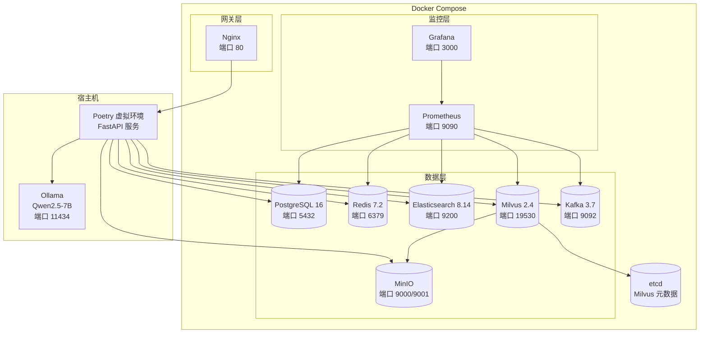

## 产品概述

银行信用卡智能客服平台的 Sprint 1（基础设施 + 项目骨架），为后续 AI 能力开发搭建完整的开发和运行环境。

## 核心功能

- Docker Compose 一键启动全部中间件（PostgreSQL/Redis/ES/Milvus/MinIO/Kafka）
- Python 项目工程化骨架（Poetry + FastAPI + gRPC）
- gRPC Proto 接口定义（分类模型/RAG 检索/安全过滤三大服务）
- Milvus Collection 建模（1024 维向量 + IVF_FLAT 索引）
- Elasticsearch 索引模板 + IK 中文分词验证
- Ollama 本地部署 Qwen2.5-7B 模型
- Prometheus + Grafana 监控中间件健康状态
- Nginx 开发网关路由（Higress 生产配置保留在注释中）
- Sprint 1 详细操作笔记写入 Obsidian

## 技术栈

- **语言/框架**: Python 3.11+, FastAPI 0.115+, Pydantic v2
- **依赖管理**: Poetry (pyproject.toml)
- **gRPC**: grpcio 1.60+, grpcio-tools (Protobuf 接口定义)
- **数据库**: PostgreSQL 16 (asyncpg + SQLAlchemy 2.0 async)
- **缓存**: Redis 7.2 (redis-py async)
- **全文检索**: Elasticsearch 8.14+ (IK 分词器, elasticsearch-py)
- **向量数据库**: Milvus 2.4+ (pymilvus)
- **对象存储**: MinIO (minio-py)
- **消息队列**: Kafka 3.7 KRaft 模式 (aiokafka)
- **大模型**: Ollama + Qwen2.5-7B (OpenAI 兼容 API, openai-python)
- **监控**: Prometheus 2.50+, Grafana 10.x
- **容器**: Docker Compose (单节点开发环境)
- **开发网关**: Nginx (反向代理 + 路由，生产级 Higress 配置保留在注释)

## 实现方案

### 总体策略

采用"基础设施即代码"方式，所有中间件通过 Docker Compose 编排，Python 项目通过 Poetry 管理依赖和虚拟环境。gRPC Proto 定义 AI 能力层接口，FastAPI 构建两个编排服务的 HTTP 入口。Ollama 作为本地大模型推理引擎，提供 OpenAI 兼容 API。监控栈通过 Prometheus 采集指标、Grafana 可视化。

### 关键技术决策

1. **Poetry 替代 pip+requirements.txt**: Poetry 提供确定性依赖锁定、虚拟环境隔离、构建打包一体化，是 Python AI 项目的标准实践。与 LangChain/LangGraph 生态兼容性最好。

2. **Nginx 替代 Higress 作为开发网关**: Higress 为 K8s 原生网关，Docker Compose 环境下运行复杂。开发阶段用 Nginx 实现路由/负载均衡，Higress 的 K8s Ingress 配置保留在 `deploy/` 目录供生产使用。

3. **Kafka KRaft 模式**: 无需 ZooKeeper，减少一个组件，简化 Docker Compose 编排。Kafka 3.7 的 KRaft 模式已生产可用。

4. **Milvus Standalone 模式**: 单节点嵌入式 etcd + MinIO 存储，适合开发环境。Collection 使用 IVF_FLAT 索引（nlist=128），1024 维向量对齐 bge-large-zh-v1.5。

5. **ES 内存限制**: 开发环境 ES 限制堆内存 1g（-Xms1g -Xmx1g），避免占用过多宿主机内存。IK 分词器使用 IK Analysis Plugin 8.14 兼容版本。

### macOS ARM64 注意事项

- Elasticsearch 官方镜像支持 ARM64
- Milvus 2.4 提供 ARM64 镜像
- Kafka 使用 bitnami/kafka 镜像（ARM64 兼容）
- Ollama 原生支持 macOS ARM64（M1/M2/M3）

## 实现说明

- Docker Compose 所有服务设置 `restart: unless-stopped` 和健康检查
- ES 使用 `esjava` 用户运行，避免 root 权限问题
- Milvus 依赖 etcd 和 MinIO，在 Compose 中定义 `depends_on` 启动顺序
- Kafka KRaft 模式需要初始化集群 ID（使用 `kafka-storage.sh`）
- Poetry 项目结构遵循 `src/` 布局，方便后续打包
- gRPC Python 代码通过 `grpcio-tools` 从 `.proto` 文件自动生成

## 架构设计



## 目录结构

```
/Users/qiangli/CodeBuddy/agent_project/
├── pyproject.toml              # [NEW] Poetry 项目配置，依赖声明
├── poetry.lock                 # [NEW] 依赖锁定文件（poetry install 后生成）
├── main.py                     # [MODIFY] FastAPI 应用入口，挂载路由
├── README.md                   # [MODIFY] 项目说明文档
├── requirements.txt            # [MODIFY] 导出 pip 兼容依赖（poetry export）
│
├── shared/                     # [EXISTING] 已有，微调
│   ├── __init__.py
│   ├── config.py               # [EXISTING] 配置管理，Docker Compose 环境变量适配
│   ├── models.py               # [EXISTING] Pydantic 数据模型
│   ├── logger.py               # [EXISTING] 日志配置
│   └── exceptions.py           # [EXISTING] 异常定义
│
├── proto/                      # [NEW] gRPC Proto 定义
│   ├── classification.proto    # 分类模型引擎接口（意图分类/实体抽取/情感分析）
│   ├── retrieval.proto         # RAG 检索引擎接口（混合检索/精排）
│   └── safety.proto            # 安全过滤引擎接口（敏感词/脱敏/合规）
│
├── services/                   # [NEW] 编排服务目录
│   ├── __init__.py
│   ├── bot/                    # 机器人服务
│   │   ├── __init__.py
│   │   ├── app.py              # FastAPI 应用，路由注册，生命周期管理
│   │   └── router.py           # HTTP API 路由定义（/api/chat, /health）
│   ├── assist/                 # 坐席辅助服务
│   │   ├── __init__.py
│   │   ├── app.py              # FastAPI 应用，WebSocket 路由
│   │   └── router.py           # HTTP/WS 路由定义
│   └── common/                 # 服务共享工具
│       ├── __init__.py
│       ├── database.py         # SQLAlchemy async engine + session
│       ├── redis_client.py     # Redis async 连接池
│       └── grpc_clients.py     # gRPC 客户端工厂（stub 创建）
│
├── scripts/                    # [NEW] 辅助脚本
│   ├── init_milvus.py          # 初始化 Milvus Collection（1024维/IVF_FLAT）
│   ├── init_elasticsearch.py   # 创建 ES 索引模板 + IK 分词验证
│   ├── init_kafka.py           # 创建 Kafka Topic
│   ├── verify_all.py           # 一键验证所有中间件连通性
│   └── generate_grpc.py        # 从 proto 文件生成 Python gRPC 代码
│
├── config/                     # [NEW] 配置文件
│   ├── sensitive_words.txt     # 敏感词库（占位）
│   ├── prometheus.yml          # Prometheus 采集配置
│   └── grafana/                # Grafana 配置
│       └── dashboards/         # 仪表盘 JSON 定义
│           └── middleware.json  # 中间件监控仪表盘
│
├── deploy/                     # [NEW] 部署配置
│   ├── docker-compose.yml      # Docker Compose 全套中间件编排
│   ├── nginx/                  # Nginx 开发网关配置
│   │   └── nginx.conf          # 路由规则（bot/assist 服务分发）
│   └── higress/                # Higress 生产配置（注释参考）
│       └── README.md           # Higress K8s Ingress 配置说明
│
├── generated/                  # [NEW] gRPC 自动生成代码（gitignore）
│   └── proto/                  # grpcio-tools 输出
│
├── tests/                      # [NEW] 测试目录
│   ├── __init__.py
│   ├── conftest.py             # pytest fixtures（测试客户端/Mock 服务）
│   ├── test_bot_api.py         # 机器人服务 API 测试
│   ├── test_assist_api.py      # 坐席辅助服务 API 测试
│   └── test_grpc_proto.py      # gRPC 接口编译验证测试
│
└── .gitignore                  # [NEW] Git 忽略规则
```

## 关键代码结构

### pyproject.toml 核心依赖

```
[tool.poetry.dependencies]
python = "^3.11"
fastapi = "^0.115"
uvicorn = {extras = ["standard"], version = "^0.30"}
pydantic = "^2.0"
pydantic-settings = "^2.0"
sqlalchemy = {extras = ["asyncio"], version = "^2.0"}
asyncpg = "^0.29"
redis = {extras = ["hiredis"], version = "^5.0"}
elasticsearch = {extras = ["async"], version = "^8.14"}
pymilvus = "^2.4"
minio = "^7.2"
aiokafka = "^0.10"
grpcio = "^1.60"
grpcio-tools = "^1.60"
openai = "^1.30"
langchain-core = "^0.3"
langgraph = "^0.2"
opentelemetry-api = "^1.20"
opentelemetry-sdk = "^1.20"
prometheus-client = "^0.20"

[tool.poetry.group.dev.dependencies]
pytest = "^8.0"
pytest-asyncio = "^0.23"
httpx = "^0.27"
```

### classification.proto 接口定义

```
syntax = "proto3";
package smartcs;

service ClassificationService {
  rpc Classify(ClassifyRequest) returns (ClassifyResponse);
}

message ClassifyRequest {
  string text = 1;
  repeated TextTurn history = 2;
  repeated ClassifyType classify_types = 3;
}

enum ClassifyType {
  INTENT = 0;
  ENTITY = 1;
  SENTIMENT = 2;
}

message TextTurn {
  string speaker = 1;
  string content = 2;
}

message IntentLabel {
  string intent = 1;
  float confidence = 2;
}

message Entity {
  string entity_type = 1;
  string value = 2;
  int32 start = 3;
  int32 end = 4;
  float confidence = 5;
}

message ClassifyResponse {
  IntentResult intent_result = 1;
  EntityResult entity_result = 2;
  SentimentResult sentiment_result = 3;
  int64 latency_ms = 4;
}

message IntentResult {
  IntentLabel primary = 1;
  repeated IntentLabel alternatives = 2;
}

message EntityResult {
  repeated Entity entities = 1;
}

message SentimentResult {
  string label = 1;
  float score = 2;
}
```

### Docker Compose 服务拓扑

```
# 核心服务清单
services:
  postgres:      # PostgreSQL 16, 端口 5432, 健康检查 pg_isready
  redis:         # Redis 7.2, 端口 6379, 健康检查 redis-cli ping
  elasticsearch: # ES 8.14 + IK, 端口 9200, 堆内存 1g
  etcd:          # Milvus 元数据, 端口 2379
  minio:         # 对象存储, 端口 9000/9001
  milvus:        # 向量数据库, 端口 19530, depends_on: etcd, minio
  kafka:         # Kafka 3.7 KRaft, 端口 9092
  prometheus:    # 端口 9090, 挂载 prometheus.yml
  grafana:       # 端口 3000, 数据源指向 prometheus
  nginx:         # 端口 80, 反向代理 bot/assist 服务
```

## SubAgent

- **code-explorer**
- Purpose: 探索项目现有代码结构，确认 shared/ 模块的具体内容和接口
- Expected outcome: 准确掌握已有代码的类/方法签名，确保新代码与现有模块无缝集成

## Skill

- **langgraph-docs**
- Purpose: 查询 LangGraph 最新文档，确认 StateGraph、条件路由等 API 的正确用法
- Expected outcome: 确保项目骨架中 LangGraph 集成代码符合最新 API 规范

- **documentation-writer**
- Purpose: 生成 Sprint 1 详细操作笔记，写入 Obsidian Vault
- Expected outcome: 高质量的技术操作笔记，覆盖每个步骤的操作命令、验证方法、踩坑记录