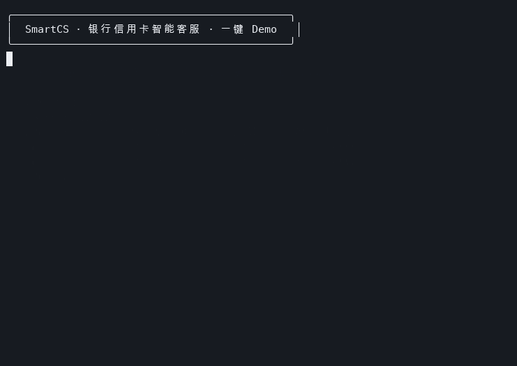
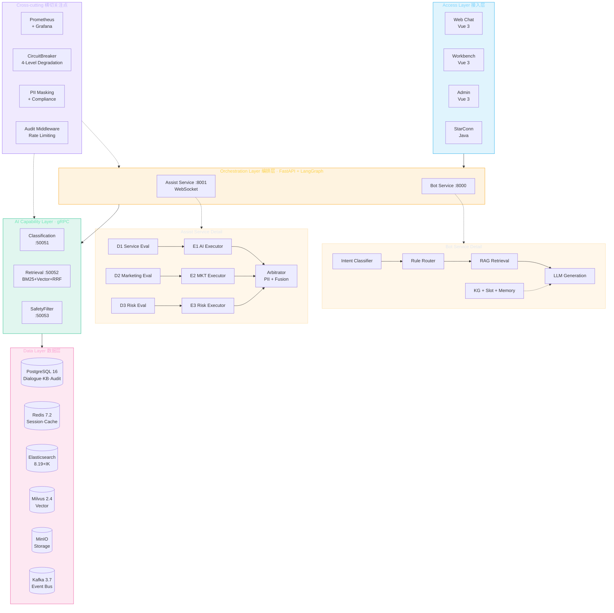

# SmartCS - 银行信用卡智能客服平台

[](LICENSE)
[](agent/pyproject.toml)
[](agent/pyproject.toml)
[](agent/pyproject.toml)

AI 坐席辅助 + 机器人自助问答系统。基于 RAG + Agent 编排 + 私有化大模型，为银行信用卡中心提供智能客服能力。



> **这是银行级私有化智能客服的参考实现**，包含完整的检索增强、Agent 编排、合规过滤、实时监控能力，适合作为私有化部署的技术基座，而非开箱即用的 SaaS。

**[架构](docs/architecture.md) · [API 文档](docs/api-reference.md) · [部署指南](docs/deployment.md) · [快速开始](#快速开始)**

## 项目架构



## 技术栈

| 分类 | 技术 | 版本 |
|------|------|------|
| Web 框架 | FastAPI | 0.115+ |
| Agent 编排 | LangGraph | 0.2+ |
| 大模型 | Qwen2.5-7B (Ollama) | — |
| Embedding | bge-large-zh-v1.5 | — |
| 数据库 | PostgreSQL | 16 |
| 缓存 | Redis | 7.2 |
| 全文检索 | Elasticsearch + IK | 8.19 |
| 向量数据库 | Milvus | 2.4 |
| 对象存储 | MinIO | 2024+ |
| 消息队列 | Kafka (KRaft) | 3.7 |
| gRPC | grpcio | 1.60+ |
| 监控 | Prometheus + Grafana | — |
| 代码质量 | Ruff + mypy + pre-commit | — |
| 数据库迁移 | Alembic | — |

## 快速开始

### ⚡ 一键 Demo（推荐，最快体验）

只需 Docker，一条命令拉起完整系统（中间件 + 数据库迁移 + 预置知识库 + Bot/Assist 服务）：

```bash
git clone https://github.com/slowleelab/QingQue.git && cd QingQue
make demo
```

启动后即可体验：

```bash
# 发送一条客户咨询
curl -X POST http://localhost:8000/api/chat/send \
  -H 'Content-Type: application/json' \
  -d '{"message":"信用卡年费怎么减免"}'
```

| 入口 | 地址 |
|------|------|
| Bot 对话服务 | <http://localhost:8000>（Swagger: `/docs`） |
| Assist 坐席辅助 | <http://localhost:8001>（Swagger: `/docs`） |
| Grafana 监控 | <http://localhost:3001> |

> 💡 无本地大模型也能跑：LLM 不可达时系统自动降级（检索摘要 → 模板回复）。有 [Ollama](https://ollama.com) 时回答质量更高。
> 停止：`make demo-down` ｜ 日志：`make demo-logs`
>
> **或者直接拉取预构建镜像（免编译）**：
> ```bash
> docker run --name smartcs-demo -d slowleelab/qingque:demo
> ```

---

### 🛠 本地开发（完整环境）

#### 1. 环境准备

```bash
# 克隆项目
git clone <repo-url> && cd agent_project

# 复制环境变量配置
cp .env.example .env
# 根据实际环境修改 .env

# 安装 Poetry（如未安装）
curl -sSL https://install.python-poetry.org | python3 -

# 安装项目依赖
poetry install

# 安装 pre-commit hooks
make pre-commit
```

#### 2. 启动中间件

```bash
# 使用 Makefile（推荐）
make build    # 构建 ES+IK 自定义镜像
make up       # 启动全部中间件
make ps       # 查看服务状态

# 或手动操作
cd deploy
docker compose build elasticsearch
docker compose up -d
docker compose ps
```

#### 3. 初始化中间件

```bash
make init     # 一键初始化 Milvus + ES + Kafka

# 或手动逐个初始化
poetry run python scripts/init_milvus.py
poetry run python scripts/init_elasticsearch.py
poetry run python scripts/init_kafka.py
```

#### 4. 数据库迁移

```bash
make migrate           # 运行迁移
make migrate-create msg="描述"  # 创建新迁移
```

#### 5. 验证环境

```bash
make verify        # 验证所有中间件连通性
make verify-ollama # 验证 Ollama + Qwen2.5-7B
```

#### 6. 启动服务

```bash
make dev  # 启动 bot(:8000) + assist(:8001)

# 或手动启动
poetry run uvicorn smartcs.main:bot_app --reload --port 8000
poetry run uvicorn smartcs.main:assist_app --reload --port 8001
```

#### 7. 运行测试

```bash
make test       # 运行测试
make test-cov   # 运行测试并生成覆盖率报告
```

## 项目结构

```
smartcs/
├── src/
│   └── smartcs/            # Python 包（src layout）
│       ├── __init__.py     # 包初始化，定义 __version__
│       ├── py.typed        # PEP 561 类型标记
│       ├── main.py         # FastAPI 应用入口
│       ├── shared/         # 共享模块
│       │   ├── config.py   # pydantic-settings 配置管理
│       │   ├── models.py   # Pydantic 数据模型
│       │   ├── logger.py   # 日志配置（支持 JSON 结构化）
│       │   ├── exceptions.py # 异常定义
│       │   └── middleware.py # 全局异常处理中间件
│       └── services/       # 编排服务
│           ├── bot/        # 机器人服务
│           ├── assist/     # 坐席辅助服务
│           └── common/     # 服务共享（DB/Redis/gRPC 客户端/DI）
├── tests/                  # 测试
├── alembic/                # 数据库迁移
├── proto/                  # gRPC Proto 定义
├── scripts/                # 辅助脚本
├── config/                 # 配置文件（非 Python 包）
├── deploy/                 # 部署配置
│   ├── Dockerfile          # 应用多阶段构建
│   ├── .dockerignore
│   └── docker-compose.yml
├── .github/workflows/      # CI/CD
├── pyproject.toml          # 项目配置（Poetry + Ruff + mypy + coverage）
├── Makefile                # 标准化开发命令
└── .pre-commit-config.yaml # pre-commit 钩子
```

## 开发命令速查

```bash
make help         # 查看所有可用命令
make install      # 安装依赖
make dev          # 启动开发服务
make test         # 运行测试
make test-cov     # 运行测试 + 覆盖率
make lint         # 代码检查
make format       # 代码格式化
make type-check   # 类型检查
make pre-commit   # 安装并运行 pre-commit
make proto        # 编译 gRPC Proto
make migrate      # 运行数据库迁移
make up           # 启动中间件
make down         # 停止中间件
make init         # 初始化中间件
make verify       # 验证环境
make clean        # 清理缓存
```

## 端口分配

| 服务 | 端口 | 说明 |
|------|------|------|
| Bot API | 8000 | 机器人服务 |
| Assist API | 8001 | 坐席辅助服务 |
| Nginx Gateway | 80 | 开发网关 |
| Grafana | 3000 | 监控面板 |
| Prometheus | 9090 | 指标采集 |
| PostgreSQL | 5432 | 数据库 |
| Redis | 6379 | 缓存 |
| Elasticsearch | 9200 | 全文检索 |
| Milvus | 19530 | 向量数据库 |
| MinIO API | 9000 | 对象存储 |
| MinIO Console | 9001 | 对象存储控制台 |
| Kafka | 9092 | 消息队列 |

## Sprint 规划

| Sprint | 目标 | 状态 |
|--------|------|------|
| Sprint 1 | 基础设施 + 项目骨架 | ✅ 已完成 |
| Sprint 2 | RAG 核心 + 知识库 | ✅ 已完成 |
| Sprint 3 | Agent 编排 + 机器人 MVP | ✅ 已完成 |
| Sprint 4 | 大模型集成 + 降级策略 | ✅ 已完成 |
| Sprint 5 | 坐席辅助服务 + OE 编排 | ⬜ 待开始 |

## 文档

- **[文档中心](docs/README.md)** — 全部文档索引
- [系统架构](docs/architecture.md) — 三层设计、数据流、设计决策
- [API 参考](docs/api-reference.md) — REST / WebSocket 接口
- [部署指南](docs/deployment.md) — Docker Compose、初始化、监控
- [配置参考](docs/configuration.md) — 环境变量全览
- [开发指南](docs/development.md) — 本地开发、代码规范、测试

## 子项目

| 目录 | 说明 | 文档 |
|------|------|------|
| `agent/` | SmartCS 核心（Bot + Assist 编排服务） | 见上方文档 |
| `knowledge-platform/` | 知识数据微服务（ES 原生 RRF） | [README](knowledge-platform/README.md) |
| `star-connection/` | 在线客服接入系统（Java） | [README](star-connection/README.md) · [DESIGN](star-connection/DESIGN.md) |
| `web/` | 坐席工作台 / 客户对话前端（Vue 3） | [README](web/README.md) |

## 贡献

欢迎贡献！请先阅读：

- [贡献指南](CONTRIBUTING.md) — 环境搭建、分支与 commit 规范、PR 流程
- [行为准则](CODE_OF_CONDUCT.md)
- [安全策略](SECURITY.md) — 漏洞请私下报告

## License

本项目基于 [Apache License 2.0](LICENSE) 开源。
