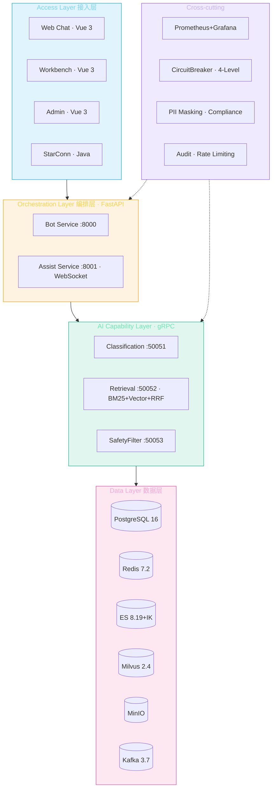

# SmartCS 系统架构

> 银行信用卡智能客服平台 —— 整体架构、核心数据流与设计决策。

## 目录

- [总览](#总览)
- [三层架构](#三层架构)
- [Monorepo 子项目](#monorepo-子项目)
- [核心数据流](#核心数据流)
- [关键设计决策](#关键设计决策)
- [可观测性](#可观测性)

---

## 总览

SmartCS 提供两大核心能力：

| 能力 | 说明 | 入口 |
|------|------|------|
| **Bot 自助服务** | 自动化对话机器人，基于 RAG + 意图分类 + Agent 编排处理客户咨询 | Bot Service `:8000` |
| **AI 坐席辅助** | 通话中向人工坐席实时推送话术 / 知识 / 合规告警 / 商品推荐 | Assist Service `:8001` (WebSocket) |

系统采用**编排层与 AI 能力层分离**的设计：FastAPI 应用只负责会话编排与业务流转，重型 AI 能力（分类、检索、安全过滤）以 gRPC 契约定义，可独立部署与伸缩。

## 三层架构



### 编排层（`agent/smartcs/services/`）

- **每个服务是独立的 FastAPI app 工厂**：`create_bot_app()` / `create_assist_app()`，各有独立 lifespan。
- **依赖注入**：DB engine、Redis 连接池、gRPC channel 存于 `app.state`，经 `Annotated[..., Depends(...)]` 注入（见 `services/common/deps.py`）。
- **共享基础设施**集中在 `services/common/`：检索、embedding、reranker、会话、降级、熔断、审计、PII 等 25 个模块。

### AI 能力层（`agent/proto/`）

以 Protobuf 定义三个服务契约，编排层通过生成的 stub 调用，并对每次调用做延迟追踪：

- `classification.proto` — 意图 / 情绪 / 领域分类
- `retrieval.proto` — 混合检索（BM25 + 向量 + RRF）
- `safety.proto` — 敏感词 / 合规过滤

> 该层当前为契约定义，编排层内置了等价的本地实现作为兜底（降级策略见下文）。

### 数据层（`deploy/docker-compose.yml`）

| 组件 | 用途 |
|------|------|
| PostgreSQL 16 | 业务真相源（会话、知识、规则、审计） |
| Redis 7.2 | 会话状态、缓存、Pub/Sub 热加载、反馈缓冲 |
| Elasticsearch 8.19 + IK | 知识全文检索（BM25），中文分词 |
| Milvus 2.4 | 向量检索（bge-large-zh  embedding） |
| MinIO | 原始文档对象存储 |
| Kafka 3.7 (KRaft) | 异步 ETL / 事件流 |
| Temporal | 工作流编排（坐席辅助 OE 流水线） |

## Monorepo 子项目

| 目录 | 语言 | 说明 |
|------|------|------|
| `agent/` | Python 3.11 | SmartCS 核心：Bot + Assist 编排服务 |
| `knowledge-platform/` | Python | 独立知识数据微服务（ES 原生 RRF，取代 Milvus 双写） |
| `star-connection/` | Java | 在线客服接入系统（Customer/Agent Server） |
| `web/` | Vue 3 + TS | 坐席工作台 / 客户对话前端 |

## 核心数据流

### Bot 对话（自助服务）

```
客户消息
  → POST /api/chat/send
  → L1 规则快速意图匹配（RuleLoader，<5ms）
  → LangGraph Agent 编排
       ├─ 意图分类（CLS gRPC）
       ├─ 混合检索（BM25 ⊕ 向量，RRF 融合 → Reranker）
       ├─ LLM 生成（Qwen2.5，含降级）
       └─ 安全过滤（敏感词 + PII 脱敏）
  → 响应入队 → GET /api/chat/poll（长轮询）
  → 命中转人工关键词 → POST /api/chat/transfer → 会话切换至人工阶段
```

### 坐席辅助（实时推送）

```
通话音频 / 客户消息
  → WS /api/ws/{session_id}（customer_message）
  → OE Pipeline 并行评估（D1 服务 / D2 营销 / D3 风险）
  → GlobalArbitrator 全局仲裁（风险优先，可阻断营销）
  → AssistOrchestrator 组装推送载荷
       （话术卡 / 知识摘要 / 合规告警 / 商品推荐）
  → WS 推送 assist_push 给坐席
  → 坐席反馈 POST /api/feedback → Redis 缓冲（3s 延迟提交，可撤销）
```

### 会话状态机

会话采用 **3 阶段 × 7 子状态**模型（`BOT → HANDOFF → ASSIST → ENDED`），完整状态存于 Redis（`SessionState`），支持 bot → 转人工 → 坐席辅助 → 结束的全生命周期。详见 [`docs/session-state-machine.html`](./session-state-machine.html)。

## 关键设计决策

| 决策 | 选择 | 理由 |
|------|------|------|
| **混合检索** | BM25 + 向量 + RRF 融合 | 兼顾精确关键词与语义召回；支持 BM25-only / 向量-only 降级 |
| **降级策略** | 熔断器 + 健康监控 + 内容降级 | LLM/检索故障时自动切换兜底路径，保证可用性（见 Sprint 4 设计） |
| **会话状态** | Redis 全量存储 | 无状态编排层可水平扩展，状态共享 |
| **OE 仲裁** | 风险优先级最高 | 金融风险拦截可覆盖营销/服务推荐，合规第一 |
| **反馈闭环** | Redis 缓冲 + 3s 延迟提交 | 坐席可在延迟期内撤销误操作反馈 |
| **知识平台** | ES dense_vector + HNSW + 原生 RRF | 消除 Milvus 双写，简化数据一致性 |

## 可观测性

- **指标**：Prometheus 抓取各 exporter（redis/postgres/kafka）+ 服务自定义指标
- **看板**：Grafana（`config/grafana/`，含中间件与服务两类 dashboard）
- **链路**：OpenTelemetry tracing（`shared/tracing.py`）
- **日志**：JSON 结构化日志（`shared/logger.py`）
- **监控配置**：单一事实源在 [`config/`](../config/)，由 `deploy/docker-compose.yml` 挂载

---

## 延伸阅读

- [API 参考](./api-reference.md) — REST / WebSocket 接口
- [部署指南](./deployment.md) — 中间件与服务启动
- [配置参考](./configuration.md) — 环境变量全览
- 设计文档（Sprint 历史）：[`docs/superpowers/specs/`](./superpowers/specs/)
