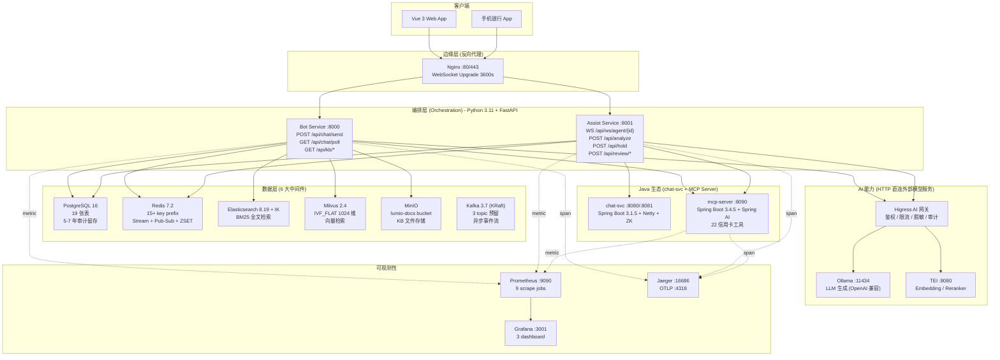
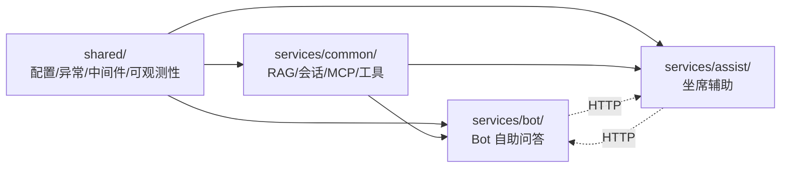

# 第 1 章: 整体架构

> 本章用一张架构图 + 5 个设计决策, 让你 18 分钟内理解 Lumio 的宏观布局.

## 1.1 三层架构总览

Lumio 整体走三层架构, 借鉴"洋葱模型":



### 1.1.1 三层的责任划分

| 层 | 责任 | 失败模式 |
|---|---|---|
| **编排层** | API 路由 / 业务编排 / 状态机 / 会话管理 | 5xx → 503 兜底 |
| **AI 能力** | LLM / 嵌入 / 重排序 (HTTP 直连外部模型服务, 经 Higress 网关治理) | 熔断 + 4 级降级链 |
| **数据层** | 持久化 / 缓存 / 检索 / 事件 | 各组件独立降级 |

**关键事实**: 不设独立 gRPC 能力层 — AI 能力 (LLM/Embedding/Reranker/分类) 由编排层
**HTTP 直连外部模型服务** (Ollama :11434 / TEI :8080), 统一治理由 Higress AI 网关承担
(鉴权/限流/脱敏/审计)。当前规模下两层编排已足够, gRPC 抽象仅增加部署与序列化开销;
若未来模型平台化 (多团队共享/vLLM 多实例/跨集群调用) 再引入.

## 1.2 两个 FastAPI 实例的边界

主入口 `agent/lumio/main.py:241-242` 创建两个独立 FastAPI 实例:

```python
bot_app: FastAPI = create_bot_app(lifespan=bot_lifespan)
assist_app: FastAPI = create_assist_app(lifespan=assist_lifespan)
```

### 1.2.1 为什么是两个而非一个?

| 维度 | 单实例 | 双实例 (当前) |
|---|---|---|
| **伸缩** | 同步扩缩, 高峰浪费 | Bot 流量大时单独扩, Assist 低负载时缩 |
| **故障域** | 一个崩溃全停 | Bot 崩了 Assist (坐席) 仍可用 |
| **部署** | 必须同步发布 | Bot 改逻辑不影响 Assist (中间件共享) |
| **资源隔离** | LLM 大模型推理互相干扰 | Bot 跑 RAG, Assist 跑仲裁, CPU 隔离 |

### 1.2.2 启动清单的差异

`agent/lumio/main.py:83-186` 定义了三组 init 步骤:

```python
_COMMON_INIT_STEPS = [  # 12 步共享
    init_db,           # PostgreSQL async engine
    init_redis,        # Redis async pool
    init_es,           # Elasticsearch async client
    init_milvus,       # Milvus async client
    init_minio,        # MinIO async client
    init_embedding,    # TEI/Ollama 嵌入 provider
    init_reranker,     # 重排序 provider
    init_llm,          # LLM client
    init_safety,       # 敏感词 Aho-Corasick
    init_metrics,      # Prometheus 指标
    init_tracing,      # OTel TracerProvider
    init_mcp_client,   # MCP 工具客户端
]

_BOT_INIT_STEPS = _COMMON_INIT_STEPS + [start_bot_worker]   # + Stream 消费
_ASSIST_INIT_STEPS = _COMMON_INIT_STEPS + [start_notify_worker]  # + 通知 worker
```

**关键设计**: 用纯函数列表编排, 避免 lifespan 自动发现机制的隐式行为. 每个步骤显式接收 `app: FastAPI` 参数, 便于测试和复用.

### 1.2.3 关闭顺序: 逆序 + 异常吞噬

```python
# main.py:65-79
class _SuppressExceptions:
    """关闭阶段吞异常, 保证其他步骤不被阻塞"""
    def __enter__(self): pass
    def __exit__(self, *args): return True
```

关闭时**逆序**调用每个步骤的 close 函数, 任何步骤失败都不影响后续 — "清理优先于报错"原则.

## 1.3 共享基础层 (`shared/`)

`agent/lumio/shared/` 目录共 4185 行, 跨服务复用:

| 模块 | 行数 | 职责 |
|---|---|---|
| `config.py` | 533 | 16 个 SubSettings 统一管理 |
| `exceptions.py` | 211 | LumioError 异常层次 + 35 错误码 |
| `middleware.py` | 119 | 全局异常处理器 + request_id 注入 |
| `models.py` | 563 | 15+ Pydantic 模型 |
| `orm_models.py` | 1060 | 19 张 SQLAlchemy 表 |
| `database.py` | 63 | async engine + 连接池 |
| `redis_client.py` | 42 | async pool |
| `auth.py` | 196 | JWT + RBAC + dev bypass |
| `safety.py` | 254 | Aho-Corasick 敏感词 |
| `pii.py` | 77 | 手机/身份证/银行卡/邮箱脱敏 |
| `session.py` | 764 | SessionManager + CAS Lua |
| `session_timeout.py` | 231 | Redis ZSET 超时队列 |
| `health.py` | 142 | 5 依赖并行健康检查 |
| `metrics.py` | 171 | 17 Prometheus 指标 |
| `tracing.py` | 232 | OTel 全链路 |
| `audit_middleware.py` | 218 | 24 端点审计自动映射 |
| `logger.py` | 110 | JSON 结构化日志 |
| `degradation.py` | 222 | 4 级降级管理器 |
| `password.py` | 45 | PBKDF2-HMAC-SHA256 |
| `rate_limit.py` | 67 | slowapi 限流 |

**关键设计**: 共享基础层**不依赖任何具体服务**, Bot 和 Assist 都通过 `from lumio.shared.xxx import YYY` 引用.

## 1.4 5 个核心设计决策 (技术选型)

下面 5 个决策是 Lumio 与同类系统最大差异点.

### 决策 1: 不用 Temporal, 用纯 asyncio.gather

Assist 引擎的 D/E 五阶段 (D1/D2/D3 + E1/E2/E3) 用 asyncio.gather 并行编排, 不引入外部工作流引擎.

**理由**:
1. **运维成本**: Temporal 需要单独的 Workflow Server + Namespace 管理 + Worker 注册
2. **调试困难**: 跨多个 Activity 的 trace 链路在 Temporal Web UI 才可见, 不能直接看 Jaeger
3. **依赖爆炸**: Python SDK + Java SDK 双维护, bug 修复要两边同步
4. **业务规模**: Assist 引擎单周期 < 5s, 5 个协程 gather 性能足够

**实现**: `agent/lumio/services/common/assist_engine.py:171` `run_assist_engine()` 入口函数:

```python
# 关键片段, 完整实现见 assist_engine.py:171-220
async def run_assist_engine(state_snapshot):
    # Phase 1: 评估器并行
    d1_task = asyncio.create_task(evaluate_d1(state_snapshot))
    d2_task = asyncio.create_task(evaluate_d2(state_snapshot))
    d3_task = asyncio.create_task(evaluate_d3(state_snapshot))
    d1, d2, d3 = await asyncio.gather(d1_task, d2_task, d3_task)

    # Phase 2: 执行器并行
    e1_task = asyncio.create_task(run_e1(d1))
    e3_task = asyncio.create_task(run_e3(d3))
    e1, e3 = await asyncio.gather(e1_task, e3_task)

    # Phase 3: 仲裁
    return GlobalArbitrator.arbitrate(d1, d2, d3, e1, e3)
```

**收益**: 节省 Temporal Server 运维, 跨服务 trace 全在 Jaeger, 调试简单. **代价**: 失去 Temporal 的 exactly-once / 长跑工作流支持 (本项目不需要).

### 决策 2: 不用 Kafka, 用 Redis Stream

**背景**: 跨进程消息队列有两个候选, Kafka vs Redis Stream.

**理由**:
1. **学习成本**: Redis 已是基础设施, Stream API (XADD / XREADGROUP / XACK) 与 Redis 风格一致
2. **单实例够用**: 银行客服日均百万级, Redis 单实例能扛
3. **运维简单**: 复用 Redis Sentinel / Cluster 即可, 不用单独运维 ZK + Kafka Broker
4. **延迟更低**: Redis 单跳延迟 < 1ms, Kafka 至少 5-10ms

**实现**: `agent/lumio/services/bot/router.py:68-194` 用 Redis Stream 做消息队列:

```python
# 关键片段, 完整实现见 router.py:68-194
XGROUP_CREATE_SCRIPT = """
XGROUP CREATE lumio:chat:stream bot-group $ MKSTREAM
"""
```

包含 4 个关键概念:
- **MAXLEN 10000**: 流最大长度, 防止 Redis 内存爆
- **Consumer Group `bot-group`**: at-least-once 投递
- **PEL (Pending Entries List)**: 已读未确认, XAUTOCLAIM 接管超时
- **Dead Letter `lumio:chat:dead_letter`**: 失败重试 3 次后转死信

**代价**: 失去 Kafka 的高吞吐 (百万级 QPS). 当前业务量级远未触达.

### 决策 3: 不用 PydanticAI / LangChain, 用纯手写 asyncio

**背景**: `agent/lumio/services/bot/bot_agent.py:4` 注释明确:

> 不依赖任何 Agent 框架 (LangGraph / PydanticAI / AutoGen), 手写 asyncio + OpenAI function-calling.

**理由**:
1. **类型安全**: Pydantic v2 原生模型 + mypy 严格, 比 LangChain 的 `Chain[Unknown, Unknown]` 强
2. **可控性**: 每个 LLM 调用 / 工具循环 / 状态转移都可见, 调试简单
3. **依赖最小**: LangChain 一次拉入 50+ 包, 升级困难
4. **业务规模**: Bot 主链路只是「分类 → 路由 → 生成」, 用不上 LangChain 的 Chain/Memory 抽象

**实现**: `bot_agent.py:92` `LumioAgent` 类手写 6 步决策:

```python
# 关键片段
async def run(self, session_id, user_input, customer_id):
    # 1. 快速问候/告别
    if is_greeting(user_input): return GREETING_RESPONSE
    # 2. pending_action 拦截
    if has_pending_action(session_id): return self._handle_pending_action(...)
    # 3. 分类
    intent = await self._classify(user_input)
    # 4. 路由
    if intent.label in KNOWLEDGE_INTENTS: return await self._handle_knowledge(...)
    if intent.label in BUSINESS_INTENTS: return await self._handle_business(...)
    # 5. 工具调用
    if has_tool(intent): return await self._handle_tool(...)
    # 6. 兜底
    return FALLBACK_SYSTEM_PROMPT.format(input=user_input)
```

**代价**: 失去 LangChain 的 Hub 提示词生态 / Tracing UI. 用 OTel 自建.

### 决策 4: 密码用 PBKDF2 而非 argon2 / bcrypt

**背景**: `agent/lumio/shared/password.py:6-10` 注释:

> 选择 PBKDF2-HMAC-SHA256 而非 argon2 / bcrypt, 因为:
> 1. 零外部依赖 (passlib+bcrypt 在 musl/alpine 编译困难)
> 2. Django/Flask 默认, 迁移成本低
> 3. 600000 次迭代满足 OWASP 2023 推荐

**实现**: `password.py:12-22`:

```python
ALGORITHM = "pbkdf2_sha256"
ITERATIONS = 600_000

def hash_password(password: str) -> str:
    salt = secrets.token_bytes(16)
    dk = hashlib.pbkdf2_hmac("sha256", password.encode(), salt, ITERATIONS)
    return f"{ALGORITHM}${ITERATIONS}${b64encode(salt).decode()}${b64encode(dk).decode()}"
```

**代价**: 600k 迭代每次 ~200ms, 比 bcrypt 慢但比 argon2 内存硬化弱. 对低 QPS 登录场景够用.

### 决策 5: 父-子分块 (Parent-Child Chunking)

**背景**: RAG 检索的经典问题是「检索粒度 vs 生成粒度」矛盾 — 检索要小 chunk (语义聚焦), 生成要大 chunk (上下文完整). 父-子分块同时解决两者.

**实现**: `agent/lumio/services/common/ingestion.py:344-366` 摄入时, 大块 (1500 字符) 是父, 切成小块 (300 字符) 是子. 子块进 Milvus 检索, 命中后 `parent_chunk_id` 回填, 生成阶段拿父块.

```python
# 关键片段
# 子块: embedding 检索
child_chunks = [chunk for chunk in chunks if not chunk.is_parent]
embeddings = await embedder.embed([c.content for c in child_chunks])
# 父块: 仅 metadata 存储
for parent in [c for c in chunks if c.is_parent]:
    parent.children_ids = [c.id for c in chunks if c.parent_id == parent.id]
```

**收益**: 检索精度 ↑, 生成上下文完整, 同一文档 1 次摄入.

**代价**: 摄入复杂度 ↑, 存储 2 倍 (子块 + 父块 metadata).

> 详细 RAG 摄入管线见 [第 9 章 RAG 摄入](chapters/09-rag-ingestion.md).

## 1.5 模块依赖图

下面用 mermaid 展示 shared / bot / assist / common 之间的依赖关系:



**关键设计**: `common/` 是 Bot 和 Assist 共享的「业务工具库」, 例如 RAG 检索 (`retrieval.py`) / 会话管理 (`session.py`) / MCP 客户端 (`mcp_client.py`) 都在 common. **不通过 HTTP 互相调用**, 而是直接 import — 因为它们是同一进程的 Python 模块.

## 1.7 本章小结

Lumio 的整体架构可以概括为:

- **两层编排 + AI 能力**: 编排 (FastAPI) / AI 能力 (HTTP 直连 Ollama/TEI, Higress 网关治理) / 数据 (6 大中间件)
- **两个服务**: Bot :8000 (高频低延迟) + Assist :8001 (低频高复杂度), 共享底层
- **5 个关键决策**: asyncio.gather 替代 Temporal / Redis Stream 替代 Kafka / 手写 Agent 替代 LangChain / PBKDF2 替代 argon2 / 父-子分块

---

> **延伸阅读**:
> - [第 2 章 配置系统](02-configuration-system.md) — 12+ SubSettings 的完整体系
> - [第 3 章 Bot 自助问答](03-bot-self-service.md) — Bot :8000 内部细节
> - [第 4 章 坐席辅助引擎](04-assist-engine.md) — Assist :8001 内部细节
