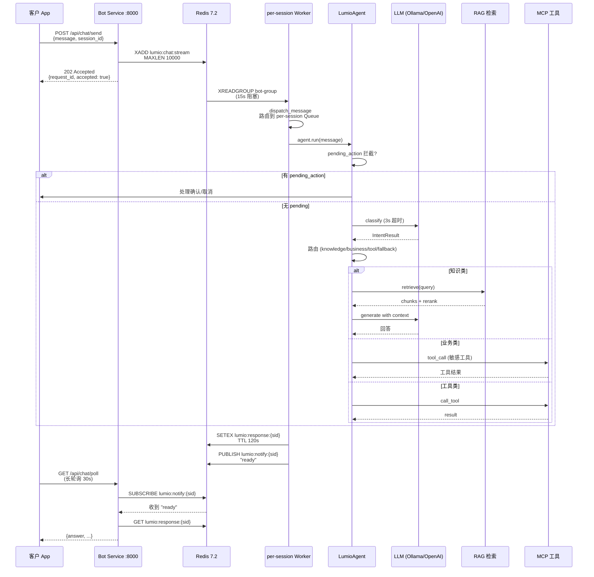
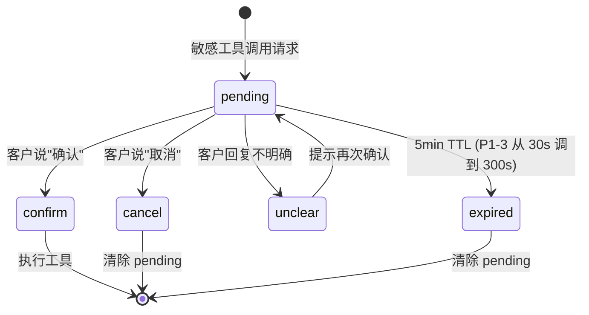

# 第 3 章: Bot 自助问答

> 本章深入 Lumio Bot 自助问答服务的全链路设计. Bot 是 Lumio 流量最大的服务, 银行客户日均百万级对话都从这里开始. 看完本章你会理解: Redis Stream 怎么用 Consumer Group 保证 at-least-once, per-session Worker 怎么保证消息有序, `LumioAgent` 怎么 6 步决策, 工具调用 + 确认状态机怎么保护客户, 3 级降级怎么在 LLM 挂时仍服务客户.

## 3.1 全链路时序图



## 3.2 入口: `POST /api/chat/send`

`agent/lumio/services/bot/router.py:951` `chat_send` 端点是整个 Bot 服务的入口. 它**不直接处理**消息, 只做两件事: 写 Redis Stream + 立即返回 202.

```python
# 简化版, 完整实现见 router.py:951-1018
@router.post("/api/chat/send")
async def chat_send(body: ChatSendRequest, request: Request) -> dict:
    """异步入口: 写 Stream + 立即返回 202"""
    # 1. 校验 (P3-7 整改: max_length=2000)
    if len(body.message) > 2000:
        raise DocumentFormatError("消息超过 2000 字符", code=2003)

    # 2. 幂等性检查 (按 request_id)
    # 3. 写 Redis Stream
    msg_id = await redis.xadd(
        "lumio:chat:stream",
        {"session_id": body.session_id, "message": body.message,
         "customer_id": body.customer_id, "request_id": body.request_id},
        maxlen=10000,  # 流最大长度, 防止 Redis 内存爆
    )
    return {"accepted": True, "request_id": body.request_id, "msg_id": msg_id}
```

**关键设计**: 立即返回 202, 不等处理. 客户端接着用 `GET /api/chat/poll` 长轮询结果. 这是**异步 API 模式** — 银行场景下, 客户电话打过来, 客服系统提交后立刻知道"已收到", 不阻塞前端.

## 3.3 Redis Stream 设计

`agent/lumio/services/bot/router.py:68-194` 集中实现 Redis Stream 的 4 个关键概念.

### 3.3.1 Consumer Group

```python
# router.py:68-77
XGROUP_CREATE_SCRIPT = """
XGROUP CREATE lumio:chat:stream bot-group $ MKSTREAM
"""
```

**Consumer Group** `bot-group` 是 Redis 5.0+ 引入的多消费者协调机制. 多个 Worker 实例共享一个组, 每条消息**只被一个 Worker 消费** (at-least-once). 这等价于 Kafka 的 partition + consumer group, 但实现更轻.

### 3.3.2 PEL (Pending Entries List) + XAUTOCLAIM

`router.py:204-265` `_claim_stale` 处理"消费者崩溃后消息卡住"问题:

```python
# 简化版
async def _claim_stale(self):
    """XAUTOCLAIM 兜底, 60s 超时 + 3 次重试转死信"""
    while True:
        claimed = await redis.xautoclaim(
            "lumio:chat:stream", "bot-group", "worker-{id}",
            min_idle_time=60_000,  # 60s 未确认
            start_id="0-0",
            count=10,
        )
        for msg_id, fields in claimed:
            retry_count = await redis.hincrby("lumio:chat:retry_count", msg_id, 1)
            if retry_count > 3:
                await redis.xadd("lumio:chat:dead_letter", fields)
                await redis.xack("lumio:chat:stream", "bot-group", msg_id)
            else:
                await self._dispatch_message(msg_id, fields)
```

**关键设计**: 60s 未确认 → 自动接管, 最多重试 3 次 → 失败转死信 `lumio:chat:dead_letter`. 防止单 Worker 崩溃导致消息丢失.

### 3.3.3 MAXLEN 10000

Stream 设上限 10000 条, 超长自动裁剪. 防止 Redis 内存无限增长. 在 dev 环境不重要, 生产环境是必选.

## 3.4 per-session Worker: 串行消费

`router.py:289-340` `_session_worker` 是个**长跑协程**, 每个 session_id 独占一个 Worker:

```python
# 简化版
async def _session_worker(self, session_id: str) -> None:
    """per-session 串行消费, 300s 空闲自动退出"""
    queue: asyncio.Queue = self._session_queues[session_id]
    while True:
        try:
            msg_id, fields = await asyncio.wait_for(queue.get(), timeout=300.0)
        except asyncio.TimeoutError:
            # 300s 无消息, 退出 Worker 释放资源
            del self._session_queues[session_id]
            return
        try:
            await self._process_message(msg_id, fields)
        except Exception as exc:
            logger.exception("process message failed", msg_id=msg_id, exc=exc)
        finally:
            await redis.xack("lumio:chat:stream", "bot-group", msg_id)
            queue.task_done()
```

**关键设计**: 同一 session 的消息**天然有序处理**, 因为一个 Worker 一个 Queue. 取消 per-session Lock, 用 asyncio.Queue 替代 (router.py:81-83 注释说明).

**300s 空闲退出**: 高峰期同时活跃 1000 session, 低谷期只 50 session, 自动伸缩.

## 3.5 `LumioAgent` 6 步决策树

`agent/lumio/services/bot/bot_agent.py:92` 是 Bot 服务的核心, 类结构清晰:

```python
# bot_agent.py:92 (简化)
class LumioAgent:
    """确定性路由主类, 纯规则引擎, LLM 仅用于内容生成"""

    def __init__(self, llm, retriever, mcp_client, ...):
        self.llm = llm
        self.retriever = retriever
        self.mcp_client = mcp_client
        self.slot_tracker = SlotTracker()
        self.memory = CustomerMemory()

    async def run(
        self, session_id: str, user_input: str, customer_id: str
    ) -> BotResponse:
        # 1. 快速问候/告别
        if is_greeting(user_input):
            return BotResponse(content=GREETING_RESPONSE, source="template")
        if is_farewell(user_input):
            return BotResponse(content=FAREWELL_RESPONSE, source="template")

        # 2. pending_action 拦截
        pending = await self.memory.get_pending_action(session_id)
        if pending:
            return await self._handle_pending_action(session_id, user_input, pending)

        # 3. 分类 (LLM, 3s 超时)
        intent = await asyncio.wait_for(
            self._classify(user_input), timeout=3.0
        )

        # 4. 路由
        if intent.label in KNOWLEDGE_INTENTS:
            return await self._handle_knowledge(session_id, user_input, intent)
        if intent.label in BUSINESS_INTENTS:
            return await self._handle_business(session_id, user_input, intent)
        if intent.label in TOOL_INTENTS and self.mcp_client.has_tool(intent.tool_name):
            return await self._handle_tool(session_id, user_input, intent)

        # 5. 兜底
        return BotResponse(content=FALLBACK_SYSTEM_PROMPT.format(input=user_input), source="fallback")
```

**关键设计**: 6 步严格顺序, 每步有 fallback. LLM 仅在第 3 步分类 + 第 4 步生成时用, 其他都是**纯规则**. 这就是"确定性路由主类"含义 — 业务流程可预测, LLM 不黑盒.

### 3.5.1 `_handle_knowledge` 知识类 (bot_agent.py:201-249)

```python
# 简化
async def _handle_knowledge(self, session_id, user_input, intent):
    # 1. RAG 检索
    chunks = await self._retrieve(user_input)
    # 2. 历史摘要 (异步, 不阻塞)
    summary_task = asyncio.create_task(self._ensure_summary(session_id))
    # 3. 拼 prompt
    context = self._build_session_memory(session_id, user_input, chunks)
    # 4. LLM 生成
    answer = await self.llm.chat(context, system=KNOWLEDGE_SYSTEM_PROMPT)
    summary_task.cancel()  # 取消未完成的摘要
    return BotResponse(content=answer, source="llm", chunks=chunks)
```

**关键设计**: 历史摘要与 LLM 生成**并行**, 摘要结果写入 Redis 供下一轮用. 这一轮不阻塞.

### 3.5.2 `_handle_business` 业务类 (bot_agent.py:250-340)

业务类更复杂, 因为涉及挂失/投诉/调额等**敏感操作**:

```python
# 简化
async def _handle_business(self, session_id, user_input, intent):
    # 1. 危险操作直接转人工
    if intent.label == IntentLabel.CARD_LOSS:
        return await self._initiate_transfer(
            session_id,
            reason="card_loss",
            template=BUSINESS_TRANSFER_TEMPLATE["card_loss"]
        )

    # 2. 有工具 → 走 MCP
    if intent.tool_name and self.mcp_client.has_tool(intent.tool_name):
        return await self._handle_tool(session_id, user_input, intent)

    # 3. 无工具 → LLM 兜底生成
    answer = await self.llm.chat(user_input, system=BUSINESS_SYSTEM_PROMPT)
    return BotResponse(content=answer, source="llm")
```

**关键设计**: `CARD_LOSS` (挂失) 不让 LLM 处理, 直接走 `_initiate_transfer` 转人工. 银行场景下, 挂失是高风险操作, 不可能让 AI 自由发挥.

### 3.5.3 `_handle_tool` 工具类 (bot_agent.py:341-401)

工具类走 MCP 工具循环, 详见 [第 17 章 工具调用与确认状态机](chapters/17-tool-calling-and-confirmation.md). 本节仅列关键摘要:

- **5 工具意图**: BILL_QUERY / TRANSACTION_QUERY / LIMIT_QUERY / INSTALLMENT_INQUIRY / REWARD_QUERY
- **渐进式暴露**: `select_tools_for_intent` 按意图+置信度裁剪, 默认关闭 (零回归)
- **4 分支循环**: 无 tool_call / 护栏拒绝 / 敏感 pending / 非敏感执行
- **5 态确认**: pending / confirm / cancel / unclear / expired, 详细状态机见 17.4 节

### 3.5.4 `_handle_pending_action` 确认状态机 (bot_agent.py:402-535)

**这是 Bot 设计最精彩的部分**. 敏感工具 (挂失/调额/兑换) 不立即执行, 而是**等客户确认**. 详细 5 态状态机 / `PendingAction` 字段 / `detect_confirmation` 关键词优先级见 [第 17.4 节 5 态确认状态机](chapters/17-tool-calling-and-confirmation.md#174-5-态确认状态机). 本节仅给个高层摘要:

```python
# 简化
async def _handle_pending_action(self, session_id, user_input, pending):
    decision = detect_confirmation(user_input)
    # decision ∈ {Confirm, Cancel, Unclear, Expired}

    if decision == Confirm:
        result = await self.mcp_client.call_tool(pending.tool_name, pending.arguments)
        await self.memory.clear_pending_action(session_id)
        return BotResponse(content=f"已执行 {pending.tool_name}: {result}", source="tool")

    if decision == Cancel:
        await self.memory.clear_pending_action(session_id)
        return BotResponse(content="已取消", source="template")

    if decision == Unclear:
        return BotResponse(content="请明确回复『确认』或『取消』", source="template")

    if decision == Expired:
        await self.memory.clear_pending_action(session_id)
        return BotResponse(content="操作已超时取消", source="template")
```

**5 态状态机图**:



**关键设计**: `pending_action` 存 Redis (`lumio:session:{id}:pending_action` Hash), 跨轮持久化. 客户这一轮说"调额到 5 万", 下一轮说"确认", 就能定位到原工具调用. `detect_confirmation` (tool_executor.py:75) 解析自然语言, **cancel 关键词优先** (规避"不确认"歧义).

## 3.6 槽位追踪: `SlotTracker`

> **本章保留摘要, 详细机制见 [第 15 章 上下文工程 §15.2 槽位注入](chapters/15-context-engineering.md)** + [附录 A.4.1 上下文工程术语](../book/appendix/A-glossary.md#a41-上下文工程术语-第-15-章).

`agent/lumio/services/bot/slot_tracker.py` 实现**多轮槽位填充**. 例如"调额到 5 万":

```python
# 简化
class SlotTracker:
    """槽位追踪, 跨轮持久化到 Redis lumio:slot:{session_id}"""

    async def fill(self, session_id: str, intent: str, slots: dict) -> dict:
        """填充槽位, 返回剩余待填槽"""
        current = await self._load(session_id, intent)
        merged = {**current, **slots}
        missing = self._check_required(intent, merged)
        await self._save(session_id, intent, merged, missing)
        return missing

    async def is_complete(self, session_id: str, intent: str) -> bool:
        return len(await self._get_missing(session_id, intent)) == 0
```

**关键设计**: 客户可能说"我想调额" → 缺 `amount` / `card_id` 槽 → Bot 问"调多少?" → "5 万" → 还缺 `card_id` → "尾号 1234 那张" → 齐了 → 触发工具调用 (但仍是敏感工具, 走确认状态机).

**7 意图 × 10 槽位映射表**:

| 意图 | 必填槽 | 可选槽 |
|---|---|---|
| INSTALLMENT_INQUIRY | amount / period | — |
| BILL_QUERY | — | period |
| LIMIT_QUERY | — | card_type |
| CARD_LOSS | card_tail | phone_number |
| COMPLAINT | issue_detail | — |
| TRANSACTION_QUERY | — | period / amount |
| REWARD_QUERY | — | card_type |

实体抽取 (entity_pool) 自动联动: `PHONE → phone_number` / `DATE → period` 等 7 映射. 完整实体→槽位映射 + 三段式 prompt 注入 (已收集/待收集/追问提示) 见 [第 15 章](chapters/15-context-engineering.md).

## 3.7 3 级降级: 不拒客

`agent/lumio/services/bot/router.py:79, 92-98` 实现了"Semaphore 满载不拒客"原则:

```python
# 简化
class BotWorkerPool:
    def __init__(self, max_concurrent: int):
        self.semaphore = asyncio.Semaphore(max_concurrent)  # 默认 10
        self._fast_replies = {
            "card_loss": "挂失请直接拨打 95xxx 或前往任一网点, 24 小时受理.",
            "overload": "系统繁忙, 您可以稍后再拨, 或直接前往任一网点.",
            ...
        }

    async def _process_with_limit(self, msg):
        if not self.semaphore.locked() or self.semaphore._value > 0:
            async with self.semaphore:
                return await self._process_message(*msg)
        # 满载走快速模板, 不阻塞客户
        BOT_FAST_REPLY.inc()
        return BotResponse(content=self._fast_replies["overload"], source="template")
```

**关键设计**: 银行客服高峰时段瞬时涌入 10x 流量, Semaphore 满载时**不能 503 拒客**, 走 `_FAST_REPLIES` 紧急话术. 客户在电话里听到"系统繁忙"是巨大舆情风险, 必须有降级话术兜底.

**降级层次** (degradation.py 完整 4 级):

| 等级 | 触发 | 行为 |
|---|---|---|
| **NORMAL** | 健康 | LLM → 检索摘要 → 模板 |
| **DEGRADED** | LLM 熔断 2 次 | 跳过 LLM → 检索摘要 → 模板 |
| **FALLBACK** | 显式触发 | 跳过 LLM → 模板 (无检索) |
| **Bot Semaphore 满** | 10 个并发 | 走 `_FAST_REPLIES` 紧急话术 |

## 3.8 文件上传 50MB 限制 (P3-7)

`agent/lumio/services/bot/router.py:1194-1270` `upload_document` 端点, P3-7 整改加上双重限制:

```python
# 简化
MAX_UPLOAD_SIZE = 50 * 1024 * 1024  # 50MB
ALLOWED_EXTENSIONS = {".pdf", ".docx", ".md", ".html", ".txt", ".xlsx"}

@router.post("/api/kb/documents")
async def upload_document(file: UploadFile, request: Request):
    # 1. Content-Length 头预检 (拒绝明显超限)
    if int(request.headers.get("content-length", 0)) > MAX_UPLOAD_SIZE:
        raise DocumentFormatError("文件超过 50MB 上限", code=2010)

    # 2. 扩展名白名单
    ext = Path(file.filename).suffix.lower()
    if ext not in ALLOWED_EXTENSIONS:
        raise DocumentFormatError(f"不支持的格式 {ext}", code=2010)

    # 3. 读 body 二次检查 (Content-Length 可能被伪造)
    content = await file.read()
    if len(content) > MAX_UPLOAD_SIZE:
        raise DocumentFormatError("文件超过 50MB 上限", code=2010)

    # 4. 上传 MinIO + 异步摄入
    ...
```

**P3-7 整改前**: 完全没有大小检查, 1MB 消息 / 1GB 文件都能进 Redis Stream + LLM, 引发 DoS 风险. 修复后, message `max_length=2000` + 文件 50MB + 扩展名白名单三道关.

## 3.9 客户画像 + 知识图谱

> **本章保留摘要, 详细机制见 [第 16 章 客户记忆与知识图谱](chapters/16-customer-memory-and-kg.md)** + [附录 A.4.2 / A.4.3 术语](../book/appendix/A-glossary.md).

`bot/customer_memory.py` 与 `bot/knowledge_graph.py` 实现**跨会话增强**:

- **CustomerMemory**: 跨 90 天 SQL `string_agg` 聚合, 推断卡种 (platinum/diamond/gold/standard) / VIP 等级 (private_banking/wealth_management/vip, max-score 评分) / 风险偏好 (R1~R4 累加). `apply_learned_profile` 用 CAS patch 写入 SessionState, **不覆盖已显式声明**.
- **KnowledgeGraph**: 5 实体 (信用卡/账单/额度/分期/挂失) × 3 关系 × 8 谓词的内存版图谱, 仅在 `_handle_knowledge` 分支注入 RAG 上下文 (Markdown `## 知识图谱补充信息:` 格式).

这些都是 Sprint 5 之后的渐进增强, 当前不是核心路径. 触发时机 / 失败兜底 / 设计取舍 (正则 vs LLM / 90 天 window / 内存版 vs Neo4j) 见 [第 16 章](chapters/16-customer-memory-and-kg.md).

## 3.10 监控指标

`shared/metrics.py` 发射 12 个 Bot 专属指标:

| 指标 | 类型 | Labels | 位置 |
|---|---|---|---|
| `lumio_fast_reply_total` | Counter | - | router.py:393 |
| `lumio_agent_responses_total` | Counter | source (llm/template/fallback/tool_*) | router.py:566 |
| `lumio_bot_semaphore_utilization` | Gauge | - | router.py:811 (0~1) |
| `lumio_active_workers` | Gauge | - | router.py:810 |
| `lumio_stream_length` | Gauge | - | router.py:809 |
| `lumio_stream_pending_total` | Gauge | - | router.py:808 (PEL pending) |
| `tool_confirmations_total` | Counter | decision (pending/confirm/cancel/unclear/expired) | bot_agent.py:416/447/458/468 (**P1-3 新增**) |
| `tool_calls_total` | Counter | tool, status | tool_executor.py:298/309 |
| `tool_guard_denials_total` | Counter | tool, reason | tool_executor.py:378 (**P1-3 新增**) |
| `http_requests_total` | Counter | method, endpoint, status | 全局 |
| `http_request_duration_seconds` | Histogram | method, endpoint | 全局 |
| `llm_call_duration_seconds` | Histogram | model, method | llm.py:174/250 |

## 3.11 测试覆盖

`agent/tests/` 中 Bot 相关测试:

- `test_bot_api.py` (e2e, CI 排除): 完整 chat 流程
- `test_bot_agent_new.py` (unit, 25+ 用例): LumioAgent 决策树
- `test_bot_memory.py` (unit, 24 用例): 客户记忆 + Redis
- `test_confirmation.py` (unit, 15 用例): 5 态确认状态机
- `test_tool_guard.py` (unit, 17 用例): 工具护栏白名单 + 额度
- `test_chat_poll.py` (e2e, CI 排除): 长轮询验证
- `test_session_lifecycle_e2e.py` (e2e, CI 排除): 会话生命周期

## 3.12 本章小结

Bot 自助问答服务是 Lumio 流量最大的入口, 设计哲学是:

- **异步 API + 长轮询**: 立即 202, 客户端 poll, 不阻塞前端
- **Redis Stream + Consumer Group**: at-least-once + 60s PEL 兜底 + 死信队列
- **per-session 串行消费**: 同一 session 消息天然有序
- **`LumioAgent` 6 步决策**: 严格规则路由, LLM 仅用于分类和生成
- **工具调用 + 5 态确认状态机**: 敏感操作等客户明确"确认"才执行
- **Semaphore 满载不拒客**: 走 `_FAST_REPLIES` 紧急话术, 银行不能拒客
- **3 级降级**: NORMAL/DEGRADED/FALLBACK, 加上 Bot 特有的 Semaphore 兜底

> **下一章预告**: [第 4 章 坐席辅助引擎](04-assist-engine.md) 深入 D1/D2/D3 + E1/E2/E3 五阶段编排 + 仲裁器融合 + WS 双模式.

---

> **延伸阅读**:
> - [第 4 章 坐席辅助引擎](04-assist-engine.md) — 坐席侧互补设计
> - [第 5 章 RAG 检索全链路](05-rag-pipeline.md) — `_retrieve` 内部细节
> - [第 7 章 MCP 工具集成](07-mcp-tool-integration.md) — 22 工具如何接入
> - [第 6 章 会话状态机](06-session-state-machine.md) — pending_action 持久化
> - [第 15 章 上下文工程](chapters/15-context-engineering.md) — 3 层上下文 + token 预算 + 增量摘要
> - [第 16 章 客户记忆与知识图谱](chapters/16-customer-memory-and-kg.md) — 跨会话画像 + 银行实体关系
> - [第 17 章 工具调用与确认状态机](chapters/17-tool-calling-and-confirmation.md) — 渐进式暴露 + 4 分支循环 + 5 态确认 + 双重护栏
