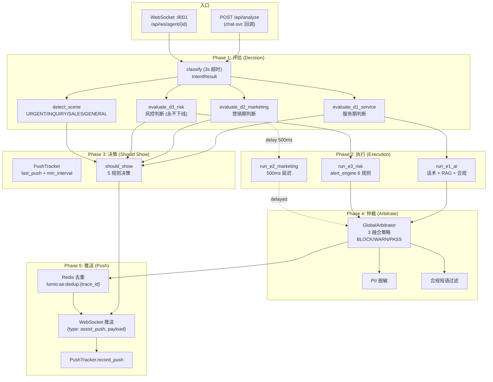

# 第 4 章: 坐席辅助引擎

> 本章深入 Lumio 坐席辅助 (Assist) 引擎. 银行坐席与客户通话时, AI 实时推送话术/知识/合规提醒 — 这是 Lumio 与普通客服系统最大的差异化能力. 看完本章你会理解: D1/D2/D3 评估器怎么决定「推不推、推什么」, E1/E2/E3 执行器怎么并行生成内容, asyncio.gather 怎么替代 Temporal 编排 5 阶段, 仲裁器怎么融合 3 路避免冲突, WebSocket 双模式怎么对接生产.

## 4.1 引擎全景图



## 4.2 入口: `POST /api/analyze` 与 WebSocket

`agent/lumio/services/assist/router.py:297` `analyze_message` 是生产主入口, chat-svc 回调使用:

```python
# router.py:297 (简化)
@router.post("/api/analyze", dependencies=[Depends(require_role("service", "admin"))])
async def analyze_message(body: AnalyzeRequest, request: Request) -> dict:
    """生产级入口: chat-svc 上传客户消息, 引擎返回推送"""
    trace_id = request.headers.get("X-Trace-Id", str(uuid4()))

    # 1. 幂等检查 (防止重试)
    if await redis.get(f"lumio:ae:dedup:{trace_id}"):
        return {"idempotent": True, "payload": None}

    # 2. 加载状态快照
    snapshot = await load_state_snapshot(body.session_id)

    # 3. 5 阶段编排 (核心)
    try:
        result = await asyncio.wait_for(
            run_assist_engine(snapshot, body, trace_id),
            timeout=5.0,  # 引擎整体 5s 超时
        )
    except asyncio.TimeoutError:
        # 兜底: 返回空 payload, 不阻塞通话
        result = AssistResult(payload=None, error="engine_timeout")

    # 4. 幂等记录
    await redis.setex(f"lumio:ae:dedup:{trace_id}", 30, "1")
    return result
```

WebSocket 双模式 (`router.py:808` per-session 测试, `router.py:866` per-agent 生产):

```python
# router.py:866 (简化)
@router.websocket("/api/ws/agent/{agent_id}")
async def assist_websocket(websocket: WebSocket, agent_id: str):
    """per-agent 生产: 一个坐席上班期间一条长连接"""
    await websocket.accept()
    # 1. JWT 验证
    user = await authenticate_websocket(websocket)
    # 2. 订阅推送
    pubsub = redis.pubsub()
    await pubsub.subscribe(f"lumio:assist:notify:{agent_id}")
    # 3. 循环
    while True:
        msg = await pubsub.get_message(ignore_subscribe_messages=True, timeout=30)
        if msg:
            await websocket.send_json(json.loads(msg["data"]))
```

**关键设计**: 生产用 `per-agent` 而非 `per-session`. 一个坐席一天处理 30-50 个客户, 如果 per-session 重连 30-50 次, 反而浪费. Per-agent 一次性连接, 推送通过 Redis Pub/Sub 路由.

## 4.3 评估器 D1/D2/D3

`agent/lumio/services/common/decision.py` 集中三个评估器, 命名规则:

- **D = Decide** (决策)
- **1/2/3 = 服务/营销/风控** 三个业务域

### 4.3.1 D1 服务评估器 (`decision.py:123-180`)

```python
# 简化
async def evaluate_d1_service(state_snapshot) -> D1Result:
    """判断当前是否在『服务期』, 服务期内不推营销"""
    intents = state_snapshot.intent_stack[-3:]  # 最近 3 个意图
    # 服务类意图 → 服务期
    if any(i in SERVICE_INTENTS for i in intents):
        return D1Result(active=True, suppress_marketing=True, rounds=2)

    # 风控类意图 → 紧急期 (最高优先)
    if any(i in RISK_INTENTS for i in intents):
        return D1Result(active=True, suppress_marketing=True, rounds=5, urgent=True)

    return D1Result(active=False)
```

**关键设计**: `suppress_marketing=True` + `rounds=2` 表示: 服务期内**接下来 2 轮**都压制营销推送. 这避免"客户说挂失, AI 推信用卡年费优惠"的灾难场景.

### 4.3.2 D2 营销评估器 (`decision.py:182-256`)

```python
# 简化
async def evaluate_d2_marketing(state_snapshot) -> D2Result:
    """判断当前是否推营销, 走产品目录匹配"""
    if state_snapshot.suppress_flag:
        return D2Result(active=False, reason="suppressed_by_d1")

    # 客户情绪 + 意图匹配
    sentiment = state_snapshot.emotion_vector.dominant
    intent = state_snapshot.intent_stack[-1] if state_snapshot.intent_stack else None

    # 找到匹配的产品
    products = product_catalog.find_matches(intent=intent, sentiment=sentiment)
    if not products:
        return D2Result(active=False, reason="no_match")

    return D2Result(
        active=True,
        products=products,
        defer_ms=500 if state_snapshot.service_active else 0,  # 服务期延迟 500ms
    )
```

**关键设计**: `defer_ms=500` 表示服务期激活时, 营销推送延迟 500ms 让服务提示先出. 这是体感优化细节.

### 4.3.3 D3 风控评估器 (`decision.py:258-310`)

```python
# 简化
async def evaluate_d3_risk(_state_snapshot) -> D3Result:
    """风控永不下线, 任何时候都跑"""
    return D3Result(active=True, severity="always")
```

**关键设计**: D3 是**唯一永不下线**的评估器. 合规要求: 即使 LLM 挂了, 即使所有降级, 风控告警必须能推. 任何 `should_show` 决策中, `risk` 永远是硬规则.

## 4.4 执行器 E1/E2/E3

评估后, 执行器**并行**生成内容:

### 4.4.1 E1 AI 执行器 (`ai_executor.py:23-180`)

```python
# 简化
class AIExecutor:
    """三路并行: 话术 + RAG + 合规短语"""

    async def run(self, snapshot) -> E1Result:
        # 三路并行
        script_task = asyncio.create_task(self._script_service.match(snapshot))
        rag_task = asyncio.create_task(self._retriever.retrieve(snapshot.query))
        compliance_task = asyncio.create_task(self._safety.check(snapshot.text))

        # gather + 全部成功才返回
        script, chunks, compliance = await asyncio.gather(
            script_task, rag_task, compliance_task
        )

        if not compliance.safe:
            return E1Result(blocked=True, reason=compliance.hit_words)

        # LLM 生成话术 (用 chunks 作为上下文)
        answer = await self.llm.chat(snapshot.query, context=chunks)
        return E1Result(answer=answer, script=script, chunks=chunks)
```

**关键设计**: 三路**严格并行**, 任一失败不影响其他. `compliance` 失败直接 block, 这是 PII + 合规的双重保险.

### 4.4.2 E2 营销执行器 (`marketing_executor.py:19-150`)

```python
# 简化
class MarketingCard:
    """营销卡片生成"""
    def __init__(self, product_catalog, llm):
        self.products = product_catalog
        self.llm = llm

    async def evaluate(self, intent, sentiment, customer_id) -> list[MarketingCard]:
        products = self.products.find_matches(intent=intent, sentiment=sentiment)
        if not products:
            return []

        # 个性化文案
        cards = []
        for p in products[:2]:  # 最多 2 张卡片
            copy = await self.llm.generate(
                prompt=f"为产品 {p.name} 生成 1 句营销话术, 客户 {customer_id}, 意图 {intent}",
            )
            cards.append(MarketingCard(product=p, copy=copy))
        return cards
```

### 4.4.3 E3 风控执行器 (`alert_engine.py:76-220`)

```python
# 简化
class AlertEngine:
    """质检告警引擎: 6 条种子规则"""
    RULES = [
        Rule(id="R-COMP-001", name="禁止承诺", check=contains_promise_words),
        Rule(id="R-COMP-002", name="禁止透露他人信息", check=mentions_other_customer),
        Rule(id="R-COMP-003", name="情绪异常升级", check=negative_sentiment_threshold),
        Rule(id="R-EMOTION-001", name="客户愤怒", check=anger_score_gt_0.8),
        Rule(id="R-SILENCE-001", name="长时间沉默", check=silence_duration_gt_30s),
        Rule(id="R-PROCESS-001", name="未走完流程", check=missed_required_step),
    ]

    async def evaluate(self, snapshot) -> list[Alert]:
        alerts = []
        for rule in self.RULES:
            if await rule.check(snapshot):
                alerts.append(Alert(rule=rule, severity=rule.severity))
        return alerts
```

**6 条种子规则**:
- **R-COMP-001/002**: 合规类, 承诺/泄密
- **R-EMOTION-001**: 情绪类, 愤怒阈值
- **R-SILENCE-001**: 沉默类, 30s+ 静默
- **R-PROCESS-001**: 流程类, 漏步骤

## 4.5 5 阶段编排: asyncio.gather 替代 Temporal

`agent/lumio/services/common/assist_engine.py:171-220` 是核心入口:

```python
# assist_engine.py:171 (简化)
async def run_assist_engine(snapshot, body, trace_id) -> AssistResult:
    # Phase 1: 评估器并行
    classify_task = asyncio.create_task(classifier.classify(body.text, timeout=3.0))
    d1_task = asyncio.create_task(evaluate_d1_service(snapshot))
    d2_task = asyncio.create_task(evaluate_d2_marketing(snapshot))
    d3_task = asyncio.create_task(evaluate_d3_risk(snapshot))

    try:
        classify, d1, d2, d3 = await asyncio.wait_for(
            asyncio.gather(classify_task, d1_task, d2_task, d3_task),
            timeout=2.0,
        )
    except asyncio.TimeoutError:
        # 分类超时用缓存, D1/D2/D3 至少 D3 必返回
        classify = await classifier.classify_cached(snapshot.session_id) or classify_fallback()
        d1, d2 = D1Result(active=False), D2Result(active=False)
        d3 = D3Result(active=True, severity="always")

    # Phase 2: 执行器并行
    e1_task = asyncio.create_task(e1_executor.run(snapshot))
    e3_task = asyncio.create_task(e3_alert_engine.evaluate(snapshot))
    e1, e3 = await asyncio.gather(e1_task, e3_task)

    # E2 延迟 500ms 避开服务期
    if d2.active and d2.defer_ms > 0:
        await asyncio.sleep(d2.defer_ms / 1000)
    e2 = await e2_marketing.evaluate(classify.intent, classify.sentiment, snapshot.customer_id)

    # Phase 3: 决策 should_show
    scene = detect_scene(classify.intent, classify.sentiment)
    primary = should_show("script", scene, snapshot, e1)  # 主推
    risk = should_show("risk", scene, snapshot, e3, force=True)  # 风控必推
    marketing = should_show("marketing", scene, snapshot, e2)

    # Phase 4: 仲裁
    payload = GlobalArbitrator.arbitrate(primary, risk, marketing, snapshot)

    # Phase 5: 推送 + 追踪
    if payload:
        await push_tracker.record_push(snapshot.session_id, payload)
    return AssistResult(payload=payload, trace_id=trace_id)
```

**关键设计**:
1. **asyncio.gather 并行评估器**: 4 个评估 200ms 内全返回
2. **超时 fallback**: 任一超时, D3 仍必返回 (风控永不下线)
3. **E2 延迟 500ms**: 服务期内不抢风头
4. **should_show 5 规则**: 见下
5. **仲裁融合**: 3 路合并去重

## 4.6 决策矩阵: `should_show` 5 规则

`agent/lumio/services/common/decision.py:258-310`:

```python
# 简化
def should_show(
    card_type: str,  # "script" / "risk" / "marketing"
    scene: Scene,
    tracker: PushTracker,
    payload: Any,
    force: bool = False,
) -> Optional[Any]:
    """5 规则决策"""
    # 规则 1: 硬规则 - 风控 BLOCK 必推, PASS 不推
    if card_type == "risk":
        if payload.severity == "BLOCK":
            return payload
        if payload.severity == "PASS":
            return None

    # 规则 2: 强制推 (D3 风控场景)
    if force:
        return payload

    # 规则 3: 时间窗 - 距上次推送 < min_interval 不推
    if tracker.last_push_at and (now - tracker.last_push_at) < tracker.min_interval:
        return None

    # 规则 4: 反馈历史 - 客户连续 3 次 dismiss 不推
    if tracker.consecutive_dismiss >= 3:
        return None

    # 规则 5: 场景适配 - SALES 场景不推知识, INQUIRY 场景不推营销
    if card_type == "marketing" and scene == Scene.INQUIRY:
        return None
    if card_type == "script" and scene == Scene.SALES:
        return None

    return payload
```

**5 规则总结**:

| 规则 | 类型 | 适用 |
|---|---|---|
| 1 硬规则 | 阻断/放行 | 风控永远特殊 |
| 2 强制 | 覆盖 | D3 场景 |
| 3 时间窗 | 避免刷屏 | 全部 |
| 4 反馈 | 客户体验 | 全部 |
| 5 场景适配 | 业务正确性 | 全部 |

## 4.7 仲裁器: 3 融合策略

`agent/lumio/services/assist/arbitrator.py:77-220` `GlobalArbitrator` 解决 3 路冲突:

```python
# 简化
class GlobalArbitrator:
    """3 融合策略 + PII 脱敏 + 合规短语过滤"""

    @staticmethod
    def arbitrate(primary, risk, marketing, snapshot) -> Optional[Payload]:
        # 1. 风控最高优先: BLOCK 阻断一切, WARN 警告
        if risk and risk.severity == "BLOCK":
            return Payload(
                type="risk_block",
                content=risk.message,
                fusion_type="BLOCK",
                suppresses=("script", "marketing"),
            )

        # 2. 营销 vs 主推冲突
        if marketing and primary and conflict(primary, marketing):
            # 主推胜出, 营销降级
            marketing = downgrade(marketing)
            ASSIST_ARBITRATION_CONFLICT.inc()

        # 3. PII 脱敏
        if primary:
            primary.content = mask_pii(primary.content)
        if marketing:
            marketing.copy = mask_pii(marketing.copy)

        # 4. 合规短语过滤
        primary.content = filter_compliance_phrases(primary.content)
        marketing.copy = filter_compliance_phrases(marketing.copy)

        # 5. 拼装 payload
        return Payload(
            type="assist_push",
            primary_card=primary,
            risk_badge=risk if risk and risk.severity == "WARN" else None,
            marketing_slot=marketing,
            fusion_type="WARN" if risk and risk.severity == "WARN" else "PASS",
        )
```

**3 融合策略**:

| 策略 | 含义 | 行为 |
|---|---|---|
| **BLOCK** | 阻断 | 只显示风控告警, 压制所有其他推送 |
| **WARN** | 警告 | 主推 + 风控徽章 + 营销降级 |
| **PASS** | 通过 | 正常 3 路全推 |

## 4.8 3s 延迟反馈 (H2 整改)

`router.py:630-700` `record_feedback` 端点实现**3s 延迟确认**:

```python
# router.py:630 (简化)
@router.post("/api/feedback")
async def record_feedback(body: FeedbackRequest, request: Request):
    """3s 延迟确认: 写 Redis 缓冲, 期间可撤销"""
    # 1. 写 Redis 缓冲
    buffer_key = f"lumio:assist:feedback:{body.session_id}:{body.agent_id}"
    await redis.setex(buffer_key, 3, json.dumps(body.dict()))

    # 2. 3s 后异步提交
    async def commit_after_delay():
        await asyncio.sleep(3.0)
        # 提交到 push_tracker
        await push_tracker.record_feedback(body.session_id, body)
        await redis.delete(buffer_key)

    asyncio.create_task(commit_after_delay())
    return {"status": "buffered", "undo_window": 3}
```

**关键设计**: 客户点"忽略/没用"后, 坐席想撤销, 有 3s 窗口. 这比立即提交友好, 符合 H2 人类工程学 (Human-Computer Interaction). 详细见 [附录 B](appendix/B-sprint-timeline.md#h2-3s-延迟确认).

## 4.9 话后小结生成

`agent/lumio/services/assist/summary.py:33-180` `generate_call_summary` 通话结束自动生成:

```python
# summary.py:33 (简化)
async def generate_call_summary(session_id, session_manager, llm):
    """话后小结, LLM JSON 模式"""
    # 1. 拉取完整对话历史
    history = await session_manager.get_full_history(session_id)

    # 2. LLM 生成结构化 JSON
    prompt = f"""根据以下通话, 生成结构化小结:
    客户意图: ...
    坐席操作: ...
    风险事件: ...
    客户反馈: ...

    {history}

    输出 JSON: {{"summary": "...", "key_points": [...], "action_items": [...], "risk_flags": [...]}}
    """
    response = await llm.chat_json(prompt, schema=CallSummary)

    # 3. 异步落库
    await dialogue_log_repo.insert(session_id, response)
    return response
```

**关键设计**: LLM JSON 模式 (response_format=json_object) + Pydantic `CallSummary` 校验, 失败重试 1 次.

## 4.10 从 Temporal → asyncio.gather 的迁移故事

Sprint 1-4 用过 Temporal Workflow 编排 D1/D2/D3 + E1/E2/E3. Sprint 5 决定迁移, 详见 [附录 B](appendix/B-sprint-timeline.md#sprint-5-assist-引擎). 关键决策依据:

1. **运维成本**: Temporal 需独立 Server + Namespace + Worker, 部署复杂
2. **调试**: Temporal Web UI 才能看 trace, 调试不能直接看 Jaeger
3. **依赖**: Python + Java SDK 双维护
4. **业务规模**: 5 阶段 < 5s, 协程足够

迁移后:
- 节省 1 个外部服务 (Temporal Server)
- 跨服务 trace 全在 Jaeger, 调试更直观
- 代码量减少 (P1-2 commit 删了 800+ 行 Temporal 相关)

## 4.11 监控指标

Assist 引擎发射 8 个核心指标 (assist_engine.py:47-120):

| 指标 | 类型 | Labels |
|---|---|---|
| `lumio_assist_engine_decisions_total` | Counter | scene, decision (push/suppress) |
| `lumio_assist_engine_latency_seconds` | Histogram | phase (classify/d1/d2/d3/e1/e2/e3/arbitrate) |
| `lumio_assist_engine_degradation_total` | Counter | agent, reason (ai/risk/no_executor/breaker_open/timeout) |
| `http_requests_total` / `http_request_duration_seconds` | 全局 | |
| `session_transitions_total` | Counter | 5 labels |
| `session_phase_duration_seconds` | Histogram | sub_phase (**P1-3 新增**) |
| `tool_guard_denials_total` | Counter | tool, reason (**P1-3 新增**) |
| `llm_call_duration_seconds` | Histogram | model, method |

## 4.12 测试覆盖

`agent/tests/` 中 Assist 相关:

- `test_assist_engine.py` (20+ 用例): 5 阶段编排 + 降级
- `test_arbitrator.py` (22 用例): 3 融合策略
- `test_decision.py` (44 用例, **TOP 1**): D1/D2/D3 + should_show 决策表
- `test_alert_engine.py` (15 用例): 6 条种子规则
- `test_script_service.py` (12 用例): 话术服务
- `test_product_catalog.py` (10 用例): 4 种子产品
- `test_assist_api.py` (e2e, CI 排除): 完整 WS 流程
- `test_observability.py` (18 用例): 指标 + tracing

## 4.13 本章小结

坐席辅助引擎是 Lumio 区别于普通客服系统的核心:

- **D1/D2/D3 评估器**: 服务/营销/风控三域, 风控永不下线
- **E1/E2/E3 执行器**: AI 三路并行, E2 延迟 500ms 避服务期
- **5 阶段编排**: asyncio.gather 替代 Temporal, 节省 1 个外部服务
- **should_show 5 规则**: 硬规则 + 强制 + 时间窗 + 反馈 + 场景适配
- **仲裁器 3 融合**: BLOCK / WARN / PASS, PII + 合规双重保险
- **WebSocket 双模式**: per-session 测试 + per-agent 生产
- **3s 延迟反馈**: H2 人类工程学, 坐席可撤销

> **下一章预告**: [第 5 章 RAG 检索全链路](05-rag-pipeline.md) 深入 BM25 + 向量 + RRF 融合 + 父-子分块 + 双写回滚.

---

> **延伸阅读**:
> - [第 3 章 Bot 自助问答](03-bot-self-service.md) — 互补入口
> - [第 5 章 RAG 检索全链路](05-rag-pipeline.md) — E1 中的 RAG 检索
> - [第 6 章 会话状态机](06-session-state-machine.md) — 状态快照
> - [第 7 章 MCP 工具集成](07-mcp-tool-integration.md) — E1 中的工具调用
> - [第 17 章 工具调用与确认状态机](chapters/17-tool-calling-and-confirmation.md) — 渐进式暴露 + 5 态确认 + 双重护栏
