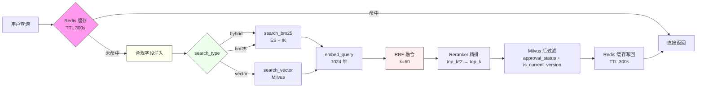
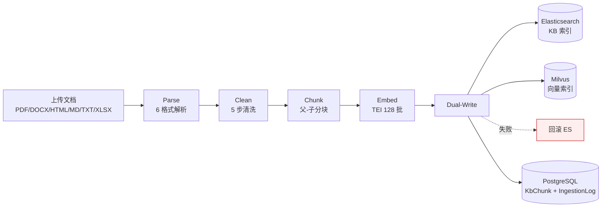
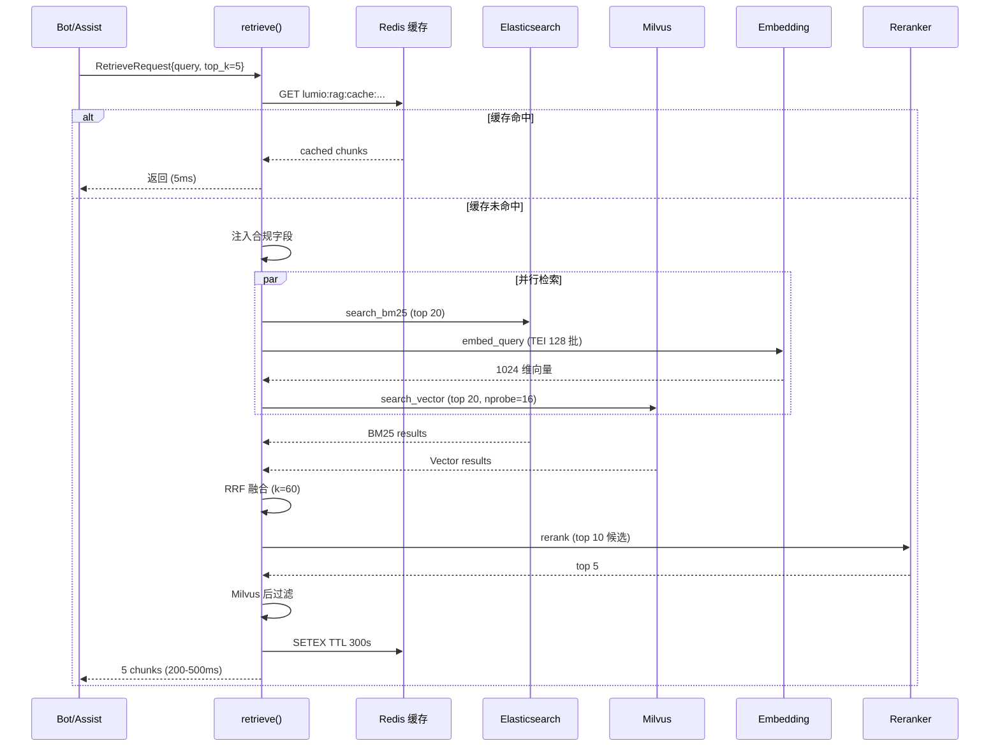

# 第 5 章: RAG 检索全链路

> 本章深入 Lumio RAG (检索增强生成) 全链路. 银行客服 80% 的问题靠知识库回答 — "信用卡年费多少? 怎么免年费? 积分怎么用?", RAG 链路质量直接决定客户体验. 看完本章你会理解: BM25 + 向量 + RRF 三路召回怎么互补, 父-子分块怎么同时满足检索粒度 + 生成粒度, ES + Milvus 双写 + 回滚怎么保证一致性, 银行合规字段怎么硬注入, 4 路径降级矩阵怎么在 ES/Milvus 不可用时仍服务.

## 5.1 检索全景图

**怎么读这张图**: 客户问"信用卡年费多少", 系统要做四件事 — ① 先看缓存 (5 分钟内问过同样问题? 直接复用); ② 加合规过滤 (只查**已发布、当前版本**的条文, 草稿和旧版绝不能答给客户); ③ 双通道检索 (关键词搜索 + 语义搜索, 谁都不能全信); ④ 精排 + 回填缓存.



### 5.1.1 双通道检索 — "为什么两条路都要走"

客户问"年费多少", 有两种找法:

- **BM25 关键词检索** (ES): 像用 Ctrl+F 搜文档 — 找"年费"两个字在哪出现. 优点: 快、准、不依赖模型; 缺点: 客户说"一年收多少钱"就搜不到"年费"
- **向量语义检索** (Milvus): 像让 AI 理解意思 — "一年收多少钱" 和 "年费" 在语义上相近, 能匹配上. 优点: 懂同义词、口语; 缺点: 依赖模型质量, 可能跑偏

**单走一条路的后果**: 只走关键词, 客户换种说法就查不到 (体验差); 只走语义, 生僻专业词可能匹配错 (风险高). 两条路都走, 再用 RRF 融合排序 — 两条路都找到的条文排最前, 只有一条路找到的靠后. 这就是**三路召回 + 融合**的核心价值.

## 5.2 入口: `RetrieveRequest`

`agent/lumio/services/common/retrieval.py:400-410` 是 RAG 入口:

```python
# retrieval.py:400 (简化)
class RetrieveRequest(BaseModel):
    query: str
    top_k: int = 5
    search_type: Literal["hybrid", "bm25", "vector"] = "hybrid"
    filters: dict | None = None
    rerank: bool = True
    use_reranker_threshold: bool = False
    confidence_threshold: float = 0.5
```

**5 字段核心**:
- `query`: 用户原始查询
- `top_k`: 返回数量, 默认 5
- `search_type`: 3 种检索模式 (hybrid / bm25 / vector)
- `filters`: ES 过滤器 (keyword/date/keywords 三类, retrieval.py:48-80)
- `rerank`: 是否启用重排序

## 5.3 4 路径降级矩阵

**业务场景**: 检索依赖两个系统 — ES (关键词) 和 Milvus (语义). 生产环境任何中间件都可能挂: ES 磁盘满、Milvus 的 etcd 抖动、嵌入模型超时. 客户可不管这些 — 他只知道"我问了问题, 系统得答". 所以检索的设计原则和 Bot 一致: **能答多少答多少, 绝不因为一个组件挂了就整个瘫痪**.

**4 种故障场景的应对** (对应下面的矩阵):
- 都正常 → 双通道 + 融合, 质量最好
- Milvus 挂了 → 只用关键词检索 (BM25) — 客户换个说法可能搜不到, 但常见问法没问题
- ES 挂了 → 只用语义检索 — 生僻词可能不准, 但大部分问题能答
- 都挂了 → 返回空, 由上层降级链兜底 (第 3 章讲过的模板话术)

`retrieval.py:419-425` 是核心降级矩阵:

```python
# retrieval.py:419 (简化)
async def retrieve(request, es_client, milvus_collection, embedding_provider, reranker, redis_client):
    # 0. 缓存检查
    cache_key = _build_cache_key(request.query, request.filters, request.search_type)
    cached = await redis_client.get(cache_key)
    if cached and request.search_type != "vector":  # vector_only 不缓存
        return json.loads(cached)

    # 1. 合规字段注入 (强制, 任何路径都加)
    es_filters = build_es_filters(request.filters)
    es_filters["approval_status"] = "PUBLISHED"
    es_filters["is_current_version"] = True
    es_filters["effective_date_lte"] = today_iso

    # 2. 三路检索 (按 search_type)
    bm25_task = None
    vector_task = None

    if request.search_type in ("hybrid", "bm25"):
        bm25_task = asyncio.create_task(search_bm25(es_client, request.query, top_k=20, filters=es_filters))

    if request.search_type in ("hybrid", "vector"):
        try:
            query_embedding = await embed_query(embedding_provider, request.query)
            vector_task = asyncio.create_task(search_vector(milvus_collection, query_embedding, top_k=20))
        except EmbeddingTimeoutError:
            # 嵌入失败 → 强制降级到 bm25_only
            logger.warning("embedding unavailable, fallback to bm25_only")
            request.search_type = "bm25"
            vector_task = None

    # 3. 降级矩阵
    if bm25_task and vector_task:
        bm25_results, vector_results = await asyncio.gather(bm25_task, vector_task)
        fused = rrf_fusion(bm25_results, vector_results, k=60)
    elif bm25_task:
        bm25_results = await bm25_task
        fused = bm25_results  # 单路, 无融合
    elif vector_task:
        vector_results = await vector_task
        fused = vector_results
    else:
        return []  # 双双不可用, 空结果

    # 4. 重排序
    if request.rerank and reranker:
        try:
            fused = await asyncio.to_thread(reranker.rerank, request.query, fused[:request.top_k*2])
        except Exception as exc:
            logger.warning("reranker failed, fallback to RRF", exc=exc)

    # 5. Milvus 后过滤 (effective_date)
    fused = [c for c in fused if c.is_current_version]

    # 6. 截 top_k
    result = fused[:request.top_k]

    # 7. 缓存写回
    if result and request.search_type != "vector":
        await redis_client.setex(cache_key, 300, json.dumps([c.dict() for c in result]))

    return result
```

**4 路径降级矩阵**:

| ES | Milvus | 行为 | 触发场景 |
|---|---|---|---|
| ✓ | ✓ | Hybrid + RRF | 正常 |
| ✓ | ✗ | BM25 only | Milvus 挂 |
| ✗ | ✓ | Vector only | ES 挂 |
| ✗ | ✗ | 空结果 | 双挂 |

**并行任务防御**: `vector_task: asyncio.Task | None = None` 初始化, 仅在任务确实创建后 cancel — 避免并发路径下引用未赋值任务.

## 5.4 BM25 检索: ES + IK

`retrieval.py:140-225` `search_bm25` 用 ES 8.19 + IK 中文分词:

```python
# retrieval.py:140 (简化)
async def search_bm25(es_client, query, top_k, filters):
    """BM25 检索, ES + IK 中文分词"""
    body = {
        "query": {
            "bool": {
                "must": [{
                    "match": {
                        "content": {
                            "query": query,
                            "analyzer": "ik_max_word",  # 细粒度切分
                            "minimum_should_match": "75%",
                        }
                    }
                }],
                "filter": [{"term": {k: v}} for k, v in filters.items()],
            }
        },
        "highlight": {
            "fields": {"content": {"number_of_fragments": 2, "fragment_size": 200}}
        },
        "size": top_k,
    }
    response = await es_client.search(index="lumio_kb_chunks", body=body)
    return [_build_chunk(hit) for hit in response["hits"]["hits"]]
```

**关键设计**:
- `ik_max_word` 细粒度切分: 命中更精准
- `minimum_should_match=75%`: 至少匹配 75% 词
- `highlight`: 返回高亮片段, 帮客户定位
- 后续 `_build_chunk` 还做 `parent_chunk_id` 回填

## 5.5 向量检索: Milvus

`retrieval.py:228-340` `search_vector` 用 Milvus IVF_FLAT:

```python
# retrieval.py:228 (简化)
async def search_vector(milvus_collection, query_embedding, top_k, filters):
    """向量检索, Milvus IVF_FLAT COSINE"""
    search_params = {"metric_type": "COSINE", "params": {"nprobe": 16}}
    # nprobe=16 查 16 个聚类桶, 平衡精度/速度
    results = milvus_collection.search(
        data=[query_embedding],
        anns_field="embedding",
        param=search_params,
        limit=top_k,
        expr=build_milvus_expr(filters),  # field == "value" + ARRAY_CONTAINS
    )
    return [_build_chunk(hit) for hit in results[0]]
```

**关键设计**:
- 1024 维 (bge-large-zh-v1.5)
- `nprobe=16`: 16 个聚类桶, 命中率 ~95%, 延迟 < 50ms
- `metric_type=COSINE`: 余弦相似度, 文本语义标准
- `build_milvus_expr`: 表达式过滤 (`approval_status == "PUBLISHED" and keywords_array contains "信用卡"`)

## 5.6 RRF 融合

`retrieval.py:344-396` `rrf_fusion` 实现倒数排名融合:

```python
# retrieval.py:344 (简化)
def rrf_fusion(bm25_results, vector_results, k=60):
    """Reciprocal Rank Fusion: score = 1/(k+rank)"""
    scores: dict[str, float] = {}  # chunk_id -> total score
    chunks: dict[str, RetrievedChunk] = {}

    for rank, chunk in enumerate(bm25_results, start=1):
        scores[chunk.id] = scores.get(chunk.id, 0) + 1.0 / (k + rank)
        chunks[chunk.id] = chunk

    for rank, chunk in enumerate(vector_results, start=1):
        scores[chunk.id] = scores.get(chunk.id, 0) + 1.0 / (k + rank)
        chunks[chunk.id] = chunk

    # 排序
    sorted_ids = sorted(scores, key=scores.get, reverse=True)
    return [chunks[i] for i in sorted_ids]
```

**RRF 公式**: `score(d) = Σ 1/(k + rank_d)` 其中 k=60 是常数. 优势:

1. **无需训练**: 不需要学习权重
2. **互补召回**: BM25 关键词精确, 向量语义相似, 两者取长补短
3. **去重**: 同一 chunk 在两路都出现, 分数累加, 自然上升

`k=60` 来自 Cormack et al. 2009 论文, 经验最优值.

## 5.7 重排序

`agent/lumio/services/common/reranker.py` 独立模块, 当前用 `OllamaReranker` (本地) 或 `TEIReranker` (生产):

```python
# reranker.py:45 (简化)
class OllamaReranker:
    """ThreadPoolExecutor 并发评分 (10 worker)"""
    def __init__(self, base_url: str, model: str = "bge-reranker-large"):
        self.base_url = base_url
        self.model = model
        self.executor = ThreadPoolExecutor(max_workers=10)

    def rerank(self, query: str, chunks: list[RetrievedChunk]) -> list[RetrievedChunk]:
        """并发评分所有候选, 按相关性降序"""
        # 1. 并发评分
        scored = list(self.executor.map(
            lambda c: (c, self._score(query, c.content)),
            chunks,
        ))
        # 2. 排序
        scored.sort(key=lambda x: x[1], reverse=True)
        # 3. 返回
        return [c for c, _ in scored]
```

**关键设计**:
- 候选 `top_k*2 = 10` 送入 reranker, 精排后取 `top_k = 5`
- `ThreadPoolExecutor(10)`: reranker 是 CPU 密集, 用线程池
- 失败 fallback 到 RRF 结果, 不阻塞

## 5.8 父-子分块 (Parent-Child Chunking)

`ingestion.py:585-595` 实现父-子分块:

```python
# ingestion.py:585 (简化)
# 1. 父块 (1500 字符) - 一次性切成
parents = chunk_text(cleaned, chunk_size=1500, overlap=200)

# 2. 子块 (300 字符) - 每个父块再切
for parent in parents:
    parent.children = chunk_text(parent.content, chunk_size=300, overlap=50, parent_id=parent.id)

# 3. 检索用子块嵌入 + 存父块内容
for child in all_children:
    child.embedding = await embedder.embed(child.content)
    child.parent_content = parent.content  # 拼父块, 给生成阶段
```

**关键设计**:
- **检索粒度小**: 300 字符子块, 语义聚焦
- **生成粒度大**: 1500 字符父块, 上下文完整
- **跨块关联**: 命中子块后, `parent_content` 字段存整个父块, 生成阶段直接用

**示意**:

```
父块 1 (1500 字符: "信用卡年费政策...")
├── 子块 1.1 (300 字符: "信用卡年费政策介绍...")  ← 检索命中
├── 子块 1.2 (300 字符: "年费减免条件...")
└── 子块 1.3 (300 字符: "积分兑换年费...")
```

客户问"年费怎么免", 命中 1.1, 拿父块 1 完整 1500 字符喂 LLM, LLM 看完整上下文给精准回答.

## 5.9 银行合规字段硬注入

`retrieval.py:460-468` 强制注入 3 个合规字段:

```python
# retrieval.py:460 (简化)
es_filters = build_es_filters(request.filters)
# 强制注入, 业务层零感知
es_filters["approval_status"] = "PUBLISHED"  # 只查已发布
es_filters["is_current_version"] = True       # 只查当前版本
es_filters["effective_date_lte"] = today_iso  # 生效日期 <= 今天
```

**Milvus 侧后过滤** (`retrieval.py:560-575`, 第五轮加固):

```python
# 简化 (第五轮修复后: 严格判定, 缺失字段视为不合规, 不做默认放行)
fused = [
    c for c in fused
    if c.metadata.get("approval_status") == "PUBLISHED"
    and str(c.metadata.get("is_current_version", "")).lower() == "true"
]
```

**关键设计**:
- 任何 `RetrieveRequest` 都自动加这 3 个过滤, 业务代码无法绕过
- 双层防护: ES 索引层 + Milvus 内存层
- 合规字段 (`approval_status` / `is_current_version`) 已写入 Milvus 标量 schema (init_milvus) 与 ingestion 插入数据, 后过滤读的是**真实值**而非默认值 — 此前 Milvus 无此字段, `metadata.get(key, 默认放行)` 让未审批文档经向量检索泄露
- 测试用例: `test_retrieval.py:18-25` `test_compliance_filter_mandatory`

**5 阶段文档审批流** (`shared/orm_models.py` `KbApprovalStatus`):

```
DRAFT → IN_REVIEW → APPROVED → PUBLISHED → SUPERSEDED
                              → REJECTED
                              → ARCHIVED
```

只有 `PUBLISHED` 状态才被检索, `DRAFT` (草稿) / `IN_REVIEW` (审核中) / `SUPERSEDED` (被替代) 都自动屏蔽. 审批链端点 (approve/reject/publish/archive) 已加 admin 角色校验.

## 5.10 缓存层

`retrieval.py:121-135` 缓存键 + `retrieval.py:585-602` 缓存写回:

```python
# 简化 (第五轮修复后: key 含 include_expired/rerank 维度)
def _build_cache_key(query, filters, search_type, include_expired=False, rerank=False):
    query_hash = md5(query.encode()).hexdigest()[:16]
    filters_hash = md5(json.dumps(filters, sort_keys=True).encode()).hexdigest()[:16]
    key = f"lumio:rag:cache:{search_type}:{query_hash}:{filters_hash}"
    if include_expired: key += ":exp"   # 过期文档结果不与默认请求互用
    if rerank: key += ":rerank"         # 精排结果与未精排结果不互用
    return key

# 写回
if result and request.search_type != "vector":
    await redis_client.setex(cache_key, 300, json.dumps([c.dict() for c in result]))
```

**维度隔离动机**: 缓存 key 此前只含 query/filters/search_type — `include_expired=True` 请求 (不加日期过滤) 的结果写入缓存后, 默认请求命中同一 key 会拿到含过期文档的结果; `rerank=True` 请求也会拿到未精排的缓存. 加后缀后两类结果物理隔离.

**关键设计**:
- TTL 300s: 5 分钟内同 query+filters 命中缓存, 节省 1 次 LLM/embedding 调用
- **vector_only 不缓存**: 向量查询个性化强 (customer_id 不同结果不同), 缓存命中率低且会污染
- 命中率指标: `lumio_retrieval_cache_hit_total` (Counter, label=hit/miss)

**全链路接线**: Bot Agent 检索路径 (`bot_agent._retrieve`) 把 `session_manager._redis` 传入
`retrieve(redis_client=...)` — 缓存读写在知识问答路径真实生效. 相同问题 5 分钟内重复问 =
直接命中缓存, 不再重复打 ES/Milvus + embedding + rerank.

## 5.10a 重复提问检测 (多轮对话)

知识问答入口先做**归一化重复检测** — 与上一轮客户消息归一化后相同 → 直接复用上次回答:

```python
# bot_agent._detect_repeat_question (简化)
norm = self._normalize_question(user_input)   # 去标点/空白/语气词 ("额度多少？" → "额度多少")
history = await self._session_manager.get_history(session_id, limit=4)
# 找到相同客户消息 → 返回其后的 Bot 回答 (source="repeat")
```

- **轻量精确匹配**而非语义相似度 — 不误伤"额度多少"→"额度怎么提升"这类真实新问题
- 短消息 (<4 字符) 不判定, 避免"好的"/"嗯"误判
- 命中时跳过检索 + LLM + 摘要, 3 次重复提问省 3 次全链路开销

## 5.10b 检索熔断检查

Bot 检索前主动查 ES/Milvus 熔断器 (`app.state.es_breaker` / `milvus_breaker`):

```python
# bot_agent._retrieve 入口
if es_breaker.is_open and milvus_breaker.is_open:
    return ""   # 双挂时主动跳过检索, 直接走无知识降级 (不打满超时)
```

- 单边熔断仍走单路降级 (BM25 only / Vector only, 见 5.3)
- 熔断器由 `init_dependency_breakers` 装配: failure_threshold=0.5 / window=20 / recovery=30s

## 5.11 摄入端 5 阶段 (概览)

完整摄入端细节见 [第 9 章 RAG 摄入管线](chapters/09-rag-ingestion.md), 这里只列关键 5 阶段:



**双写时序** (ingestion.py:374-465):
1. ES 写 N 成功 (`es_count == len(chunks)`) → 才继续
2. Milvus 写 → 失败回滚 ES (`_rollback_es_docs` 逐个删)
3. 全部成功 → 落 KbChunk 表 + 写 7 阶段流水日志

## 5.14 检索端到端流程图



## 5.15 监控指标

RAG 链路发射 4 个核心指标:

| 指标 | 类型 | Labels | 位置 |
|---|---|---|---|
| `lumio_retrieval_duration_seconds` | Histogram | search_type (hybrid/bm25/vector) | retrieval.py:607 |
| `lumio_retrieval_cache_hit_total` | Counter | hit/miss | retrieval.py:600 |
| `lumio_embedding_unavailable_total` | Counter | - | embedding.py:280 |
| `http_requests_total` | Counter | method, endpoint, status | 全局 |

**降级告警**: Prometheus 规则 `EmbeddingUnavailabilityHigh` (>5 次/分钟, 持续 5m) → warning.

## 5.16 测试覆盖

`agent/tests/test_retrieval.py` (22 用例) 覆盖:

- `test_hybrid_search_rrf_fusion` — RRF 公式正确性
- `test_embedding_failure_degrades_to_bm25` — 嵌入失败降级到 BM25 的回归用例
- `test_compliance_filter_mandatory` — 合规字段硬注入
- `test_cache_hit_skips_retrieval` — 缓存命中
- `test_milvus_filter_post_processing` — 后过滤
- `test_reranker_failure_fallback` — 重排序降级
- `test_parent_child_chunk_relationship` — 父-子分块
- `test_filter_by_keywords_array` — ARRAY_CONTAINS

## 5.17 本章小结

RAG 检索全链路是 Lumio 服务客户的核心:

- **三路召回互补**: BM25 关键词精确 + 向量语义相似 + RRF 融合无需训练
- **父-子分块**: 检索粒度小 (300 字符), 生成粒度大 (1500 字符), 一次摄入两用
- **ES + Milvus 双写 + 回滚**: 一致性保障, 任何路径失败不污染
- **合规字段硬注入**: 业务层零感知, 3 重过滤, 5 阶段审批流
- **4 路径降级矩阵**: 4 种 (ES✓/Milvus✓) 组合, 双挂时返空
- **缓存层**: 5 分钟 TTL, vector_only 不缓存, 命中率指标
- **重排序**: 候选 10 精排 5, 失败 fallback RRF

> **下一章预告**: [第 6 章 会话状态机](06-session-state-machine.md) 深入 3 phase × 7 sub-state + CAS Lua 原子控制 + ZSET 超时队列.

---

> **延伸阅读**:
> - [第 9 章 RAG 摄入管线](chapters/09-rag-ingestion.md) — 摄入端 5 阶段
> - [第 12 章 数据层](chapters/12-data-layer.md) — ES + Milvus 索引设计
> - [第 11 章 安全合规](chapters/11-security-compliance.md) — 银行合规字段
> - [附录 A 术语表](../appendix/A-glossary.md#a6-rag-检索术语) — RAG 术语速查
