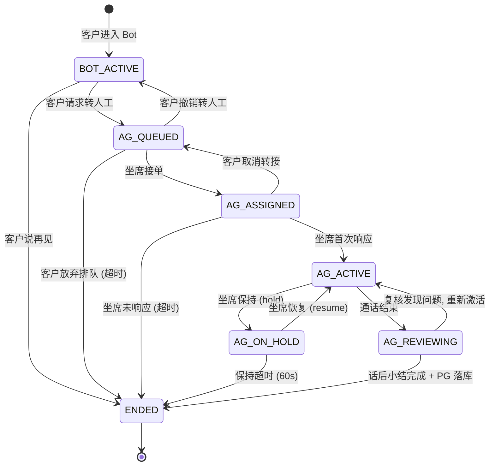

# 第 6 章: 会话状态机

> 本章深入 Lumio 会话状态机. 银行客服一次通话从客户拨入到结束, 涉及 4 phase × 7 sub-state 21 种状态组合 — 怎么保证多实例并发下不丢转换, 怎么 5 秒检测超时, 怎么保证 5-7 年审计留存, 是本章核心. 看完本章你会理解: 状态机怎么设计才能既灵活又安全, CAS Lua 怎么原子控制并发, ZSET 怎么替代 asyncio.Task 做分布式超时, PostgreSQL 怎么异步落库.

## 6.1 状态机全景



**4 phase** (顶层):

| Phase | 含义 | 进入条件 |
|---|---|---|
| `BOT` | Bot 自助期 | 客户首次进入系统 |
| `AGENT` | 坐席通话期 | 客户转人工后 |
| `ENDED` | 通话结束 | 双方挂断 / 超时 |
| `legacy` | 旧版本兼容 | 旧数据迁移 |

**7 sub-state** (子状态):

| SubPhase | 含义 |
|---|---|
| `BOT_ACTIVE` | Bot 正常对话 |
| `AG_QUEUED` | 转人工排队中 |
| `AG_ASSIGNED` | 已分配坐席, 等待首次响应 |
| `AG_ACTIVE` | 坐席与客户对话中 |
| `AG_ON_HOLD` | 坐席主动保持 (hold) |
| `AG_REVIEWING` | 通话结束, 等待话后小结 |
| `ENDED` | 完全结束, PG 已落库 |

`VALID_TRANSITIONS` 白名单 (models.py) 严格控制哪些转换合法, 任何非法转换抛 `InvalidTransitionError (3005)`.

## 6.2 `SessionManager` 完整 API

`agent/lumio/services/common/session.py:92-280` `SessionManager` 集中所有会话操作:

```python
# session.py:92 (简化)
class SessionManager:
    def __init__(self, redis_client, dialogue_log_repo=None):
        self.redis = redis_client
        self.dialogue_log_repo = dialogue_log_repo
        self._cas_script = redis_client.register_script(_CAS_WRITE_SCRIPT)

    async def get_or_create(self, session_id: str, customer_id: str) -> SessionState:
        """获取或创建会话, UUID v7"""
        meta_key = session_meta_key(session_id)
        if not await self.redis.exists(meta_key):
            state = SessionState(
                session_id=session_id,
                customer_id=customer_id,
                phase=SessionPhase.BOT,
                sub_phase=SessionSubPhase.BOT_ACTIVE,
                version=0,  # CAS version
            )
            await self._create(state)
        return await self._load(session_id)

    async def add_turn(self, session_id: str, turn: DialogueTurn):
        """追加对话轮次, RPUSH + LTRIM 20"""
        history_key = session_history_key(session_id)
        await self.redis.rpush(history_key, turn.model_dump_json())
        await self.redis.ltrim(history_key, -20, -1)
        # TTL = max(配置, session_timeout×2+300) = 3900s (第五轮修复)
        # 旧默认 1800 与 AG_ACTIVE 超时相等: 空闲会话 meta 先过期 → get_session 返回
        # None → 超时轮询器吞错 → 会话永不走 ENDED → persist_dialogue 不触发 (审计缺口)
        await self.redis.expire(history_key, self._ttl)

    async def transition_phase(
        self, session_id: str, to_phase: SessionPhase, to_sub: SessionSubPhase, reason: str = ""
    ) -> SessionState:
        """CAS 原子转换"""
        # 1. 校验白名单
        if (to_phase, to_sub) not in VALID_TRANSITIONS.get(current_phase, {}):
            raise InvalidTransitionError(
                f"非法转换 {current_phase}/{current_sub} → {to_phase}/{to_sub}",
                code=3005,
            )
        # 2. CAS Lua 原子写
        new_version = await self._cas_script(
            keys=[session_meta_key(session_id)],
            args=[to_phase.value, to_sub.value, reason, ...],
        )
        if new_version == -1:
            # version 冲突, 重试 1 次
            raise StateConflictError(...)
        # 3. 指标 + 日志
        SESSION_TRANSITIONS.labels(
            from_phase=current_phase.value, from_sub=current_sub.value,
            to_phase=to_phase.value, to_sub=to_sub.value, reason=reason,
        ).inc()
        return new_state

    async def patch_state(
        self, session_id: str, patch: dict, mode: str = "merge"
    ) -> SessionState:
        """字段级合并, 3 种模式: 增量 / 单向门 / 全量覆写"""
        # _INCREMENTAL_FIELDS: intent_stack / entity_pool (去重合并)
        # _ONE_WAY_FIELDS: suppress_flag (false → true 单向)
        # 其他: 全量覆写
        ...
```

**关键设计**: 5 个核心 API: `get_or_create` / `add_turn` / `transition_phase` / `patch_state` / `persist_dialogue`. 任何会话操作必走这 5 个, 业务层零 Redis 接触.

## 6.3 CAS Lua 脚本: 原子控制

`session.py:67-95` 是核心 Lua 脚本:

```lua
-- session.py:67 (完整)
local current_version = tonumber(redis.call('HGET', KEYS[1], 'version'))
if current_version == nil then
    return -1  -- key 不存在
end
local expected_version = tonumber(ARGV[1])
if current_version ~= expected_version then
    return -1  -- version 冲突
end
-- 原子更新
redis.call('HSET', KEYS[1], 'phase', ARGV[2], 'sub_phase', ARGV[3], 'reason', ARGV[4])
redis.call('HINCRBY', KEYS[1], 'version', 1)
-- 合并 patch (JSON)
local patch_json = ARGV[5]
if patch_json and patch_json ~= '' then
    local patch = cjson.decode(patch_json)
    for k, v in pairs(patch) do
        if type(v) == 'table' and v.op == 'merge' then
            -- 增量合并 (去重)
            local existing = redis.call('HGET', KEYS[1], k)
            if existing then
                local existing_list = cjson.decode(existing)
                for _, item in ipairs(v.value) do
                    if not list_contains(existing_list, item) then
                        table.insert(existing_list, item)
                    end
                end
                redis.call('HSET', KEYS[1], k, cjson.encode(existing_list))
            else
                redis.call('HSET', KEYS[1], k, cjson.encode(v.value))
            end
        elseif type(v) == 'table' and v.op == 'one_way' then
            -- 单向门 (false → true)
            local existing = redis.call('HGET', KEYS[1], k)
            if not existing or existing == 'false' then
                redis.call('HSET', KEYS[1], k, tostring(v.value))
            end
        else
            -- 全量覆写
            redis.call('HSET', KEYS[1], k, cjson.encode(v))
        end
    end
end
return current_version + 1
```

**关键设计**:
- Lua 在 Redis 单线程内**原子执行**, 不会被其他命令打断
- version 不匹配立即返 -1, Python 侧重试
- 字段级合并: 3 种模式 (增量 / 单向门 / 全量), 全部在 Redis 端做, 减少网络往返
- `_INCREMENTAL_FIELDS = {"intent_stack", "entity_pool"}`: 数组去重合并
- `_ONE_WAY_FIELDS = {"suppress_flag"}`: false → true 单向, 不允许反向

**为什么不用 Redis 内置 `WATCH/MULTI`**:
- WATCH/MULTI 失败时**整批回滚**, 需要重试整批逻辑
- Lua 脚本**细粒度控制**, 字段级合并逻辑可嵌入
- Lua 性能更好 (一次 RTT)

## 6.4 字段级合并规则

`session.py:80-95` 定义 3 种合并模式:

```python
# session.py:80 (简化)
INCREMENTAL_FIELDS = {"intent_stack", "entity_pool", "recent_topics"}  # 增量去重
ONE_WAY_FIELDS = {"suppress_flag", "transferred_to_human"}             # 单向门
# 其他字段: 全量覆写
```

**场景示例**:

| 字段 | 模式 | 例子 |
|---|---|---|
| `intent_stack` | 增量 | `["complaint"]` + `["faq", "complaint"]` → `["complaint", "faq"]` (去重) |
| `suppress_flag` | 单向 | `false` + `true` → `true`; `true` + `false` → 仍是 `true` |
| `phase` | 全量 | `BOT` + `AGENT` → `AGENT` (覆盖) |
| `customer_id` | 全量 | 不变 (业务不变更) |

**为什么用 3 模式而非简单全量覆写**:
- **增量**: 意图栈需要累积而非覆盖
- **单向门**: `suppress_flag` 一旦设了 true, 不允许回退 (防止竞争条件下误关)
- **全量**: phase 等明确字段直接覆写最简单

## 6.5 ZSET 超时队列: 5s 轮询

`agent/lumio/services/common/session_timeout.py:44-180` 用 Redis ZSET 做分布式超时:

```python
# session_timeout.py:44 (简化)
TIMEOUT_ZSET_KEY = "lumio:session:timeouts"

class SessionTimeoutManager:
    """5 类超时统一管理"""

    async def start_guard(
        self, session_id: str, sub_phase: SessionSubPhase, timeout_type: TimeoutType, ttl: int
    ):
        """ZADD score=expire_ts"""
        score = int(time.time()) + ttl
        await self.redis.zadd(
            TIMEOUT_ZSET_KEY,
            {f"{session_id}:{timeout_type.value}": score},
        )

    async def cancel_guard(self, session_id: str, timeout_type: TimeoutType):
        """ZREM 取消"""
        await self.redis.zrem(TIMEOUT_ZSET_KEY, f"{session_id}:{timeout_type.value}")

    async def _poll_loop(self):
        """5s 一次轮询"""
        while True:
            await asyncio.sleep(5.0)
            now = int(time.time())
            # 1. 找出所有过期项
            expired = await self.redis.zrangebyscore(TIMEOUT_ZSET_KEY, 0, now)
            for member in expired:
                session_id, timeout_type = member.rsplit(":", 1)
                # 2. ZREM 原子竞争 (多实例只有一个能删成功)
                removed = await self.redis.zrem(TIMEOUT_ZSET_KEY, member)
                if removed == 0:
                    continue  # 其他实例已经处理
                # 3. 触发超时处理
                await self._handle_timeout(session_id, TimeoutType(timeout_type))
```

**5 类超时**:

| Type | TTL | 触发动作 |
|---|---|---|
| `BOT_IDLE` | 1800s (30 分钟) | 客户 30 分钟无消息, 自动 ENDED |
| `QUEUE` | 60s | 转人工排队 60s 仍无坐席, 提示客户选择继续等或回 Bot |
| `RINGING` | 30s | 已分配坐席 30s 未响应, 重新排队 |
| `SESSION` | 1800s (30 分钟) | 通话总时长 30 分钟, 提示结束 |
| `REVIEW` | 300s (5 分钟) | 通话结束 5 分钟内必须生成话后小结 |

**关键设计**: ZSET 而非 asyncio.Task. 原因:
- **多实例支持**: Bot 和 Assist 都能处理同一会话超时
- **重启恢复**: 服务重启后 ZSET 数据仍在 Redis, 自动恢复
- **原子竞争**: `ZRANGEBYSCORE` 查 + `ZREM` 删 是 2 步, 但 ZREM 只删一个成员, 多实例并发只有一个成功

## 6.6 PostgreSQL 异步落库

会话结束 (`ENDED` phase) 时, 异步落 `dialogue_log` 表:

```python
# session.py:380 (简化)
async def persist_dialogue(self, session_id: str):
    """会话结束, 异步落 PG dialogue_log 表"""
    # 1. 拉取完整历史
    history = await self.redis.lrange(session_history_key(session_id), 0, -1)
    meta = await self.redis.hgetall(session_meta_key(session_id))

    # 2. 转 DialogueLog ORM 模型
    log = DialogueLog(
        session_id=session_id,
        customer_id=meta["customer_id"],
        phase=meta["phase"],
        sub_phase=meta["sub_phase"],
        turns=[DialogueTurn.parse_raw(t) for t in history],
        started_at=datetime.fromisoformat(meta["created_at"]),
        ended_at=datetime.utcnow(),
        total_turns=len(history),
        compressed_json=compress(json.dumps([t.dict() for t in history])),
    )

    # 3. 异步落库 (fire-and-forget, 不阻塞)
    asyncio.create_task(self.dialogue_log_repo.insert(log))

    # 4. 清理 Redis (可选, 留 7 天备份)
    await self.redis.expire(session_meta_key(session_id), 7 * 86400)
    await self.redis.expire(session_history_key(session_id), 7 * 86400)
```

**关键设计**:
- **5-7 年留存**: PG 表 `dialogue_log` 由 DBA 配置保留期, 金融合规要求
- **压缩存储**: `compressed_json` 字段 (BYTEA) 压缩对话原文, 减少存储
- **fire-and-forget**: `asyncio.create_task` 不阻塞 `transition_phase` 调用
- **Redis 留 7 天**: 临时备份, 7 天后过期

## 6.7 Redis key 集中化

Redis key 命名集中在 `session.py` 统一管理:

```python
# session.py:24-50 (简化)
def session_meta_key(session_id: str) -> str:
    return f"lumio:session:{session_id}:meta"

def session_history_key(session_id: str) -> str:
    return f"lumio:session:{session_id}:history"

def session_meta_scan_pattern() -> str:
    return "lumio:session:*:meta"

def session_timeout_zset_key() -> str:
    return "lumio:session:timeouts"

# SessionManager 内部使用这些 helpers, 不再硬编码
class SessionManager:
    def _meta_key(self, session_id: str) -> str:
        return session_meta_key(session_id)  # 委托
    def _history_key(self, session_id: str) -> str:
        return session_history_key(session_id)  # 委托
```

**集中管理收益**:
- **未来 prefix 改动**: 单点修改 `session.py:24-50`, 全局生效
- **测试更简单**: 测试可以 mock helper 函数
- **审计清晰**: `session_meta_scan_pattern()` 给 SCAN 用, 避免散落

## 6.8 状态模型: 3×7 矩阵

会话状态机采用 **4 phase (顶层) × 7 sub-state (子)** 的矩阵模型:

```
PHASE:   BOT → AGENT → ENDED
SUB:     IDLE / ACTIVE / WAITING_HUMAN / QUEUING / ASSIGNED / ON_HOLD / REVIEWING ...
```

设计动机:
- 扁平状态互相转换规则复杂 (N×N 组合)
- `WAITING_HUMAN` 需要表达"排队中 vs 已分配"区别
- 终结态统一归 `ENDED`, 用 `reason` 字段区分 (abandoned / transferred / normal)
- 21 种组合但只允许 11 种合法转换, 非法转换直接拒绝

兼容策略:
- `legacy` phase 兼容旧数据读取

## 6.9 监控指标

会话状态机发射 5 个核心指标:

| 指标 | 类型 | Labels | 位置 |
|---|---|---|---|
| `session_transitions_total` | Counter | from_phase, from_sub, to_phase, to_sub, reason | session.py:403 |
| `session_timeouts_total` | Counter | sub_phase, reason | session_timeout.py:155 |
| `session_phase_duration_seconds` | Histogram | sub_phase | session.py:412 (5s-3600s buckets) |
| `state_conflict_retries_total` | Counter | - | session.py:285 (CAS 冲突重试) |
| `dialogue_log_persist_total` | Counter | status (success/error) | session.py:395 |

**6 类指标 0 冲突**: 全部指标名 + label 在 Grafana dashboard 有对应 panel.

## 6.10 测试覆盖

`agent/tests/` 中会话相关:

- `test_session.py` (25 用例, **TOP 4**): 会话生命周期 + 转换
- `test_state_models.py` (28 用例, **TOP 3**): 状态机 ORM 模型 + VALID_TRANSITIONS
- `test_session_timeout.py` (15 用例): ZSET 超时 + 5 类
- `test_session_lifecycle_e2e.py` (e2e, CI 排除): 完整流程
- `test_state_conflict.py` (10 用例): CAS 冲突重试

**关键测试** (test_session.py:570-578):

```python
# 验证 CAS 增量合并
async def test_intent_stack_incremental_merge(redis):
    mgr = SessionManager(redis)
    await mgr.get_or_create("s1", "c1")
    # 添加 3 个意图, 模拟重复
    await mgr.patch_state("s1", {"intent_stack": {"op": "merge", "value": ["complaint"]}})
    await mgr.patch_state("s1", {"intent_stack": {"op": "merge", "value": ["faq"]}})
    await mgr.patch_state("s1", {"intent_stack": {"op": "merge", "value": ["complaint"]}})  # 重复
    # 验证去重后只有 2 个
    state = await mgr.get_or_create("s1", "c1")
    assert len(state.intent_stack) == 2
    assert "complaint" in state.intent_stack
    assert "faq" in state.intent_stack
```

## 6.11 本章小结

会话状态机是 Lumio 处理客户对话的"中枢神经":

- **3 phase × 7 sub-state**: 21 组合, 11 合法转换, 白名单控制
- **CAS Lua 原子控制**: 单 RTT, 字段级合并, 失败重试
- **3 种字段合并模式**: 增量去重 / 单向门 / 全量覆写
- **ZSET 分布式超时**: 替代 asyncio.Task, 多实例支持, 5s 轮询 + ZREM 原子竞争
- **5 类超时**: BOT_IDLE / QUEUE / RINGING / SESSION / REVIEW, 各 TTL 不同
- **PG 异步落库**: 5-7 年合规留存, fire-and-forget 不阻塞
- **key 集中化**: 未来 prefix 改动单点

> **下一章预告**: [第 7 章 MCP 工具集成](07-mcp-tool-integration.md) 深入 22 个 Java 工具 + Higress 网关 + Python 端零回归.

---

> **延伸阅读**:
> - [第 3 章 Bot 自助问答](03-bot-self-service.md) — pending_action 跨轮持久化
> - [第 12 章 数据层](chapters/12-data-layer.md) — Redis ZSET + CAS Lua 详解
> - [附录 A 术语表](../appendix/A-glossary.md#a3-会话状态机) — 状态机术语速查
> - [第 16 章 客户记忆与知识图谱](chapters/16-customer-memory-and-kg.md) — 跨会话画像学习 (vip_level / card_types / risk_tolerance CAS patch 写入 SessionState)
