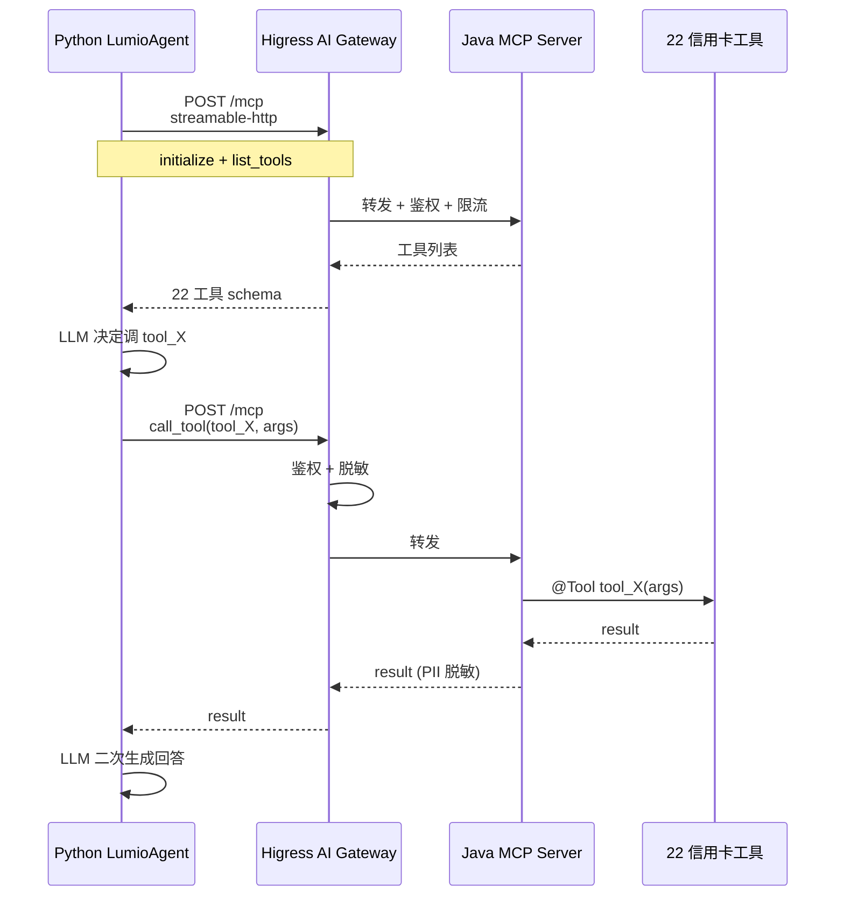
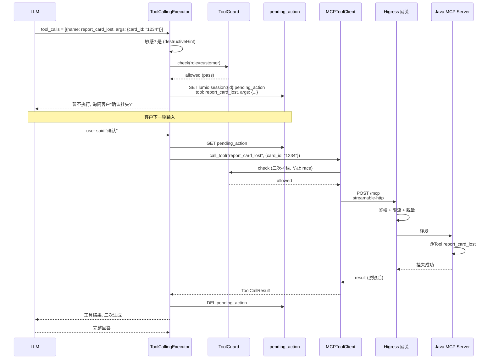

# 第 7 章: MCP 工具集成

> 本章深入 Lumio MCP (Model Context Protocol) 工具集成. 银行客户要查年费、调额度、办分期, 这些都需要真实业务系统操作 — 怎么让 LLM 安全调用银行工具, 怎么保护敏感操作等客户确认, 怎么在工具出错时不让 LLM 幻觉回答, 是本章核心. 看完本章你会理解: MCP 协议怎么替代旧 SSE 实现跨语言工具调用, 22 个 Java 工具怎么对应 7 个业务域, destructiveHint 注解怎么自动标记敏感, 工具护栏怎么双重保险, Higress 网关怎么集中治理鉴权/限流/脱敏/审计.

## 7.1 MCP 协议概览

MCP (Model Context Protocol) 是 Anthropic 2024 年提出的 **AI Agent 调用工具标准协议**. Lumio 采用 streamable-http 传输 (替代旧 SSE):



**streamable-http vs 旧 SSE 优势**:
- **双向流**: HTTP POST + GET 并存, 旧 SSE 单向
- **重连友好**: 连接断开自动重连, 不丢消息
- **多路复用**: 同一连接并发多个请求
- **代理友好**: HTTP 标准头, Nginx/Envoy 直接转发

## 7.2 22 个 Java 工具分类

`mcp-server/src/main/java/com/lumio/mcp/tools/` 下 7 个文件, 共 22 工具:

| 文件 | 工具数 | 工具名 | 敏感 (destructiveHint) |
|---|---|---|---|
| `BillTools.java` | 3 | `query_card_bill` / `query_bill_detail` / `query_annual_fee` | 只读 |
| `TransactionTools.java` | 1 | `query_transactions` | 只读 |
| `PointsTools.java` | 3 | `query_points` / `query_card_benefits` / **`redeem_points`** | `redeem_points` 敏感 |
| `CreditLimitTools.java` | 4 | `query_credit_limit` / **`adjust_temp_credit_limit`** / `query_limit_adjust_history` / **`apply_permanent_limit`** | `adjust_*` / `apply_*` 敏感 |
| `CardServiceTools.java` | 4 | **`report_card_lost`** / `query_card_status` / **`activate_card`** / **`report_transaction_dispute`** | `report_*` / `activate_*` 敏感 |
| `InstallmentTools.java` | 4 | `query_installment_offer` / **`apply_bill_installment`** / `query_installment_status` / **`cancel_installment`** | `apply_*` / `cancel_*` 敏感 |
| `PaymentTools.java` | 3 | **`repay_credit_card`** / `query_repayment_history` / **`set_auto_repay`** | `repay_*` / `set_auto_*` 敏感 |
| **合计** | **22** | | **11 敏感 + 11 只读** |

**关键设计**:
- **11 写操作 = 11 敏感**: `destructiveHint=true` 自动标记
- **11 只读**: `query_*` 前缀, 自动安全
- **业务命名规范**: `动作_对象`, 例如 `query_card_bill` / `report_card_lost`

## 7.3 Python 端 `MCPToolClient`

`agent/lumio/services/common/mcp_client.py:72-393` 是 Python 侧统一接口:

```python
# mcp_client.py:72 (简化)
class MCPToolClient:
    """MCP 工具客户端, 单后端 / 多后端路由"""

    def __init__(self, settings: MCPSettings):
        self.settings = settings
        self.sessions: dict[str, ClientSession] = {}  # 多后端 sessions
        self._tools: dict[str, ToolSpec] = {}         # name → ToolSpec
        self._sensitive: set[str] = set()             # 敏感工具白名单
        self.connected = False

    async def connect(self):
        """连接 MCP 后端, 单后端零回归 / 多后端路由"""
        if not self.settings.enabled:
            logger.info("MCP disabled, skip connect")
            return

        if self.settings.backends:
            # 多后端路由模式
            for backend in self.settings.backends:
                session = await self._connect_single(backend.endpoint)
                self.sessions[backend.name] = session
        else:
            # 单后端零回归 (旧配置兼容)
            session = await self._connect_single(self.settings.endpoint)
            self.sessions["default"] = session

        await self._refresh_tools()  # 拉取工具列表
        self.connected = True

    async def list_tools(self) -> list[ToolSpec]:
        """返回所有工具"""
        if not self.connected:
            return []  # 零回归, 不连接返回空
        return list(self._tools.values())

    async def to_openai_tools(self, names: list[str] | None = None) -> list[dict]:
        """转换为 OpenAI function-calling 格式, names 白名单支持渐进式暴露"""
        tools = self.list_tools()
        if names:
            tools = [t for t in tools if t.name in names]
        return [
            {
                "type": "function",
                "function": {
                    "name": f"{t.server}.{t.raw_name}" if t.server != "default" else t.name,
                    "description": t.description,
                    "parameters": t.input_schema,
                },
            }
            for t in tools
        ]

    async def call_tool(self, name: str, arguments: dict) -> ToolCallResult:
        """路由分发到对应后端"""
        if not self.connected:
            raise MCPToolError("MCP not connected", code=4020)

        # 1. 查找路由
        target = self._route(name)
        if target is None:
            raise MCPToolError(f"unknown tool: {name}", code=4020)
        server, raw_name = target

        # 2. 工具护栏 (role 授权 + 金额限额)
        await self.tool_guard.check(server, raw_name, arguments)

        # 3. 调用
        result = await self.sessions[server].call_tool(raw_name, arguments)

        # 4. PII 脱敏
        result.content = mask_pii(result.content)

        # 5. 审计
        await audit_mcp_call(server, raw_name, arguments, result)

        return result
```

**关键设计**:
- **单后端零回归**: `backends=[]` 默认走 `endpoint + prefix=""`, 与旧版兼容
- **多后端路由**: `card.query_card_bill` (信用卡域) vs `loan.apply_loan` (贷款域) 避免撞名
- **零回归 opt-in**: `MCP_ENABLED=false` 默认, 不连接返回空列表, Bot 走 RAG 兜底
- **工具护栏**: role 授权 + 金额限额在调用前拦截
- **PII 脱敏 + 审计**: 调用后端做, 符合银行合规

## 7.4 `destructiveHint` 自动标记敏感

`mcp-server/src/main/java/com/lumio/mcp/tools/AdjustTempCreditLimitTool.java` (示例):

```java
// mcp-server Java 端 (简化)
@Tool(description = "调整信用卡临时额度")
public AdjustTempCreditLimitResult adjustTempCreditLimit(
    @ToolParam(description = "卡号") String cardId,
    @ToolParam(description = "新额度") BigDecimal newLimit,
    @ToolParam(description = "持续天数") int days
) {
    // 业务逻辑
    return new AdjustTempCreditLimitResult(...);
}
```

Spring AI 框架解析 `@Tool` 注解, **自动生成 OpenAI function-calling schema**, 包含 `destructiveHint` 字段. Python 端 `MCPToolClient._refresh_tools` 解析:

```python
# mcp_client.py:227 (简化)
async def _refresh_tools(self):
    for server, session in self.sessions.items():
        tools = await session.list_tools()
        for tool in tools:
            # destructiveHint 自动标记敏感
            is_sensitive = tool.annotations.get("destructiveHint", False)
            # 累积到白名单
            if is_sensitive:
                self._sensitive.add(tool.name)
            # 存 ToolSpec
            self._tools[tool.name] = ToolSpec(
                name=tool.name,
                description=tool.description,
                input_schema=tool.inputSchema,
                sensitive=is_sensitive,
                server=server,
                raw_name=tool.name,
            )
```

**关键设计**:
- **注解驱动**: Java 端只管 `@Tool` 注解, 不用手写 `sensitive` 字段
- **自动同步**: 改 Java 端注解, Python 端下次 `_refresh_tools` 自动同步
- **零硬编码**: 不维护"哪些工具敏感"的列表

## 7.5 工具护栏 `tool_guard.py`

`agent/lumio/services/bot/tool_guard.py:1-101` 实现**双重护栏**:

```python
# tool_guard.py (简化)
class ToolGuard:
    """工具护栏: role 授权 + 金额限额"""

    ROLE_RULES = {
        "report_card_lost": {"roles": {"customer"}, "amount_limit": None},
        "repay_credit_card": {"roles": {"customer"}, "amount_limit": 100_000},
        "adjust_temp_credit_limit": {"roles": {"customer"}, "amount_limit": 50_000},
        "redeem_points": {"roles": {"customer"}, "amount_limit": 1_000_000},
        "apply_permanent_limit": {"roles": {"customer", "agent"}, "amount_limit": 200_000},
    }

    async def check(
        self, server: str, tool_name: str, arguments: dict, actor_role: str = "customer"
    ) -> GuardDecision:
        # 1. role 授权
        rule = self.ROLE_RULES.get(tool_name)
        if rule and actor_role not in rule["roles"]:
            TOOL_GUARD_DENIALS.labels(tool=tool_name, reason="role_denied").inc()
            return GuardDecision(allowed=False, reason=f"role {actor_role} not allowed")

        # 2. 金额限额
        if rule and rule["amount_limit"]:
            amount = arguments.get("amount") or arguments.get("new_limit") or 0
            if amount > rule["amount_limit"]:
                TOOL_GUARD_DENIALS.labels(tool=tool_name, reason="amount_exceeded").inc()
                return GuardDecision(allowed=False, reason=f"amount {amount} exceeds limit {rule['amount_limit']}")

        return GuardDecision(allowed=True)
```

**关键设计**:
- **role 授权**: `agent` 角色不能调 `report_card_lost` (客户专属), 防止越权
- **金额限额**: 客户单次还款 10 万上限, 调临时额度 5 万上限 (银行风控要求)
- **指标发射**: `tool_guard_denials_total{tool, reason}` 拒绝原因分类
- **走 PII 脱敏前**: 护栏拒绝后不会泄露客户的尝试金额

## 7.6 调用全流程



**关键设计**:
- **二次护栏**: 客户确认时再 check 一次, 防止 race condition (确认期间 role 变化)
- **pending_action 5 态**: 见 [第 3 章 3.5.4](03-bot-self-service.md#354-_handle_pending_action-确认状态机-bot_agentpy402-535)
- **Higress 中间层**: 鉴权/限流/脱敏/审计 4 件套统一在网关

## 7.7 工具调用循环

`agent/lumio/services/bot/tool_executor.py` 实现 LLM↔MCP 多轮循环:

```python
# tool_executor.py (简化)
class ToolCallingExecutor:
    """LLM ↔ MCP 多轮循环, 最多 max_tool_iterations 轮"""

    async def run_conversation(
        self, messages: list[dict], tools: list[dict], max_iterations: int = 5
    ) -> str:
        for iteration in range(max_iterations):
            response = await self.llm.chat(messages, tools=tools)
            if not response.tool_calls:
                return response.content  # 无工具调用, 结束

            for tool_call in response.tool_calls:
                # 1. 敏感工具 → pending_action
                if self.mcp.is_sensitive(tool_call.function.name):
                    decision = await self._ask_confirmation(tool_call)
                    if decision != "confirm":
                        continue
                # 2. 非敏感 → 直接调
                result = await self.mcp.call_tool(tool_call.function.name, tool_call.arguments)
                # 3. 消息追加
                messages.append({"role": "tool", "content": result.content, "name": tool_call.function.name})
        return response.content
```

**关键设计**:
- **最多 5 轮**: `MCP_MAX_TOOL_ITERATIONS=5`, 防止无限循环
- **每轮追加消息**: tool_call 后 message 追加 tool result, LLM 下一轮可基于结果再决策
- **敏感工具异步**: 挂失类不进循环, 走 `pending_action` 跨轮等待

## 7.8 Higress 网关集中治理

`mcp-server/deploy/higress/mcp-credit-card.yaml` 配置:

```yaml
# Higress MCP 网关配置 (简化)
apiVersion: networking.higress.io/v1
kind: McpServer
metadata:
  name: lumio-mcp-server
  namespace: higress-system
spec:
  registries:
    - nacos:
        serverAddr: nacos:8848
        namespace: public
        serviceName: lumio-mcp-server
  tools:
    - name: report_card_lost
      allowRoles: [customer]  # 网关层 role 拦截
      rateLimit: 5/minute
      piiFilter: true  # 响应脱敏
    - name: repay_credit_card
      allowRoles: [customer]
      rateLimit: 10/minute
      piiFilter: true
      amountLimit: 100000  # 网关层金额限额
```

**关键设计**:
- **网关层护栏**: 即使 Python 端 ToolGuard 漏掉, Higress 仍能拦截
- **限流分散**: 不同工具不同限流策略, 防止某工具被刷爆
- **响应脱敏**: 网关层 mask PII, Python 端再 mask 一次 (双重保险)
- **Nacos 注册**: MCP Server 启动时注册到 Nacos, Higress 自动发现

**多 MCP 后端路由**:

```yaml
apiVersion: networking.higress.io/v1
kind: McpServerRoute
metadata:
  name: lumio-multi-domain
spec:
  rules:
    - match: { prefix: "card." }
      backend: lumio-mcp-credit-card
    - match: { prefix: "loan." }
      backend: lumio-mcp-loan
    - match: { prefix: "fund." }
      backend: lumio-mcp-fund
```

## 7.9 Python 端零回归

`mcp_client.py` 设计原则: **opt-in, 零回归**:

```python
# mcp_client.py:272 (简化)
async def list_tools(self) -> list[ToolSpec]:
    if not self.connected:
        return []  # 不连接返回空, Bot 走 RAG 兜底
    return list(self._tools.values())
```

**关键设计**:
- `MCP_ENABLED=false` 默认: 不启用 MCP, Bot 仍能 RAG 检索
- `list_tools()` 返 `[]`: Bot `_handle_tool` 判断 `not has_tool(intent.tool_name)` 自动走 RAG
- 启动期不抛错: MCP 不可用时**只 warn 不 fatal**, 不阻塞 Bot 启动

**MCP 关闭时 Bot 行为**:
- `LumioAgent._handle_tool` → `self.mcp_client.has_tool(...)` 返 False → 走 `_handle_knowledge` 兜底
- 不影响主流程, 降级路径透明

## 7.10 监控指标

MCP 链路发射 6 个核心指标:

| 指标 | 类型 | Labels | 位置 |
|---|---|---|---|
| `mcp_tool_calls_total` | Counter | tool, status (success/error) | mcp_client.py:309 |
| `tool_calls_total` | Counter | tool, status | tool_executor.py:298/309 |
| `tool_confirmations_total` | Counter | decision (pending/confirm/cancel/unclear/expired) | tool_executor.py:261 (**P1-3 新增**) |
| `tool_guard_denials_total` | Counter | tool, reason (role_denied/amount_exceeded) | tool_executor.py:378 (**P1-3 新增**) |
| `mcp_connection_state` | Gauge | backend (default/card/loan/...) | mcp_client.py:80 |
| `http_requests_total` | Counter | method, endpoint, status | 全局 |

**OTel span** (`mcp_client.py:308`):
- `mcp.tool` = 工具名
- `mcp.server` = 后端名 (单后端: default; 多后端: card/loan/fund)
- `mcp.is_error` = 业务错误 (true/false)
- `mcp.duration_ms` = 调用耗时

## 7.11 测试覆盖

`agent/tests/` 中 MCP 相关:

- `test_mcp_client.py` (18 用例): 连接 / 工具列表 / 调用 / 路由
- `test_tool_guard.py` (17 用例, **TOP 13**): role 授权 + 金额限额
- `test_confirmation.py` (15 用例): 5 态确认状态机
- `test_tool_executor.py` (12 用例): LLM↔MCP 循环

**Java MCP Server** (`mcp-server/src/test/java/`):
- `CreditCardToolsTest` (15 用例): 22 工具业务逻辑
- `ToolCallAspectTest` (5 用例): 切面计数/计时
- `ApiKeyAuthFilterTest` (3 用例): 网关鉴权

## 7.12 本章小结

MCP 工具集成是 Lumio 业务执行的"手脚":

- **streamable-http 协议**: 替代旧 SSE, 双向流 + 重连友好 + 多路复用
- **22 个 Java 工具**: 7 业务域 (账单/交易/积分/额度/卡服务/分期/还款)
- **destructiveHint 自动标记**: 11 写操作自动加敏感白名单, 零硬编码
- **双重护栏**: Python 端 ToolGuard + Higress 网关, 越权零容忍
- **pending_action 5 态**: 敏感操作等客户确认, 跨轮持久化
- **零回归 opt-in**: `MCP_ENABLED=false` 默认, 不连接返回空, Bot 走 RAG 兜底
- **Higress 集中治理**: 鉴权/限流/脱敏/审计统一网关, Nacos 注册发现

> **下一章预告**: [第 8 章 错误处理](chapters/08-error-handling.md) 深入 35 错误码 + 统一响应体 + P3 整改.

---

> **延伸阅读**:
> - [第 3 章 Bot 自助问答](03-bot-self-service.md) — pending_action 集成
> - [第 4 章 坐席辅助引擎](04-assist-engine.md) — E1 中的工具调用
> - [第 11 章 安全合规](chapters/11-security-compliance.md) — 工具护栏 + 网关鉴权
> - [第 13 章 部署](chapters/13-deployment.md) — MCP Server opt-in profile
> - [第 17 章 工具调用与确认状态机](chapters/17-tool-calling-and-confirmation.md) — 工具调用编排 + 5 态确认状态机 + 双重护栏
