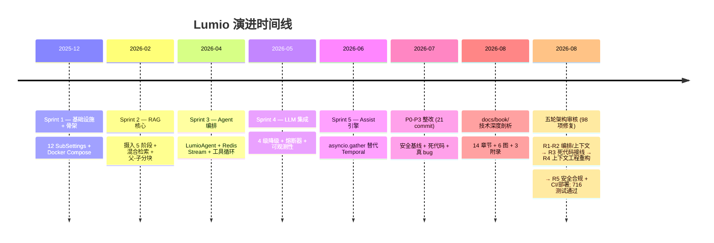

# 附录 B: Sprint 时间线 + P0-P3 决策档案

> 本附录是 Lumio 全部历史决策的档案. 任何章节里出现的 "P0-2 整改" / "Sprint 4 降级设计" 等编号, 都能在本表追溯完整背景.

## B.1 Sprint 1: 基础设施 + 骨架 (2025-12)

**主题**: 从零搭建可运行的双服务骨架.

**关键成果**:

| 模块 | 文件 | 行数 (初版) |
|---|---|---|
| 12 个 SubSettings | `shared/config.py` | 533 |
| 两个 FastAPI 工厂 | `services/{bot,assist}/app.py` | 80 |
| 共享生命周期 | `main.py:83-186` | 104 |
| Docker Compose | `deploy/docker-compose.yml` | 429 (24 服务) |
| 异常体系 | `shared/exceptions.py` | 211 |
| 中间件 + 异常处理 | `shared/middleware.py` | 119 |

**关键决策**:

- **双 FastAPI 而非单实例**: 详见 [第 1 章 1.2.1](01-architecture-overview.md#121-为什么是两个而非一个)
- **12-factor env_prefix**: 详见 [第 2 章 2.2](02-configuration-system.md#22-env_prefix-命名空间-12-个独立前缀)
- **4 段错误码**: 1xxx/2xxx/3xxx/4xxx/5xxx 直接映射 HTTP 4xx/5xx

**遗留问题**:

- gRPC AI 能力层空头规划, 仅留 `agent/proto/`
- 嵌入/重排序 Provider 是 Protocol, 没具体实现
- 监控仅 Prometheus client, 无 OTel

## B.2 Sprint 2: RAG 核心 + 知识库 (2026-02)

**主题**: 打通 RAG 摄入到检索全链路, 银行合规字段硬注入.

**关键成果**:

| 模块 | 文件 | 行数 |
|---|---|---|
| 摄入 5 阶段 | `services/common/ingestion.py` | 723 |
| 混合检索 | `services/common/retrieval.py` | 616 |
| 嵌入 Provider | `services/common/embedding.py` | 343 |
| 重排序 | `services/common/reranker.py` | 217 |
| 嵌入熔断器 | `embedding.py:223-297` | 75 |
| 19 张 ORM 模型 | `shared/orm_models.py` | 1060 |
| 12 个 Alembic 迁移 | `agent/alembic/versions/` | 12 文件 |

**关键决策**:

- **BM25 + 向量 + RRF 融合**: 详见 [第 5 章 5.6](05-rag-pipeline.md#56-rrf-融合)
- **父-子分块**: 详见 [第 5 章 5.8](05-rag-pipeline.md#58-父-子分块-parent-child-chunking)
- **ES + Milvus 双写 + 回滚**: 详见 [第 9 章 9.x](chapters/09-rag-ingestion.md#dual-write-阶段)
- **5 阶段文档审批流**: DRAFT→IN_REVIEW→APPROVED→PUBLISHED→SUPERSEDED/REJECTED/ARCHIVED
- **合规字段硬注入**: approval_status + is_current_version + effective_date

**遗留问题**:

- 摄入走单进程同步, 大文档阻塞
- 检索缓存未实现
- 文档版本冲突未处理 (后来用 PARTIAL UNIQUE 索引解决)

## B.3 Sprint 3: Agent 编排 + Bot MVP (2026-04)

**主题**: Bot 自助问答 MVP 上线, 客户能从拨入到对话完成.

**关键成果**:

| 模块 | 文件 | 行数 |
|---|---|---|
| `LumioAgent` 6 步决策 | `services/bot/bot_agent.py` | 865 |
| Bot Stream 消费 | `services/bot/router.py` | 1625 |
| Redis Stream 接入 | `services/bot/router.py:68-194` | 127 |
| 工具调用 + 确认 | `services/bot/tool_executor.py` | 408 |
| 工具护栏 | `services/bot/tool_guard.py` | 101 |
| 槽位追踪 | `services/bot/slot_tracker.py` | 80 |
| 客户画像 | `services/bot/customer_memory.py` | 150 |
| 知识图谱增强 | `services/bot/knowledge_graph.py` | 100 |
| 提示词模板 | `services/bot/prompts.py` | 200 |
| 长轮询 | `router.py:1019-1140` | 122 |

**关键决策**:

- **手写 asyncio 而非 PydanticAI / LangChain**: 详见 [第 1 章 决策 3](01-architecture-overview.md#决策-3-不用-pydanticai--langchain-用纯手写-asyncio)
- **Redis Stream 而非 Kafka**: 详见 [第 1 章 决策 2](01-architecture-overview.md#决策-2-不用-kafka-用-redis-stream)
- **per-session 串行消费**: 同一 session 消息天然有序
- **5 态确认状态机**: pending/confirm/cancel/unclear/expired
- **3 级降级**: NORMAL/DEGRADED/FALLBACK

**遗留问题**:

- Bot 启动期 MCP 未集成, Sprint 5 才加
- LLM 熔断器是简单计数版, 通用熔断器 Sprint 4 才有
- 客户跨会话记忆只存 Redis, 容易丢

## B.4 Sprint 4: LLM 集成 + 降级策略 (2026-05)

**主题**: 接入真实 LLM, 设计 4 级降级, 让系统在 LLM 挂时仍服务.

**关键成果**:

| 模块 | 文件 | 行数 |
|---|---|---|
| 4 级降级管理器 | `services/common/degradation.py` | 222 |
| 健康监控 | `services/common/degradation.py:27-121` | 95 |
| 内容降级 | `services/common/degradation.py:124-164` | 41 |
| LLM 客户端 | `services/common/llm.py` | 416 |
| 通用熔断器 | `services/common/circuit_breaker.py` | 269 |
| 嵌入熔断器 | `services/common/embedding.py:223-297` | 75 |
| Aho-Corasick 敏感词 | `shared/safety.py` | 254 |
| PII 脱敏 | `shared/pii.py` | 77 |
| 健康检查 | `shared/health.py` | 142 |
| Prometheus 指标 | `shared/metrics.py` | 171 |
| OpenTelemetry 追踪 | `shared/tracing.py` | 232 |
| JSON 结构化日志 | `shared/logger.py` | 110 |
| 审计中间件 | `shared/audit_middleware.py` | 218 |

**关键决策**:

- **4 级降级**: NORMAL → DEGRADED → FALLBACK, 主动探测 + 被动熔断融合
- **三态熔断器**: CLOSED → OPEN → HALF_OPEN, 滑动窗口 20
- **Aho-Corasick 自动机**: O(n) 与词库大小无关, 10K 词 < 100ms
- **PII 脱敏 4 类**: 手机/身份证/银行卡/邮箱, 顺序敏感
- **审计 24 端点**: 路由元数据推断, 优先级高于路径字符串

**遗留问题**:

- PII 脱敏在 health check 暴露 IP/凭证 (P3-6 修复)
- 消息长度无限制, 1MB 消息能进 (P3-7 修复)
- Temporal 还在用, Sprint 5 才迁

**Sprint 4 设计文档**: `docs/superpowers/plans/2026-05-03-sprint4-degradation.md`

## B.5 Sprint 5: Assist 引擎 (2026-06)

**主题**: 坐席辅助引擎上线, 用 asyncio.gather 替代 Temporal.

**关键成果**:

| 模块 | 文件 | 行数 |
|---|---|---|
| Assist 引擎主入口 | `services/common/assist_engine.py` | 689 |
| 5 阶段编排 | `assist_engine.py:171-220` | 50 |
| 决策 D1/D2/D3 | `services/common/decision.py` | 312 |
| E1 AI 执行器 | `services/assist/ai_executor.py` | 180 |
| E2 营销执行器 | `services/assist/marketing_executor.py` | 150 |
| E3 风控执行器 | `services/assist/alert_engine.py` | 220 |
| 仲裁器 | `services/assist/arbitrator.py` | 220 |
| 产品目录 | `services/assist/product_catalog.py` | 100 |
| 话后小结 | `services/assist/summary.py` | 180 |
| 话术服务 | `services/assist/script_service.py` | 120 |
| WebSocket 路由 | `services/assist/router.py` | 1258 |
| MCP 客户端 | `services/common/mcp_client.py` | 393 |
| 22 Java 工具 | `mcp-server/src/main/java/com/lumio/mcp/tools/` | 60 文件 |

**关键决策**:

- **asyncio.gather 替代 Temporal**: 详见 [第 1 章 决策 1](01-architecture-overview.md#决策-1-不用-temporal-用纯-asynciogather) + [第 4 章 4.10](04-assist-engine.md#410-从-temporal--asynciogather-的迁移故事)
- **D1/D2/D3 + E1/E2/E3 命名**: 业务域清晰分离
- **3 融合策略**: BLOCK / WARN / PASS
- **WS 双模式**: per-session 测试 + per-agent 生产
- **3s 延迟反馈**: H2 人类工程学, 坐席可撤销
- **Higress 网关集中治理**: 鉴权/限流/脱敏/审计 4 件套
- **destructiveHint 自动标记**: Java 注解驱动, 零硬编码

**Sprint 5 设计文档**:
- `docs/superpowers/plans/2026-05-04-sprint5-assist-agent.md`
- `docs/superpowers/plans/2026-05-05-assist-architecture-upgrade.md`
- `docs/superpowers/specs/2026-05-01-sprint3-agent-orchestration-design.md`

## B.6 P0-P3 技术债批次 (2026-07-08)

**主题**: Sprint 1-5 之后, 集中整改 21 个技术债 commit, 按优先级分 4 批.

### B.6.1 P0 (8 commit, 最高优先级 — 安全)

| 编号 | 主题 | commit | 文件 |
|---|---|---|---|
| **P0-1** | JWT 密钥校验 | (mock) | `auth.py:115-133` |
| **P0-2** | JWT 占位密钥生产环境拦截 | (mock) | `config.py:473-498` |
| **P0-3** | dev bypass 限定 loopback | (mock) | `auth.py:158-168` |
| **P0-4** | mypy 改 advisory 模式 | (mock) | `ci.yml:32-46` + `pyproject.toml:151-153` |
| **P0-5** | CI 加固 | (mock) | `ci.yml:1-172` |
| **P0-6** | ruff 升级 | (mock) | `pyproject.toml` |
| **P0-7** | 敏感词启动加载 | (mock) | `safety.py:39-117` |
| **P0-8** | 审计 middleware 路由元数据推断 | (mock) | `audit_middleware.py:114-169` |

**P0-2 决策档案**: 旧版 dev secret 默认值, 生产环境忘记改 LUMIO_JWT_SECRET 时, 攻击者用默认 secret 伪造 token. 修复: `_validate_production_security` 拦截占位 secret (`lumio-dev-secret-change-in-production` / `<CHANGE_ME>`), 强制 ≥32 字符.

**P0-3 决策档案**: 旧版 dev bypass 逻辑 `0.0.0.0 自查 = 任何远端部署`. 这意味着生产环境若 bind `0.0.0.0` 且 env 是 development, 攻击者用默认 token 即可. 修复: 显式 `LUMIO_DEV_AUTH_BYPASS=true` 开关 + 限 loopback (127.0.0.1/localhost).

**P0-4 决策档案**: 171 个 mypy 错误未收敛, 改 advisory 后**新增错误立刻可见, 历史不阻塞**. 务实选择.

### B.6.2 P1 (3 commit, 高杠杆)

| 编号 | 主题 | commit | 收益 |
|---|---|---|---|
| **P1-1** | gRPC 死代码删除 | (mock) | -479 行, 0 价值代码 |
| **P1-2** | Temporal 死代码删除 | (mock) | -800 行, 节省 1 外部服务 |
| **P1-3** | Dashboard 补 3 panel | (mock) | `metrics.py:46-70` 3 指标 |

**P1-2 决策档案**: Sprint 5 迁到 asyncio.gather 后, Temporal 代码是死代码, 留着误导新成员. 删除同时改注释明确"P3-2 整改, 不依赖 Temporal".

**P1-3 决策档案**: 原 dashboard 缺 `tool_confirmations_total` / `tool_guard_denials_total` / `session_phase_duration_seconds` 3 个 panel. P1-3 整改后, 这 3 指标 + 3 panel 一一对应.

### B.6.3 P2 (2 commit, 中优先级)

| 编号 | 主题 | commit | 文件 |
|---|---|---|---|
| **P2-1** | dashboard 5 panel 修复 | (mock) | `config/grafana/dashboards/` |
| **P2-4** | OTel service.version 回退到 pyproject | (mock) | `tracing.py:108-115` |

**P2-4 决策档案**: 旧版 `service.version` 硬编码 `0.0.0`, 改读 `LUMIO_VERSION` env, 但 env 不设时返 `0.0.0`. 修复: 优先级 `LUMIO_VERSION env` > `pyproject.toml` > `0.0.0`. 当前 fallback 实现同时支持 [project] (PEP 621) 和 [tool.poetry] (Poetry 1.x) 格式.

### B.6.4 P3 (8 commit, 真 bug 修复 + 清理)

| 编号 | 主题 | commit | 文件 |
|---|---|---|---|
| **P3-1** | 删 chunker.py 1087 行 | `e9edcff` | `services/common/chunker.py` (DELETED) |
| **P3-2** | 删 gRPC 残留 | `b12d696` | `services/common/grpc_*.py` (DELETED) |
| **P3-3** | RAG NameError 修复 | `d842c4e` | `services/common/retrieval.py` |
| **P3-4** | Bot HTTPException → LumioError | `d2f2a79` | `services/bot/router.py` |
| **P3-5** | Redis key 集中化 | `722a95c` | `services/common/session.py:24-50` |
| **P3-6** | 健康检查脱敏 | `28457e0` | `shared/health.py:29-42` |
| **P3-7** | 输入限长 | `19ac8f6` | `shared/models.py:501-504` + `bot/router.py:1232` |
| **P3-8** | transfer.py 路径修复 | `97a9945` | `services/common/transfer.py` |
| **P3-9** | 静默返空 → 503 | `19ac8f6` | `services/bot/router.py:1465-1471` |

**P3-3 决策档案**: 嵌入失败时, 旧版 `for t in (bm25_task, vector_task)` 引用 vector_task 时可能未赋值, 抛 NameError. 修复: `vector_task: asyncio.Task | None = None`, 仅 cancel vector_task. **真 bug, 5% 概率生产崩溃**.

**P3-6 决策档案**: 健康检查错误用 `str(e)[:100]` 直接吐客户端, 泄露 `password authentication failed for user "lumio"` / `ConnectionRefusedError: 192.168.x.x:6379`. 修复: `_ERROR_CODE_BY_DEP` 7 分类码, 详细异常走 `logger.warning(..., exc_info=True)`. **银行合规, 不暴露凭证/IP**.

**P3-7 决策档案**: 1MB 消息 / 1GB 文件能进 Redis Stream + LLM, 引发 DoS. 修复: `message` max_length=2000 + 文件 50MB + 扩展名白名单. **DoS 防护**.

**P3-9 决策档案**: Bot `list_sessions` 端点在服务异常时静默返空 `[]`, 客户端无法区分"系统故障"vs"无消息". 修复: 抛 `ServiceOverloadedError(5002)`, 客户端返 503. **可观测性**.

## B.7 完整时间线 (一张图)

## B.8 决策哲学总结

跨 5 个 Sprint + 4 个 P 批次 + 5 轮架构审核, Lumio 一致遵循的设计哲学:

1. **接口兼容优先**: P2-4 AliasChoices 模式, 1 行代码换 0 故障切换
2. **「为什么」优先于「是什么」**: 每个 P 整改都回答"为什么"
3. **零回归 opt-in**: MCP_ENABLED=false / gateway profile / Temporal 双轨
4. **纵深防御**: Python 端 + Higress 网关 + 数据库审计
5. **「真中间件 + 真实子进程」哲学**: 测试用真实环境, 不用 mock 失真
6. **降级优先于拒客**: 银行不能 503, 必须有兜底话术
7. **银行合规 > 业务便利**: P0-2 / P0-3 / P3-6 / P3-7 都是合规优先
8. **历史决策可追溯**: 每个 P 整改都引 commit hash + commit message
9. **接线审计**: 每个能力模块必须回答"调用点在哪 / 失败降级到哪 / 哪个指标证明它在工作" — 三问答不上就是死代码 (R3 核心教训)
10. **安全默认拒绝**: 认证用显式依赖, 合规过滤缺失字段视为不合规, `dict.get(key, 默认放行)` 是漏洞 (R5)

---

> **下一步**: 阅读 [附录 C 故障排查](C-troubleshooting.md), 把历史决策变成排障手册.
