# 第 8 章: 错误处理

## 为什么需要一套自研错误体系

Lumio 是面向银行客户的对话平台,涉及支付、签约、转账等强合规场景。一个不能精确表达"业务问题"还是"系统问题"、一个会把"PG 密码错误"或"Redis IP"直接吐回给前端的错误响应,在生产环境是不可接受的。曾调研过直接抛 `HTTPException` 的方案,放弃的核心理由有三点: 第一,业务语义丢失——422 和 500 无法区分"用户输入问题"和"上游 LLM 抖动"; 第二,合规审计需要稳定的错误码而不是动态消息; 第三,前端需要按错误码做精细分支(比如 3005 非法状态转换要回到登录态,3001 知识库未命中要降级到兜底话术)。

基于这些约束,我们设计了 **35 个错误码 + 5 段式分段 + LumioError 异常类层次 + 统一 JSON 响应体** 的四层结构。本章沿着"为什么 → 是什么 → 怎么用 → 怎么演化"的顺序,把这套体系讲清楚。

## 错误码的 5 段划分

错误码不是随便分配的,每一段都对应一个明确的"责任方"和默认 HTTP 状态:

| 段位 | 含义 | 默认 HTTP | 责任方 | 典型处理 |
|------|------|-----------|--------|----------|
| 1xxx | 认证授权 | 401 / 403 | 调用方 | 重登录 / 申请权限 |
| 2xxx | 输入校验 | 400 | 调用方 | 修正参数 |
| 3xxx | 业务规则 | 422 | 业务层 | 流程分支 |
| 4xxx | 外部依赖 | 502 | 第三方 | 降级 / 重试 |
| 5xxx | 系统内部 | 500 | 我们 | 告警 / 排查 |

**为什么这么划?** 段位高位代表"问题离我们越远":1xxx 是"你(调用方)的问题",5xxx 是"我们的问题"。这样前端、监控、客服三方拿到错误码的第一位就能判断该谁介入。另一种常见思路是按 HTTP 状态码映射(400/422/500/502/503),我们评估后放弃,因为 HTTP 状态码只有约 10 个有效分类,远不够覆盖 Lumio 的业务场景——光"业务规则"一层就有 6 种完全不同的语义(未命中、未认证、高风险拦截、会话不存在、非法转换、并发冲突),挤在一个 422 里前端必须读 message 才能分支,这就把契约推给了不可控的字符串。错误码 5 段划分给了我们 5 × 99 = 495 个稳定槽位,足够未来 3 年扩展。完整的 35 错误码分配在 `agent/lumio/shared/exceptions.py:11-211`,下面给出每段的代表项:

| 段位 | 错误码 | 类名 | 含义 |
|------|--------|------|------|
| 1xxx | 1001 | (Auth 模块) | 认证失败,默认 HTTP 401 |
| 1xxx | 1003 | (Auth 模块) | 鉴权失败,默认 HTTP 403 |
| 2xxx | 2001 | `IntentUnrecognizedError` | 意图无法识别 |
| 2xxx | 2002 | `EntityIncompleteError` | 实体抽取不完整 |
| 2xxx | 2003 | `QueryOutOfRangeError` | 查询超出范围 |
| 2xxx | 2010 | `DocumentFormatError` | 不支持的文档格式 |
| 3xxx | 3001 | `KnowledgeMissError` | 知识库未命中 |
| 3xxx | 3002 | `CustomerNotAuthenticatedError` | 客户身份未认证 |
| 3xxx | 3003 | `HighRiskBlockedError` | 高风险业务拦截 |
| 3xxx | 3004 | `SessionNotFoundError` | 会话不存在 |
| 3xxx | 3005 | `InvalidTransitionError` | 非法状态转换 |
| 3xxx | 3010 | `IngestionConflictError` | 文档并发写入冲突 |
| 4xxx | 4001 | `LLMTimeoutError` | 大模型推理超时 |
| 4xxx | 4002 | `LLMInferenceError` | 大模型推理异常 |
| 4xxx | 4003 | `BankAPIError` | 银行 API 调用失败 |
| 4xxx | 4004 | `VectorSearchError` | 向量检索异常 |
| 4xxx | 4005 | `EmbeddingServiceError` | 嵌入服务调用失败 |
| 4xxx | 4006 | `EmbeddingTimeoutError` | 嵌入服务调用超时 |
| 4xxx | 4007 | `BM25SearchError` | BM25 检索异常 |
| 4xxx | 4010 | `MinIOError` | 对象存储读写异常 |
| 4xxx | 4012 | `DualWriteError` | 双写部分失败 |
| 4xxx | 4020 | `CircuitBreakerOpenError` | 熔断器打开 |
| 5xxx | 5001 | `SessionCorruptedError` | 会话状态损坏 |
| 5xxx | 5002 | `ServiceOverloadedError` | 服务过载 |
| 5xxx | 5003 | `StateConflictError` | CAS 状态版本冲突 |
| 5xxx | 5004 | `OrchestrationTimeoutError` | 编排全局超时 |

## HTTP 状态映射:默认段位 + 精确覆盖

段位默认映射不够,有些错误需要"语义正确但状态码微调"。典型例子:`SessionNotFoundError`(3004)按段位默认是 422,但 REST 语义上"资源不存在"应该是 404;`InvalidTransitionError`(3005)用 409 Conflict 比 422 更贴切;`ServiceOverloadedError`(5002)按段位是 500,但过载应当返回 503 让上游重试。

因此 `agent/lumio/shared/middleware.py:26-32` 维护了一张精确覆盖表:

```python
# agent/lumio/shared/middleware.py:26
_HTTP_STATUS_OVERRIDES: dict[int, int] = {
    SessionNotFoundError.code: 404,
    InvalidTransitionError.code: 409,
    ServiceOverloadedError.code: 503,
    1001: 401,
    1003: 403,
}
```

其余错误码走分段兜底:`2000 ≤ code < 3000 → 400`、`3000-3999 → 422`、`4000-4999 → 502`、`5000+ → 500`。这种"白名单覆盖 + 段位兜底"的设计,既保留了 5 段划分的简洁性,又允许对个别错误做语义化微调,不需要在每个异常类里硬编码 HTTP 状态。

## 统一响应体格式

所有错误响应都遵循同一形态,前端只需要写一套解析逻辑:

```json
{
  "error": {
    "code": 3004,
    "message": "会话不存在: sess-9f8a",
    "type": "SessionNotFoundError"
  },
  "request_id": "8c4a1d2e-3b4f-4a2e-9c1d-2e3f4a5b6c7d"
}
```

三个字段各有职责:`code` 是稳定的数字错误码(逻辑分支用),`message` 是面向用户的中文文案(可直接展示),`type` 是 Python 异常类名(开发联调用)。`request_id` 是后文要讲的全链路追踪锚点。这种"稳定码 + 动态文案 + 内部类名"的组合,在不泄露实现细节的前提下兼顾了前端、客服、研发三方诉求。值得特别说明的是,**`type` 字段在生产环境会被脱敏**(见下文),只在 development 环境保留真实类名,这样契约文档可以引用 `SessionNotFoundError` 这种稳定标识,实际线上又不会泄露库实现。

FastAPI 端由 `lumio_error_handler` 统一构造(`middleware.py:48-84`),`RequestValidationError` 走单独的 `validation_error_handler`(`middleware.py:86-99`,code 固定 2000,响应体额外带 `details` 字段透出 Pydantic 校验明细),其他未捕获异常走 `generic_error_handler`(`middleware.py:101-119`)。三个 handler 形成"已知业务异常 → 参数校验异常 → 完全未知兜底"的三段式拦截,任何路径上抛出的异常都会被收口成统一形态,不会让 FastAPI 默认的 500 页面穿透到客户端。

## LumioError 异常类层次

异常类不是简单的"一个错误一个类",而是精心设计过的继承链。所有异常都继承自 `LumioError` 基类(`exceptions.py:11-22`),它在 `Exception` 基础上加了 `code` 和 `message` 两个类属性,允许子类只声明码和文案,无需重写 `__init__`:

```python
# agent/lumio/shared/exceptions.py:11
class LumioError(Exception):
    code: int = 5000
    message: str = "系统内部错误"

    def __init__(self, message: str | None = None, code: int | None = None):
        if message is not None:
            self.message = message
        if code is not None:
            self.code = code
        super().__init__(self.message)
```

继承关系如下:

```mermaid
graph TD
    E[Exception] --> L[LumioError<br/>code=5000]

    L --> A1[AuthenticationError<br/>1001]
    L --> A2[AuthorizationError<br/>1003]
    L --> I1[IntentUnrecognizedError<br/>2001]
    L --> I2[EntityIncompleteError<br/>2002]
    L --> I3[QueryOutOfRangeError<br/>2003]
    L --> I4[DocumentFormatError<br/>2010]

    L --> B1[KnowledgeMissError<br/>3001]
    L --> B2[CustomerNotAuthenticatedError<br/>3002]
    L --> B3[HighRiskBlockedError<br/>3003]
    L --> B4[SessionNotFoundError<br/>3004]
    L --> B5[InvalidTransitionError<br/>3005]
    L --> B6[IngestionConflictError<br/>3010]

    L --> D1[LLMTimeoutError<br/>4001]
    L --> D2[LLMInferenceError<br/>4002]
    L --> D3[BankAPIError<br/>4003]
    L --> D4[VectorSearchError<br/>4004]
    L --> D5[EmbeddingServiceError<br/>4005]
    L --> D6[BM25SearchError<br/>4007]
    L --> D7[MinIOError<br/>4010]
    L --> D8[CircuitBreakerOpenError<br/>4020]

    L --> S1[SessionCorruptedError<br/>5001]
    L --> S2[ServiceOverloadedError<br/>5002]
    L --> S3[StateConflictError<br/>5003]
    L --> S4[OrchestrationTimeoutError<br/>5004]
```



**怎么读这张树**: 所有错误都是 `LumioError` 的孩子, 每个孩子带着自己的错误码和默认 HTTP 状态. 业务代码**只抛具体的子类** (比如 `raise SessionNotFoundError(...)`), 中间件捕获后按错误码映射成统一 JSON — 这就是"异常类层次 + 错误码 + 统一响应体"三层结构的落点: **代码里抛的是语义 (SessionNotFound), 网络上传的是契约 (3004), 前端处理的是分支 (回登录/重试/降级)**.

层次设计有两条原则:第一,**5 大子类在语义上对应 5 段错误码**,通过单根继承让中间件 `isinstance(exc, LumioError)` 一行就能拦截所有业务异常;第二,**个别异常允许自定义 `__init__` 接收上下文参数**,如 `SessionNotFoundError(session_id)`、`InvalidTransitionError(detail)`、`CircuitBreakerOpenError(executor_name)`(`exceptions.py:93`、`104`、`178`),这样错误消息能带上具体定位信息,运维不用翻 trace。`StateConflictError`(`exceptions.py:200-204`)更进一步,在 message 里把 CAS 期望版本和当前版本都打出来,这种"自描述"异常在并发场景下能省掉一次 grep。

值得指出,**我们刻意没有为每条错误码都建一个类**——比如 4001 / 4002 都是 LLM 相关,但运行时常常分不清"是 timeout 还是 inference error",硬要分类反而会引入边界判断开销。当业务侧确实需要细分时,再从 `LLMError` 基类派生;当前保持 35 错误码对应的扁平结构,演进成本最低。

## PII 脱敏贯穿异常 message

一个反直觉的设计:**异常 message 也会走 PII 脱敏**。看起来 message 是开发自己写的字符串,有什么可脱敏的?但实战中 message 经常携带用户输入(比如 "用户 13812345678 的请求被高风险拦截"),如果直接进日志,手机号就泄露了。`PIIMaskFilter`(`agent/lumio/shared/logger.py:17-31`)挂在 logging 上,对所有 `record.msg` 和 `record.args` 都跑一遍 `mask_pii`(`pii.py:63-76`),会按"敏感字段 → 邮箱 → 身份证 → 银行卡 → 手机号"顺序脱敏,身份证和银行卡优先于手机号,避免 11 位数字被误判为手机号。这样我们就可以放心地把 `exc.message` 直接塞进 `logger.warning` 的格式化串,日志与对外响应双侧都不会泄露 PII。

## request_id 全链路串联

排查生产问题时最大的痛点就是"用户报障 → 客服截图 → 研发翻日志"这条链断在中间。Lumio 的解法是给每个 HTTP 请求注入一个 `request_id`,贯穿日志、响应头、错误体:

```python
# agent/lumio/shared/middleware.py:38
@app.middleware("http")
async def request_id_middleware(request: Request, call_next):
    request_id = request.headers.get("X-Request-ID") or str(uuid.uuid4())
    request.state.request_id = request_id
    response = await call_next(request)
    response.headers["X-Request-ID"] = request_id
    return response
```

设计上做了三件事:第一,**支持透传**——如果上游(网关、压测平台)带了 `X-Request-ID` 就用上游的,保证跨服务追踪能连上;第二,**兜底生成 UUID**——确保即使没上游也有锚点;第三,**写回响应头**——客户端报错截图时直接能看到 ID,客服不用再问研发"几点几分调的接口"。

业务侧通过 `request.state.request_id` 读取,日志侧通过 `logger.warning("...", extra={"request_id": ...})` 注入到结构化字段里(`logger.py:71-72`),JSON formatter 会自动展开到 `log_entry` 的顶层。这样在 Kibana 里用 `request_id:"8c4a1..."` 一搜,就能把这次请求触发的所有日志串起来。`TraceContextFilter`(`logger.py:34-47`)还会把 OpenTelemetry 的 `trace_id` / `span_id` 一起注入,实现"日志 ↔ 链路"双向跳转——从 Jaeger 看 trace 能跳到日志,反之亦然。这两套 ID 不冲突:`request_id` 是 Lumio 自己的 HTTP 层锚点,`trace_id` 是 OTel 跨进程的追踪锚点,在网关入口和下游服务间需要分别保留。

## 生产环境不暴露内部异常类名

`generic_error_handler` 兜底所有未捕获异常,但**生产环境会把类名替换成 `InternalError`**(`middleware.py:107`):

```python
exc_type = type(exc).__name__ if settings.environment == "development" else "InternalError"
```

原因:Python 异常类名会暴露使用的库(`asyncpg.PostgresError`、`httpx.ConnectError`、`pydantic.ValidationError`...),这些都是攻击者的侦察情报。开发环境保留真实类名方便定位,生产环境一律抹平。完整 traceback 仍然走 `logger.exception` 进日志(`middleware.py:108`),研发用 `request_id` 关联即可。

## 健康检查脱敏

`_check_redis` / `_check_db` / `_check_es` **对外只返回分类码、详细信息走日志**:

```python
# agent/lumio/shared/health.py:29
def _error_response(dep_name: str, exc: Exception) -> dict[str, str]:
    logger.warning("health check %s down: %s", dep_name, exc, exc_info=True)
    return {
        "status": "down",
        "error_code": _ERROR_CODE_BY_DEP.get(dep_name, "dependency_unreachable"),
    }
```

`_ERROR_CODE_BY_DEP`(`health.py:20-26`)定义了 7 个稳定的分类码——`redis_unreachable` / `postgres_unreachable` / `elasticsearch_unreachable` / `milvus_unreachable` / `minio_unreachable` / `llm_unreachable` / `embedding_unreachable`——它们是面向客户端的"运维可定位但不含内部细节"的最佳折中。若把 `str(exc)` 直接吐给客户端,会泄露 `"password authentication failed for user \"lumio\""`、`"ConnectionRefusedError: 192.168.x.x:6379"` 等敏感信息——这是合规审计的高危项。`logger.warning(..., exc_info=True)` 自动附加完整 traceback 到日志,运维侧要查 192.168.x.x:6379 还是去 ELK 查 `request_id` 关联的日志。

## Bot 静默返空改为显式 503

Bot 在 LLM 不可达时**显式抛 `ServiceOverloadedError`(5002)**,由中间件统一映射为 503,而非返回空列表:

```python
raise ServiceOverloadedError("LLM 熔断中,请稍后重试")
```

设计动机:静默返空时前端以为"用户没说话"继续等待,实际是上游已经熔断。前端拿到 503 + 错误码 5002 后,可以走"稍后重试"提示,而不是傻等。5002→503 的映射在 `_HTTP_STATUS_OVERRIDES` 表里(`middleware.py:29`)。这是"错误处理不只是技术问题,而是产品决策"的体现——静默返空看似容错,实际是给用户制造假象。

## LLM 空串回复:重试 + 熔断

模型返回空 content 与超时同样危险 — 客户端会收到 `done + 空 reply` (看似成功实则无内容):

```python
# llm.py generate 循环 (简化)
if not content.strip():
    if attempt < max_retries - 1:
        await asyncio.sleep(0.5 * (2 ** attempt)); continue   # 重试
    self._breaker.record_failure()
    raise LLMInferenceError("LLM 返回空内容")                  # 熔断 + 走降级链
```

空串视为失败而非成功 — 触发熔断计数 + 降级链, 客户端拿到模板话术而非空回复.

## 降级回复 → 真实转人工

降级模板 (BILL/LIMIT/FAQ 等) 文案含"请输入转人工", 但**转接本身真实触发**:

```python
# bot_agent _handle_knowledge / _handle_business (简化)
if result.source in ("template", "fallback") and not should_transfer:
    should_transfer = True
    transfer_reason = f"degraded_{result.source}: LLM 不可用, 降级回复"
```

- 客户看到"请转人工"时, 人工会话已创建 — 不必再发一条"转人工"消息
- 例外: `_handle_fallback` (chitchat 域) 仅模板回复时触发, LLM 正常闲聊不转

## 死信队列: 指标 + 告警 + 人工重放

消息重试 3 次仍失败 → 进死信 `lumio:chat:dead_letter` (maxlen 5000), 客户只收到
"系统处理您的请求时出现错误"。**闭环处理**:

| 机制 | 说明 |
|---|---|
| 指标 | `lumio_dead_letter_writes_total{reason=retry_exhausted/agent_error}` |
| 告警 | 每次写入打 ERROR 日志 (`DEAD_LETTER: 消息进入死信队列 ... 需人工处理`), Grafana alert 依赖 |
| 重放 | `POST /admin/dead-letter/replay` (admin) — 按 original_msg_id 定位死信, 以原内容 XADD 回主 Stream 重走完整处理链, 成功后 XDEL 死信条目 + 计数 `lumio_dead_letter_replays_total` |
| 查看 | `GET /admin/dead-letter?count=N` (admin, 含 PII 需鉴权) |

## 测试覆盖

错误处理不是"写完就好",必须有自动化测试把契约钉死。`agent/tests/test_middleware.py` 覆盖了关键映射与响应体:

- `test_lumio_error_2xxx_returns_400` / `test_lumio_error_3xxx_returns_422` / `test_lumio_error_4xxx_returns_502` / `test_lumio_error_5xxx_returns_500` 验证 4 段默认映射;
- `test_session_not_found_returns_404` / `test_invalid_transition_returns_409` / `test_service_overloaded_returns_503` 验证 3 个白名单覆盖;
- `test_error_response_format` 钉死 `error.code / error.message / error.type / request_id` 四字段;
- `test_generic_error_production_hides_type` 验证生产环境 `type` 字段为 `InternalError`。

`agent/tests/test_auth.py` 则覆盖了 1001 / 1003 两条认证线的具体路径:`test_decode_invalid_token_raises` / `test_decode_expired_token_raises` 触发 1001,`test_require_role_rejects_wrong_role` 触发 1003。**全链路契约通过这两个文件钉住,任何重构改了映射或响应体都会立刻红灯**。

## 小结与反思

Lumio 的错误处理经历了三个阶段:P0 设计 5 段码 + 异常类层次,P1 补上 request_id 与 PII 脱敏,P2/P3 收口合规与可观测性。这套体系的关键不是"错误码多",而是"错误码的语义稳定 + 响应体形态统一 + 全链路可追踪"。下一步值得讨论的是:错误码是否需要国际化和多语言?是否要把 5 段扩展到 6 段(增加 6xxx 表示"用户主动取消")?这些演进将在附录 A 术语表与后续章节中展开。

> **延伸阅读**:
> - [第 11 章 安全合规](11-security-compliance.md) — JWT 错误 1001/1003 完整流程
> - [附录 A 术语表](../appendix/A-glossary.md#a2-错误码段) — 35 错误码速查
> - [第 6 章 会话状态机](../06-session-state-machine.md) — `InvalidTransitionError` 3005 详解
