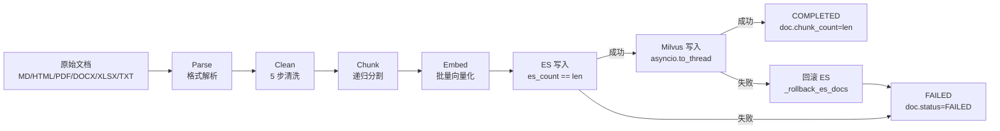
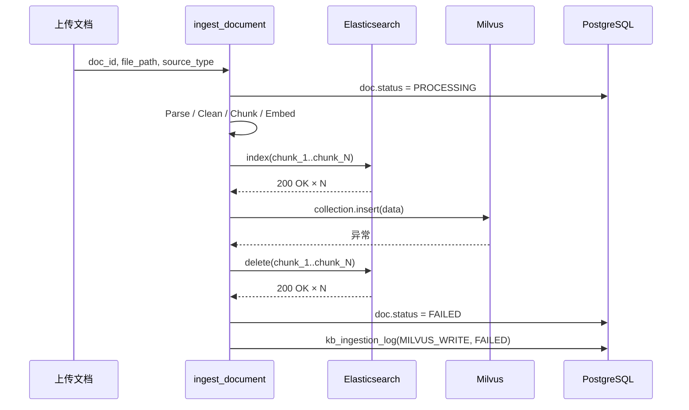

# 第 9 章: RAG 摄入管线

> 本章拆解 Lumio 把一份原始文档送进 ES + Milvus 的完整路径, 重点回答: 5 阶段为什么是这 5 个? 双写失败时怎么回滚? 如何做到增量版本管理?

## 9.1 5 阶段管线总览

文档摄入是 RAG 系统里最容易被低估的环节. 检索端 (`第 5 章`) 拿到的是已经向量化的 chunk, 看上去只取决于 Embedding 模型; 但 chunk 的边界是否合理、元数据是否完整、版本是否可追溯, 全部由摄入管线决定. Lumio 把摄入拆成 5 个明确的阶段, 每个阶段都写一条 `kb_ingestion_log` 流水:



为什么是 **Parse → Clean → Chunk → Embed → Dual-Write** 这五步? 核心约束是"先纯化, 再切分, 再向量化, 最后落库". Parse 阶段把二进制变成字符串, Clean 阶段去掉页眉页脚/控制字符等噪声, Chunk 阶段才能在干净的文本上找到语义边界; 如果反过来先切再清洗, 切出来的 chunk 边界很可能落在页眉上, 检索时把"第 3 页 / 共 20 页" 当成正文返回. Embed 必须在 Chunk 之后: 一次性把整篇文档塞给 Embedding 服务, 显存压力和超时风险都不可控. Dual-Write 最后做, 是因为只有到这一刻, 我们才拥有"可以同时被 ES (BM25) 和 Milvus (向量) 检索"的完整对象.

`ingest_document()` 是顶层编排器, 在 `agent/lumio/services/common/ingestion.py:522` 起. 它先查文档记录, 把 `doc.status` 置为 `PROCESSING`, 然后线性走完 5 个阶段. chunker 逻辑内联进 `ingestion.py`, 阶段间只通过字符串 / 字典传递, 减少了临时状态序列化开销.

## 9.2 Parse 阶段: 6 种文件格式

Parse 阶段的目标只有一个: 把任何格式变成纯文本. 6 种格式的解析器集中在 `ingestion.py:54-188`, 通过 `_PARSE_DISPATCH` 字典按 `KbSourceType` 派发:

| 格式 | 库 | 入口函数 | 特点 |
| --- | --- | --- | --- |
| Markdown | `markdown-it-py` | `parse_markdown` (`:54`) | 走 token 树, 只取 `text` 节点, 块级元素插 `\n` |
| HTML | `BeautifulSoup` + `lxml` | `parse_html` (`:77`) | 显式 `decompose` 掉 `script/style/nav/footer/header` |
| PDF | `pymupdf` (`fitz`) | `parse_pdf` (`:90`) | 逐页 `get_text()`, 简单但对扫描件无 OCR |
| DOCX | `python-docx` | `parse_docx` (`:105`) | 段落 + 表格分行, 表格用 ` \| ` 拼接 |
| XLSX | `openpyxl` | `parse_xlsx` (`:125`) | `read_only=True` 省内存, 行格式 `header: value \| ...` |
| TXT | 无 | `parse_text_content` (`:150`) | 仅 `strip()`, 直通 |

为什么 HTML 解析要主动 `decompose` nav/footer/header? 因为这些标签里几乎全是导航链接、版权信息、备案号, 检索时召回它们会污染 top-K 结果. 举个例子, 一份产品手册的"联系我们"区块如果被切成 chunk, 用户问"怎么退款" 时反而可能优先命中 footer 里的电话. 主动过滤是廉价的预防.

Markdown 的 token 树方案比正则替换更稳. 写法上 `parse_markdown` 不去管标题/列表语义, 只收集 `inline.text` 子节点, 然后在块级元素之间补 `\n` 维持段落感. 这种"语义忽略, 文本提取" 的策略在表格 / 代码块上有信息损失, 但配合后续 Chunk 阶段的中文句末优先断点已经够用.

PDF 是 6 种里唯一可能解析失败的 (扫描件), 目前 `parse_pdf` 抛异常会冒泡到顶层 `try/except`, 直接把 `doc.status` 标记为 `FAILED` (`:720`). 未来如果要支持扫描件, 应在 Parse 内部接 OCR 而不是把噪声推给下游.

## 9.3 Clean 阶段: 5 步清洗

`clean_text()` 在 `ingestion.py:211`, 5 步串行:

```python
# agent/lumio/services/common/ingestion.py:220
text = _RE_PAGE_HEADER_FOOTER.sub("", raw)      # 1. 去页眉页脚
text = _RE_CONTROL_CHARS.sub("", text)          # 2. 去控制字符
text = _RE_MULTI_SPACES.sub(" ", text)          # 3. 多空格合一
text = _RE_MULTI_NEWLINES.sub("\n\n", text)     # 4. 3+ 换行折叠为 2

# 5. 段落级 MD5 去重
```

5 步顺序不能换. 如果先合并空格再去除控制字符, 某些控制字符会冒充"占位空格" 把两个有意义的 token 粘在一起; 如果先折叠换行再去页眉, `第 3 页` 这类页眉被换行包夹, 正则匹配不到. 第 5 步的段落 MD5 去重专门处理 PDF 复制粘贴时的页眉残留: 即使前 4 步漏掉了 `Lumio 内部资料`, 同一份文档多个段落开头都是这 8 个字, 也只保留一份.

`page_header_footer` 正则 (`ingestion.py:196`) 同时匹配中英文:

```python
# agent/lumio/services/common/ingestion.py:196
_RE_PAGE_HEADER_FOOTER = re.compile(
    r"(第\s*\d+\s*页\s*/?\s*共\s*\d+\s*页|Page\s+\d+\s+of\s+\d+)",
    re.IGNORECASE,
)
```

`re.IGNORECASE` 让 `Page 3 of 20` 和 `PAGE 3 OF 20` 都能命中, 但代价是无法区分"正文里出现'第 3 页' 这种字面量" — 真实业务里这个概率极低, 当前可以接受.

## 9.4 Chunk 阶段: 递归字符分割

`chunk_text()` 在 `ingestion.py:297`, 默认 `chunk_size=1500`, `overlap=200`. 这里 1500 是中文字符数, 约等于 600-800 个英文 token, 对 `bge-large-zh-v1.5` 的 512 token 上限有充足余量 (一段中文 token 化后大约 1.8 倍字符数).

断点搜索在 `_find_break_point()` (`:251`), 3 个优先级:

1. **句末标点** `_SENTENCE_ENDINGS = "。！？；\n"` (`:44`)
2. **短语标点** `_PHRASE_ENDINGS = "，、：""）】》"` (`:46`)
3. **空格** (最后兜底)

搜索窗口是目标位置前后 ±200 字符 (`search_start = max(start, target - 200)`, `:262`). 为什么是 200? 它等于 overlap, 保证即使断点落在窗口最远端, 下一块也能从 `break_pos - 200` 继续, 不会和上一块完全无重叠.

为什么句末优先级最高? 因为中文的句号 / 问号 / 感叹号背后是完整的语义单元, 在这里断开 chunk 不会切断"主谓宾". 短语标点 (顿号 / 逗号) 通常连接并列项, 单独切断一个并列项会导致该 chunk 失去上下文. 空格是英文 / 数字的兜底断点, 命中率比前两个低很多.

## 9.5 Embed 阶段: 批大小 128 + 熔断器

`embed_chunks()` (`:344`) 把 chunks 按 `batch_size=128` 分批:

```python
# agent/lumio/services/common/ingestion.py:362
for i in range(0, len(chunks), batch_size):
    batch = chunks[i : i + batch_size]
    embeddings = await provider.embed(batch)
    all_embeddings.extend(embeddings)
```

128 这个数不是随便选的. TEI (`embedding.py:138`) 的 `bge-large-zh-v1.5` 模型 batch=128 时单次请求约 60-80ms, GPU 利用率能跑到 70%+. 继续增大到 256 时延翻倍但吞吐只提升 30%, 反而拖慢端到端. 128 也正好是 HuggingFace TEI 默认值, 跨环境一致.

`embedding.py` 里有两个实现: `OllamaEmbedding` (本地开发, 默认 `nomic-embed-text` 768 维) 和 `TEIEmbedding` (生产, `BAAI/bge-large-zh-v1.5` 1024 维). 两者实现 `EmbeddingProvider` 协议 (`embedding.py:26`), 由 `EmbeddingCircuitBreaker` (`:223`) 包一层做健康探测.

熔断器配置是 **3 失败开 / 2 成功关 / 30s 探测间隔**:

```python
# agent/lumio/services/common/embedding.py:230
self._probe_interval = 30.0
self._failure_threshold = 3
self._recovery_threshold = 2
```

为什么不"1 失败就开"? 因为单次健康探测可能因网络抖动失败, 1 次就熔断会让系统过于敏感. 3 次连续失败 (累计 90s 探测窗口) 几乎可以确认后端真出问题了. 关闭条件用 2 次成功而不是 1 次, 是为了避免"刚开又关" 的抖动. 30s 探测间隔是经验值, 嵌入服务出问题一般 30s 内仍处于恢复阶段, 没必要更密.

熔断器初始 `_is_open = True` (`:241`), 首次 `health_check()` 成功后才关闭. 这是冷启动安全: 进程刚起时不假定 TEI 一定可用, 一定要探一次.

## 9.6 Dual-Write 阶段: ES 先, Milvus 后

Dual-Write 是整个管线最容易出错的地方. Lumio 选择 **ES 先, Milvus 后**, 不是没有理由. ES 写入是单文档 `index()` 调用, 失败可以精确定位到 chunk_id; Milvus 是批量 `insert()`, 失败时只能回滚整批. 顺序反过来如果 Milvus 失败, 已经写入 ES 的 chunk 没法追溯是哪些 (因为还没回填 doc_group), 会出现"ES 有文档但用户搜不到" 的鬼影数据.

判定条件是 `es_count == len(chunk_records)` (`:653`):

```python
# agent/lumio/services/common/ingestion.py:652
es_count = await write_to_es(chunk_records, es_client)
es_ok = es_count == len(chunk_records)
```

ES 写满才算成功, 哪怕只丢 1 个 chunk 也要标 FAILED. 这是"全或无" 语义, 因为 ES 索引是检索的唯一入口, 缺一个就意味着少一条召回.

Milvus 写失败时调 `_rollback_es_docs` (`:472`) 逐个删除已写入的 ES 文档. 回滚失败也不抛出, 仅 `logger.debug`, 因为状态已经被主流程标为 FAILED, 后续重试会重新写 ES (用相同的 `chunk_id`, ES `index` 是 upsert 语义). 成功路径最后写 `KbChunk` 入库, 更新 `doc.status = COMPLETED` 和 `doc.chunk_count = len(chunks)`.



## 9.7 摄入日志: 7 阶段流水

`kb_ingestion_log` 表在 `shared/orm_models.py:412`, 配合 `KbIngestionStage` 枚举 (`:93`) 提供 7 个固定阶段:

`PARSE` → `CLEAN` → `CHUNK` → `EMBED` → `ES_WRITE` → `MILVUS_WRITE` → `KAFKA_PUBLISH`

注意 `KAFKA_PUBLISH` 在当前 `ingestion.py` 内联编排器里没有显式调用 — 它属于" 摄入完成后通知下游" 的发布阶段, 由上层服务 (例如 ingestion worker) 触发, 写日志时复用同一张表. 7 个阶段共用同一张流水表的好处是: 给定 `doc_id`, 一条 `SELECT stage, status, duration_ms, step_detail, created_at ORDER BY created_at` 就能复盘整个文档的生命周期.

每行写 (stage, status, duration_ms, step_detail), 其中 `step_detail` 是 JSON 字段, 容纳阶段特定的元数据. 例如 CHUNK 阶段写 `{"chunk_count": N}` (`:594`), EMBED 阶段写 `{"embedding_dim": 1024}` (`:606`), ES_WRITE 阶段写 `{"success_count": M, "total": N}` (`:660`). 这种"通用字段 + JSON 详情" 的设计避免了阶段专属列膨胀.

## 9.8 增量摄入与版本管理

企业知识库是持续演化的, 同一份产品手册会有 v1.0 / v1.1 / v2.0 多个版本. Lumio 的版本模型不靠"先删后写", 而是靠 PostgreSQL 的 **部分唯一索引**:

```sql
-- orm_models.py:282
Index(
    "doc_group",
    postgresql_where=text("is_current_version = true AND is_deleted = false"),
    unique=True,
)
```

含义: 同一 `doc_group` 下, 只能有 1 条记录同时满足 `is_current_version=true AND is_deleted=false`. 增量摄入时, 旧版本自动设 `is_current_version=false` (即被 supersede), 新版本占位为 `true`. 部分唯一索引让数据库本身保证一致性, 应用层不需要分布式锁.

ES 和 Milvus 在检索时会带上 `approval_status=PUBLISHED AND is_current_version=true` 的过滤 (`ingestion.py:409-411`), 旧版本 chunk 物理上还在索引里, 但永远不会被召回, 既保证可回滚又保证检索不返祖.

## 9.9 测试覆盖

`agent/tests/test_ingestion.py` 覆盖三个核心场景类:

- **TestCleanText** (`:18`): 页眉页脚清除 / 多空格合并 / 控制字符清理
- **TestChunkText** (`:58`): 短文本直通 / 长文本分块 / 中文句末边界优先
- **TestParse** (`:95`): Markdown token 树 / TXT 直通

其中 `test_chunk_respects_chinese_sentence_boundary` (`:81`) 是最关键的一条: 它构造一段长文本断言 chunk 边界落在 `。` 而非中段, 直接锁定了第 9.4 节的优先级约定. Milvus 写入和 ES 回滚走集成测试 (需要真集群), 不在单测范围.

## 9.10 小结

Lumio 的摄入管线把" 让 ES 和 Milvus 数据一致" 这个难题拆成 5 个串行阶段 + 1 个对账回滚路径. Parse 阶段屏蔽 6 种格式差异, Clean 阶段用 5 步正则清洗噪声, Chunk 阶段在中文句末优先断点, Embed 阶段走 128 批 TEI + 3/2/30s 熔断器, Dual-Write 阶段用 ES 先 / Milvus 后 + `_rollback_es_docs` 保证原子性. 7 阶段 `kb_ingestion_log` 是出问题时的第一现场, 部分唯一索引让版本管理不依赖应用层逻辑.

> **延伸阅读**:
> - [第 5 章 RAG 检索全链路](../05-rag-pipeline.md) — 检索端细节
> - [第 12 章 数据层](12-data-layer.md) — ES/Milvus 索引设计
> - [附录 A 术语表](../appendix/A-glossary.md#a6-rag-检索术语) — RAG 术语速查
