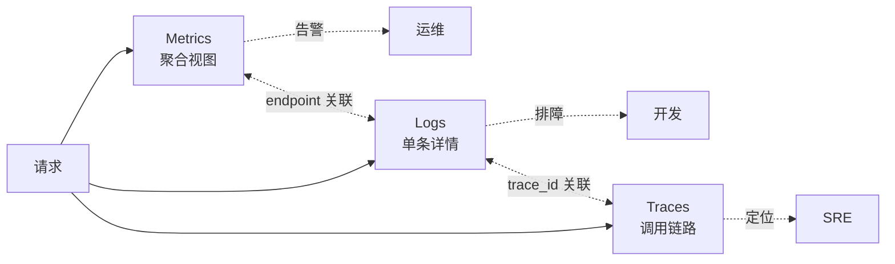
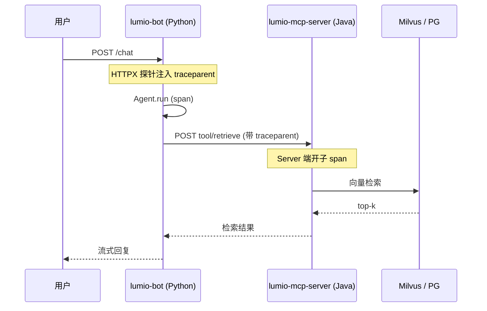

# 第 10 章: 可观测性

一个生产级多智能体系统,上线之后真正"难"的往往不是写代码,而是回答两个问题:「现在系统在做什么」「为什么它变慢了」。Lumio 把可观测性当作一等公民来设计——三个服务(`lumio-bot` / `lumio-assist` / `lumio-mcp-server`)共享同一套指标、日志与追踪基座,运维与开发可以基于同一份"事实"对话。

本章的叙述顺序会沿着「数据怎么产生 → 怎么聚合 → 怎么呈现 → 怎么告警」的链路展开,先讲三大支柱的概念,再分别看 Prometheus 指标、JSON 日志、OTel 追踪的实现细节,最后落到仪表盘与告警规则上。

## 10.1 三大支柱:Metrics / Logs / Traces

可观测性的经典三角是指标(Metrics)、日志(Logs)、追踪(Traces)。Lumio 的实现选择不是巧合,而是各取所长:

- **Metrics(Prometheus)**——低成本、高基数友好,适合「看趋势、做告警」。Prometheus 每 15s 主动拉取一次,数据在 TSDB 里以 counter 增量和 histogram bucket 形式长期存储,几 GB 就能覆盖数月的业务时序。
- **Logs(JSON)**——高上下文,可携带完整请求体与业务字段,适合「排障时翻记录」。Loki 这类日志聚合系统对 JSON schema 友好,字段级查询的体验接近数据库。
- **Traces(OTel)**——单次请求跨多个服务、多个函数的串联视图,适合「定位慢在哪一跳」。一条 trace 可以挂几十个 span,每个 span 自带耗时、attributes、events。



三者通过 `trace_id` 和 `endpoint` 互相串联:同一次请求产生的所有日志都会带上当前活跃 span 的 `trace_id`(`logger.py:34-47`),而指标又可以按 `endpoint` 维度聚合——这样从"哪个端点慢了"下钻到"具体哪次调用报错了"是平滑的,中间不需要人工做 join。

值得提醒的一点:三大支柱不是"加得越多越好"。每加一个指标,TSDB 就要多一份存储;每加一条日志,Loki 就要多一份索引;每开一个 span,OTel collector 就要多一份处理。Lumio 在选型时严格遵循「**指标回答 what、日志回答 how、trace 回答 where**」的分工——能用 counter 回答的就不打 log,以此控制观测成本。

## 10.2 17 个 Prometheus 指标

`agent/lumio/shared/metrics.py` 是两个 Python 服务共用的指标注册表。指标选型遵循两个原则:① **优先 Counter/Histogram 而非 Gauge**,因为前者是单调累加的,Prometheus 的 `rate()` 函数天然友好;② **label 维度控制在可枚举范围内**,避免高基数把 TSDB 撑爆。

按命名空间分两组:

### 通用域:`http_*` / `llm_*` / `tool_*` / `session_*`

这五个名字是"领域无关"的,任何 Web 服务都能复用:

| 指标名 | 类型 | 关键 labels | 来源 |
| --- | --- | --- | --- |
| `http_requests_total` | Counter | method / endpoint / status | `metrics.py:18-22` |
| `http_request_duration_seconds` | Histogram(9 buckets) | method / endpoint | `metrics.py:24-29` |
| `session_transitions_total` | Counter | from_phase / from_sub / to_phase / to_sub / reason | `metrics.py:33-37` |
| `session_timeouts_total` | Counter | sub_phase / reason | `metrics.py:39-43` |
| `session_phase_duration_seconds` | Histogram | sub_phase | `metrics.py:45-50` |
| `tool_calls_total` | Counter | tool / status | `metrics.py:54-58` |
| `tool_confirmations_total` | Counter | decision | `metrics.py:60-64` |
| `tool_guard_denials_total` | Counter | tool / reason | `metrics.py:66-70` |
| `llm_call_duration_seconds` | Histogram | model / method | `metrics.py:74-79` |

注意 `http_request_duration_seconds` 的桶是 `[0.01, 0.05, 0.1, 0.25, 0.5, 1.0, 2.5, 5.0, 10.0]`——这是经验值,既覆盖了健康路径(0.1s 内),又给 P99(5~10s)留了尾部空间;而 `llm_call_duration_seconds` 的桶一直延伸到 60s,因为 LLM 推理天然就慢。

### 业务域:`lumio_*`

剩下 8 个指标全部以 `lumio_` 为前缀,代表「只对 Lumio 业务有意义」:

| 指标名 | 类型 | 关键 labels | 用途 |
| --- | --- | --- | --- |
| `lumio_fast_reply_total` | Counter | — | 并发满载时的模板兜底计数 |
| `lumio_agent_responses_total` | Counter | source | 区分 llm / template / fallback / tool_* |
| `lumio_bot_semaphore_utilization` | Gauge(0~1) | — | Agent 信号量占用率 |
| `lumio_active_workers` | Gauge | — | 活跃会话 worker 数 |
| `lumio_stream_length` | Gauge | — | Redis Stream 当前长度 |
| `lumio_stream_pending_total` | Gauge | — | PEL 待确认消息数 |
| `lumio_retrieval_duration_seconds` | Histogram | search_type | hybrid / bm25 / vector |
| `lumio_degradation_level` | Gauge(0/1/2) | — | 0=normal, 1=degraded, 2=fallback |

**为什么分通用/业务两套前缀?** 这是有意识的命名空间选择:通用域用 `http_*` 而不是 `lumio_http_*`,这样未来如果 Lumio 要开源指标 SDK,或被其他项目引用,这些名字不会显得"私有";而 `lumio_*` 名字本身就是一道"业务边界",dashboard 上 `rate(lumio_*)` 一筛,就能拿到 Lumio 自己的健康度视图,不会被通用 HTTP 噪声淹没。

另外,业务域里三个 Gauge(`semaphore_utilization` / `active_workers` / `stream_pending`)反映的是 Bot 运行时状态,由 router 的监控循环周期性刷新——**这些 Gauge 不在 PrometheusMiddleware 里写,而是有专门的 background coroutine 每 5s 同步一次**。这种"指标自治"的拆分让中间件不必知道业务有多少种 Gauge,新加业务指标只需要在 router 里写,不需要改 shared 库。

另有 3 个 session 维度的指标:`session_phase_duration_seconds` 用来观察每个子阶段(等待用户/处理中等)的停留分布,桶覆盖 5s 到 3600s;`tool_confirmations_total` 区分"用户确认 / 取消 / 模糊 / 过期"四种决策,帮助产品观察敏感工具的用户体验;`tool_guard_denials_total` 区分"角色不足"与"额度超限",给安全团队一个独立的拦截监控面。

### PrometheusMiddleware:自动打点与反馈循环防护

Starlette/FastAPI 的请求打点用 `PrometheusMiddleware` 自动完成(`metrics.py:138-160`)。它在 `try/finally` 里包住下游,无论请求成功还是抛异常,都会写入计数与耗时:

```python
# metrics.py (第五轮修复后)
async def send_wrapper(message):
    nonlocal status_code
    if message["type"] == "http.response.start":
        status_code = message.get("status", 200)
    await send(message)

try:
    await self.app(scope, receive, send_wrapper)
finally:
    duration = time.perf_counter() - start
    endpoint = _normalize_metric_path(path)  # 高基数防护
    REQUEST_COUNT.labels(method=method, endpoint=endpoint, status=status_code).inc()
    REQUEST_LATENCY.labels(method=method, endpoint=endpoint).observe(duration)
```

**高基数防护 (第五轮修复)**: 纯 ASGI 中间件执行早于路由匹配, `scope["route"]` 恒为 None — 直接取原始 path 会让 `/api/sessions/{uuid}/messages` 每个会话一个时间序列, 打爆 TSDB。现用 `_normalize_metric_path` 做**模板化归一化**: 8+ 字符且含数字/连字符的路径段 (UUID/长数字) → `{param}`, 纯字母短词 (chat/send/health) 不受影响:

```python
_PATH_PARAM_RE = re.compile(r"/(?=[0-9a-zA-Z-]*[0-9-])[0-9a-zA-Z-]{8,}")
# /api/sessions/550e8400-.../messages → /api/sessions/{param}/messages
```

这里有一个常被忽略但很致命的细节:`_EXCLUDED_PATHS = {"/metrics", "/health", "/favicon.ico"}`(`metrics.py:129`)。如果不排除 `/metrics` 端点本身,Prometheus 每 15s 抓一次就会产生一条新指标,这个指标又会触发下一次抓取——**指标反馈循环**会让 TSDB 在几小时内被自己的噪声打爆。`/health` 同样如此(LB 健康检查通常 QPS 极高,会把 `http_request_duration_seconds` 的 P99 拉到不可信)。这个 3 项白名单是防御反馈循环的关键,被锁定为"不允许删"。

## 10.3 JSON 结构化日志

人类读文本日志方便,但机器检索/Loki 解析/ELK 聚合都需要结构化。Lumio 提供两套格式,生产推荐 JSON。`shared/logger.py` 里三个 filter/format 协作完成:

- `PIIMaskFilter`(`logger.py:17-31`):在 record 落到 handler 之前调 `mask_pii`(`shared/pii.py`),把手机号、身份证、邮箱、敏感键值替换成 `***`。这层必须放在 handler 上而不是业务代码里,否则任何 `logger.info(f"user {phone}")` 都会漏网。
- `TraceContextFilter`(`logger.py:34-47`):从 `tracing.get_trace_context()` 拿当前活跃 span 的 `(trace_id, span_id)`,挂到 `record` 上。这是「日志 ↔ 链路」关联的关键。
- `JSONFormatter`(`logger.py:50-73`):把 record 序列化成固定 schema:`timestamp / level / logger / message / module / function / line / exception / extra`;有 `trace_id` 时附在 `trace_id` / `span_id` 字段,这样 Loki 里查 `trace_id="abc..."` 就能拉出这一次请求的全部日志。
注意 `TraceContextFilter` 在没有活跃 span 时**完全不写字段**,这是有意的——零开销,零噪声。如果无脑写空字符串,反而会让日志解析时多一层 `if` 判断。`setup_logger()` 的设计是"幂等":已经 attach 过 handler 的 logger 直接返回,避免重复添加导致一条日志被打印多次。

## 10.4 OpenTelemetry 全链路追踪

Lumio 服务的追踪基于 OTel SDK,封装在 `shared/tracing.py` 里。设计哲学是"**业务代码零 OTel 依赖**"——开发者只 `@traced("Agent.run")`,不需 import 任何 opentelemetry 包。

### 探针与单例 TracerProvider

`_init_tracing()`(`tracing.py:74-135`)是单例,模块级 flag `_provider_initialized` 保证只跑一次。它做四件事:

1. 从 `ObservabilitySettings` 读 `enabled / jaeger_host / otlp_endpoint`;
2. 构造 `Resource`,挂上四个属性(下文详述);
3. 选 `ParentBasedTraceIdRatioSampler` 而不是裸 `TraceIdRatioSampler`——这是跨服务 trace 能否串起来的关键;
4. 注册 `OTLPSpanExporter` + `BatchSpanProcessor`,默认发到 `http://{jaeger_host}:4318/v1/traces`。

`instrument_app(app, app_name)`(`tracing.py:138-163`)装三个自动探针: FastAPI、Redis、**HTTPX**。前两个大家熟悉,第三个是重点:

```python
# tracing.py:155-160
# HTTPX 探针:MCP streamable-http 每次出站 POST 自动注入 W3C traceparent,
# 使 Python 客户端 span 与下游 Java server span 串成同一条链路.
with contextlib.suppress(Exception):
    from opentelemetry.instrumentation.httpx import HTTPXClientInstrumentor
    HTTPXClientInstrumentor().instrument()
```

Lumio Bot 通过 HTTPX 调用 Java 写的 `lumio-mcp-server`,而 MCP streamable-http 本身就是普通 HTTP POST。**没有 HTTPX 探针的话,Python 侧的 `tool_calls` span 和 Java 侧 server span 是断开的**——你只能看到"我调了 MCP",看不到"对方做了什么、慢在哪"。HTTPX 探针在每次出站请求自动塞 W3C `traceparent` header,下游收到后接着开子 span,自然连成一条树。

### 跨服务 trace 流



上图中,Bot 端 trace 和 MCP 端 trace 共享同一个 `trace_id`,只在 Jaeger UI 里以"不同 service 但同一 trace"展示。开发只需要在 Jaeger 里按 `trace_id` 一搜,就能从"用户消息进 bot"一路下钻到"Java 端向量检索用了多少 ms"。

### Resource 属性

`_init_tracing` 给每个 span 挂上 4 个 resource 属性(`tracing.py:108-115`):

| 属性 | 值 | 用途 |
| --- | --- | --- |
| `service.name` | `lumio-bot` / `lumio-assist` / `lumio-mcp-server` | Jaeger 按服务过滤 |
| `service.namespace` | `lumio` | 业务域聚合 |
| `service.version` | 见下文优先级 | 发版前后对比 |
| `deployment.environment` | 从 `Settings.environment` 读 | 区分 dev/staging/prod |

`service.version` 的读取优先级是 (`tracing.py:24-54`):

```text
LUMIO_VERSION env > pyproject.toml [project].version > 0.0.0
```

设计要点:只读 env 时,本地开发没设 env 就拿到空字符串,Jaeger 看到的所有 span 都是"未版号化"的,排查"这个 bug 在哪个版本引入"非常费劲。因此从 `pyproject.toml` 读 PEP 621 的 `[project].version` 兜底,真正"开箱即用",CI 上再被 `LUMIO_VERSION` 覆盖。兼容旧字段 `LUMIO_TRACING_ENABLED` 用 Pydantic 的 `AliasChoices` 做了别名兼容,升级期不会破坏现有 `.env`。

`_read_service_version` 还做了三件小事:① 用 `tomllib`(Python 3.11+)或 `tomli` 回退,跨版本都跑得起来;② 兼容 Poetry 1.x 的 `[tool.poetry].version`;③ 读不到时返回 `"0.0.0"` 而不是抛异常,符合 OTel 规范对 `service.version` 的"non-empty string"要求。

### 采样策略

`ParentBasedTraceIdRatioSampler(sampling_ratio)`(`tracing.py:118`)的语义是:

- 如果上游请求带了 `traceparent`——跟随上游决策(上游采样我也采,上游丢弃我也丢);
- 没有上游——按本地 `sampling_ratio` 决定。

这避免了"本地配 10% 但因为上游被丢弃导致整条 trace 缺一半"的尴尬。生产默认 1.0(全采),压测或高 QPS 时降到 0.1。

## 10.5 审计中间件:状态变更的"事后账本"

`shared/audit_middleware.py` 解决的是合规问题:谁、什么时候、对哪个对象、做了什么操作。这部分用 fire-and-forget 异步写库,**不阻塞主请求路径**:

```python
# audit_middleware.py:48-53
try:
    import asyncio
    asyncio.create_task(_write_audit_log(request, response, elapsed_ms))
except Exception:
    logger.debug("审计日志创建任务失败: %s %s", request.method, path)
```

`_write_audit_log`(`audit_middleware.py:58-111`)从 JWT 解出 `actor_id / actor_role`,再调 `_infer_action` 推断操作类型。`actor_id` 默认 `"anonymous"`,在开发环境下会用 `dev-user` 兜底,方便本地手测时不必每次都拿 token。`detail` 字段除了 `elapsed_ms`,还会记录脱敏后的 query params——这条细节在合规审计里很重要:如果某个 `DELETE` 出问题了,审计员需要能复现当时的过滤条件。

**核心是 `_ENDPOINT_ACTION_MAP`**(`audit_middleware.py:174-206`):24 个端点函数名 → `(action, target_type)` 的精确映射表。`_infer_action` 的优先级是「**先查路由元数据,再 fallback 到路径字符串**」:

```python
# audit_middleware.py:124-132
route = request.scope.get("route")
if route is not None and hasattr(route, "endpoint"):
    endpoint_name = route.endpoint.__name__
    mapped = _ENDPOINT_ACTION_MAP.get(endpoint_name)
    if mapped:
        action, target_type = mapped
        target_id = _extract_target_id(request.url.path, target_type)
        return action, target_type, target_id
```

为什么"路由元数据"比"路径字符串"更可靠?因为路径可以被改、被翻译、被装饰器插入,例如 `PUT /api/v1/session/{id}/hold` 既可能被认成 `session.transition` 也可能被认成 `session.hold`;但 `hold_session` 这个函数名唯一对应 `session.hold`。仅用路径推断容易"action 记错"。GET 类不审计(`_AUDITED_METHODS` 只含 POST/PUT/PATCH/DELETE),纯读操作不需要合规留痕。

24 个端点覆盖了三类业务:`assist/router.py` 的会话/反馈/通知/复盘类、`bot/router.py` 的聊天/文档类、`faq_router.py` 的 FAQ 全生命周期类,加上 `auth_router.py` 的 `login`。新增端点时,需要同步在映射表里登记,否则会回退到路径推断——这是 code review checklist 的固定项。审计模块的 connection pool 与请求池分开,即使审计慢也不会拖垮主业务。

## 10.6 Grafana 仪表盘与告警规则

3 套 dashboard 各有分工:

- `config/grafana/dashboards/lumio-overview.json` —— **15 panel** 业务总览,核心是 HTTP 速率、Agent 槽位利用率、PEL 待处理数、P50–P99 延迟分位、会话阶段转换漏斗。这个 dashboard 是 SRE 日常巡检的主入口。
- `config/grafana/dashboards/middleware.json` —— **15 panel** 基础设施,顶部 6 个状态卡实时展示 Bot / Assist / Redis / PostgreSQL / Kafka / Milvus 的 up 状态。一旦某个依赖变红,运维能在第一时间收到 alert 通知。
- `config/grafana/dashboards/lumio-dashboard.json` —— 业务概览(111 行),关注 Lumio 自身核心 KPI,例如"每小时回答多少条消息""LLM 调用与模板兜底的比例"。

告警规则集中在 `config/prometheus/rules/alerts.yml` 6 条:

| 规则 | 触发条件 | 持续 | 严重度 |
| --- | --- | --- | --- |
| `ServiceDown` | `up==0`(bot/assist/mcp 任意) | 1m | critical |
| `MCPToolErrorRateHigh` | MCP 工具错误率 > 10% | 5m | warning |
| `PyToolErrorRateHigh` | 编排层工具错误率 > 10% | 5m | warning |
| `LLMLatencyP99High` | LLM p99 > 15s | 5m | warning |
| `HTTPLatencyP99High` | HTTP p99 > 5s | 5m | warning |
| `SessionTimeoutSpike` | 超时速率 > 1/s | 5m | warning |

`ServiceDown` 是唯一 critical,因为单个服务下线意味着用户体验直接受损;其余都是 warning,给 SRE 留出调查窗口。两类工具错误率分开告警是因为 MCP 错误可能来自下游 Java 服务,Python 侧错误可能来自编排逻辑,二者的根因和处置路径完全不同。

告警规则里有几个值得展开的细节:`clamp_min(..., 1e-9)`(`alerts.yml:23-24`)在分母为 0 时兜底,避免 `rate(...)/0` 出现 `NaN`(Prometheus 对 `NaN` 的处理是"不触发告警",反而让错误隐藏);`histogram_quantile(0.99, sum(rate(...)) by (le))`(`alerts.yml:49`)的分位计算必须在 `by (le)` 之后聚合,这是新人常踩的坑;所有 warning 都用 `for: 5m` 过滤掉抖动——如果用 `for: 1m`,一次 GC 抖动就会拉一堆告警,让 on-call 同学对告警失去敏感度。`Alertmanager` 在配置里是 opt-in,默认只让 Prometheus 把告警状态显示在 UI 的 Alerts 页,适合还没接 Slack/钉钉的小团队。

## 10.7 小结

Lumio 的可观测性是按"开发愿意用、运维信得过"双向目标设计的:开发侧只有 `@traced` 一行成本,业务代码不需要 import OTel 包;运维侧有 17 指标 + 3 dashboard + 6 告警的标准化视图。"反馈循环"、"路由元数据精确审计"、"resource version fallback"这些边界条件都固化为代码,确保新同学不会在不知情时再踩同样的坑。

> **延伸阅读**:
> - [第 8 章 错误处理](08-error-handling.md) — 错误响应体格式
> - [第 11 章 安全合规](11-security-compliance.md) — 审计与脱敏
> - [第 13 章 部署](13-deployment.md) — Prometheus 抓取配置
