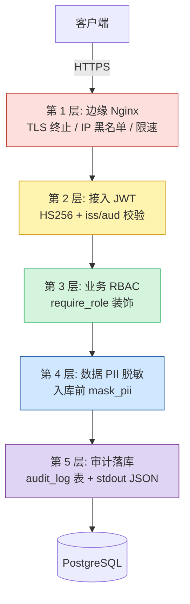
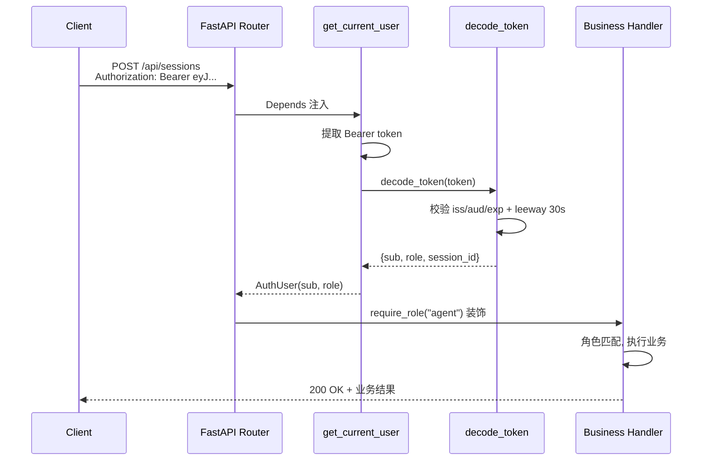

# 第 11 章: 安全合规

Lumio 是一款银行场景的智能客服助手,任何一次越权读、一次敏感词漏检、一次错误响应里泄露的数据库连接串,都可能触发银保监的合规审查。本章从纵深防御的全局视角出发,逐层拆解边缘网关、接入鉴权、业务授权、数据脱敏与审计回溯这五道防线的设计动机与代码实现,并重点回顾 P0/P3 阶段几次关键整改背后的权衡。

## 11.1 纵深防御:为什么需要 5 层

银行客户对"防御"的理解不是"一道墙够不够厚",而是"墙被突破后,还剩几道"。Lumio 因此采用了**纵深防御 (Defense in Depth)** 模型,将请求生命周期切分为 5 个独立失效域:任何单层失守,其他层仍能阻断或留痕。



5 层各司其职,设计上不允许跨层"借力":例如 Nginx 不会做应用层鉴权,JWT 不会做业务级字段过滤。一旦某一层需要扩展,改动也只局限在那一层,不会引发雪崩式回归。第 10 章讲到的可观测性横切所有 5 层,但它本身不是独立防线。

## 11.2 JWT 接入:从签发到解析的完整链路

Lumio 选用 JWT 而非 Session,核心动机是**无状态**:多副本部署无需共享 session 存储,access token 自带 role 声明,网关层可直接做粗粒度路由。但 JWT 一旦泄漏即可被任意重放,所以签发、解析、刷新三段都做了针对性加固。

### 11.2.1 access token 与 refresh token

`create_access_token()` (auth.py:67-93) 构造 7 个标准声明:

```python
payload = {
    "sub": user_id, "role": role,
    "iss": "lumio", "aud": "lumio-api",
    "exp": expire, "iat": now, "jti": uuid4().hex,
}
```

- `iss=lumio` / `aud=lumio-api` 用于拒绝跨服务 token 互用,例如 chat-svc 的 token 不会被 assist-svc 接受。
- `jti` 给每次签发一个唯一 ID,理论上未来可用于黑名单撤销,目前仅做日志关联。
- 过期时间默认 30 分钟 (`jwt_expire_minutes`),由配置注入,方便按安全等级调短。

`create_refresh_token()` (auth.py:96-112) 走另一条命名空间 `aud=lumio-refresh` 并显式标 `type=refresh`,生命周期 7 天。这样即便 refresh token 被截获用于调用业务接口,也会因 `aud` 不匹配被立即拒绝。

### 11.2.2 解码与时钟容差

`decode_token()` (auth.py:115-133) 在 `jwt.decode` 中显式传入 `issuer="lumio"` 与 `audience="lumio-api"`,库内部会做严格比对;同时设置 `leeway=30`,容忍 ±30 秒的多机时钟漂移。这个数值的选择有讲究:银行内网 NTP 通常同步到秒级,30 秒既覆盖偶发抖动,又不会让一张被吊销的 token 长期可用。

### 11.2.3 依赖注入与 dev 旁路

`get_current_user()` (auth.py:139-175) 是 FastAPI `Depends` 的入口,先尝试 `Authorization: Bearer <token>`,`?token=xxx` query param **仅限 development 环境** (生产环境拒绝, 防 token 落访问日志/Referer/代理缓存 — 第五轮加固)。WS 握手鉴权同样走 query param token + 有效性校验。



### 11.2.4 全端点认证与角色矩阵 (第五轮加固)

chat/session 全部端点强制 `user: CurrentUser` 依赖,并带 **session 归属校验** (JWT 声明 session_id 与请求不一致 → 403; customer 读他人会话按 meta owner 二次校验)。`list_sessions` 按用户过滤 — customer 只见自己的会话, admin/agent 才可全量枚举。

权限矩阵 (第五轮补齐, 此前三个"总开关"级缺口):

| 端点 | 要求 | 防御 |
|---|---|---|
| `/admin/sensitive-words` GET/PUT | admin | 任意登录用户可清空全系统过滤词库 |
| `/admin/dead-letter` | admin | 匿名可读原始客户消息 (PII) |
| `/kb/documents/{id}/approve/reject/publish/archive` | admin | 绕过"审核-发布"合规流程 |
| `/admin/rules/reload` `/admin/stats` | admin | 规则热加载/业务统计 |
| `/api/chat/*` `/api/sessions/*` | 登录 + 归属 | 匿名读写对话 |
| `/api/gdpr/delete` | 本人或 admin | 删除请求发起 |

**原则**: 安全代码的默认值必须是拒绝 — 认证用显式依赖而非可选参数, 角色用 `require_role` 依赖而非函数内 if, 合规过滤缺失字段视为不合规而非默认放行。

## 11.3 P0-2 / P0-3 整改:占位密钥与 dev 旁路的正确关闭方式

合规上线前两次关键 P0 整改值得专门记录,因为它们揭示了"配置安全"与"环境默认"两个最易被忽视的失败模式。

### 11.3.1 P0-2:JWT 占位密钥拦截

历史问题:`Settings.jwt_secret` 默认值是 `lumio-dev-secret-change-in-production`,代码里没有强制覆盖。如果运维漏配 `LUMIO_JWT_SECRET`,服务会**静默用默认密钥启动**,所有 token 可被任何人伪造。

`config.py:473-498` 的 `_validate_production_security` 修复了这个问题:

```python
forbidden_secrets = {
    "lumio-dev-secret-change-in-production",
    "<CHANGE_ME>", "<CHANGE_ME_IF_NEEDED>",
}
if self.jwt_secret in forbidden_secrets:
    if self.environment == "production":
        raise ValueError("生产环境必须设置 LUMIO_JWT_SECRET ...")
    # dev/test 也仅 WARNING, 不阻断启动 (兼容本地开发)
    logger.warning("⚠️  JWT 密钥仍为占位值 ...")
if self.environment == "production" and len(self.jwt_secret) < 32:
    raise ValueError("生产环境 JWT 密钥长度必须 >= 32 字符")
```

设计动机:生产环境**硬阻断**,dev/test 环境**告警但不阻断**——避免本地开发时每次都要 `openssl rand` 改 secret。生产长度门槛定在 32 字符,刚好覆盖 `hex(32)` 生成的 64 字符熵。

### 11.3.2 P0-3:dev bypass 限定 loopback

历史 bug 更隐蔽:旧版 `get_current_user` 在 dev + 本地绑定场景下,无 token 直接放行 `admin`。问题在于"本地绑定"的判断是 `service_host` 不在公网 IP 列表,但容器化部署若把 `0.0.0.0` 当成自查通过的依据,任何能访问容器 8080 端口的远端流量都会获得 admin。

修复 (auth.py:158-168) 引入显式开关 `dev_auth_bypass` + 严格 loopback 校验:

```python
if settings.dev_auth_bypass and settings.environment == "development":
    if settings.service_host not in ("127.0.0.1", "localhost"):
        raise AuthenticationError(
            "开发旁路仅允许绑定 loopback (127.0.0.1/localhost), "
            f"当前 service_host={settings.service_host!r}"
        )
    return AuthUser(user_id="dev-user", role="admin")
```

**双条件**是核心:即使显式开启旁路,绑定地址不在 loopback 也拒绝;而默认 `dev_auth_bypass=False` 让生产或 staging 环境根本进不到这段逻辑,杜绝"配置漂移引发提权"。

## 11.4 密码哈希:为什么是 PBKDF2 而不是 argon2

`shared/password.py` 用 `hashlib.pbkdf2_hmac` 实现 PBKDF2-HMAC-SHA256,迭代次数 600000 次,产物格式与 Django 完全一致:`pbkdf2_sha256$600000$<salt_b64>$<hash_b64>`。

```python
salt = secrets.token_bytes(16)
digest = hashlib.pbkdf2_hmac("sha256", password.encode(), salt, 600000)
return f"pbkdf2_sha256$600000${b64(salt)}${b64(digest)}"
```

为什么不用 argon2 / bcrypt?这是工程权衡,不是技术先进性问题:

- **零外部依赖**:`hashlib` 是 Python 标准库,跨 musl/alpine 镜像零编译痛苦。passlib+bcrypt 在 alpine 上要装 rustc、build-base,镜像膨胀 300MB+,CI 缓存命中率下降。
- **生态成熟**:600000 次迭代对齐 OWASP 2023 建议,Django/Flask 默认同款算法,审计与迁移成本低。
- **时序攻击防御**:`verify_password` 用 `secrets.compare_digest` 而非 `==`,防止攻击者通过响应时间差异逐字节猜 hash。

代价是 CPU:单次校验在主频 2.6GHz 机器上约 350ms,登录接口必须做限速,否则就是天然 DoS 入口。`require_role` 与 `get_current_user` 都不涉及密码哈希,不会被这个开销拖累。

## 11.5 Aho-Corasick 敏感词过滤

银行客户对话里出现竞品名称、监管敏感词、政治关键词是常态。Lumio 用 `pyahocorasick` 实现 AC 自动机,核心动机是**O(n) 匹配复杂度与词库大小无关**——万级词库下整段对话扫描仍 < 100ms。

### 11.5.1 归一化与热更新

`safety.py:39-117` 的 `SafetyFilter` 类做了三件事:

1. `_normalize()` 用 `unicodedata.normalize("NFKC", text)` 把全角字符转半角,再 `lower()`。这步至关重要:银行客户经常输入全角数字和字母,词库是半角写的,不做归一化会全军覆没。
2. `load_from_file()` 启动时一次性加载,`add_word()` 支持增量,内部调 `make_automaton()` 重建 DFA。
3. Redis Pub/Sub 通道 `lumio:safety:reload` 接收热更新信号,从 `lumio:safety:words` 这个 Set 拉取最新词库,避免改一个词要重启服务。

### 11.5.2 双重过滤

合规要求"出口必查":任何用户输入在**应用层**先过一次 `check_input()`,命中即拒绝;同时所有原始文本进入**审计层**时再过一次 `filter_output()`,把命中的敏感词替换为 `*` 后再写日志。这样即使应用层策略被绕过,审计日志里也不会出现原始敏感词,事后追溯不被污染。

## 11.6 PII 脱敏:5 类规则 + 顺序敏感

`shared/pii.py:20-77` 提供 5 类脱敏,各自一条正则:

| 类型 | 模式 | 输出示例 |
|------|------|----------|
| 手机号 | `1[3-9]\d{9}` | `138****5678` |
| 身份证 | `\d{17}[\dX]` | `110101********1234` |
| 银行卡 | 16-19 位连续数字 | `6222****7890` |
| 邮箱 | 标准 RFC 简化 | `z***@example.com` |
| JSON 敏感 key | password/secret/token/api_key/cvv/pin | 值替换 `******` |

`mask_pii()` 的调用顺序不是随意排列,而是有强约束:**敏感字段 → 邮箱 → 身份证 → 银行卡 → 手机号**。身份证 18 位、银行卡 16-19 位都包含 11 位连续数字子串,如果手机号规则先跑,会把身份证尾数 4 位当手机号中段误判成 `110101********5678`(中间只遮 4 位而不是 8 位)。身份证与银行卡先跑把"长串数字"先吃掉,剩下独立的 11 位才轮到手机号规则。

这个细节在 code review 时容易漏掉,所以写在函数 docstring 里钉死。

## 11.7 双重审计:DB 落库 + stdout JSON

`shared/audit_middleware.py` 实现**双通道审计**——同一操作既写 `audit_log` 表(供合规取证与查询),也通过结构化日志走 stdout(供 ELK/Loki 聚合)。两路并行,互不阻塞,任何一路故障不影响另一路。

关键设计是 `_ENDPOINT_ACTION_MAP` (audit_middleware.py:174-206):21 条端点函数名到 `(action, target_type)` 的精确映射,优先级高于路径字符串推断。这是因为路径推断会因 `/api/v1/sessions/{id}/update` 与 `/api/v1/sessions/update` 在 `/update` 命中上歧义,而 FastAPI 路由匹配后 `request.scope["route"].endpoint.__name__` 是唯一确定的,这是"权威来源"。

```python
# 精确映射示例
"submit_review": ("review.submit", "review"),
"approve_faq": ("faq.approve", "faq"),
"publish_faq": ("faq.publish", "faq"),
```

未命中映射的端点才走兜底路径推断,标注 `target_type=other` 方便监控告警,提示补充映射。

## 11.8 银行合规字段:KbDocument 7 态审批

知识库文档不是"上传就能用",监管要求**双人四眼 + 版本隔离 + 可见性控制**。`shared/orm_models.py` 的 `KbDocument` 因此带了一组独有字段:

- `approval_status`:7 态枚举 `DRAFT → IN_REVIEW → APPROVED → PUBLISHED → SUPERSEDED → REJECTED → ARCHIVED`。`SUPERSEDED` 显式表示被新版本替代,而不是直接删除,留可追溯。
- `doc_group`:文档组 ID,同一逻辑文档的不同版本共享,语义上相当于"业务主键"。
- `is_current_version`:PARTIAL UNIQUE 索引 (`postgresql_where=is_current_version = true AND is_deleted = false`),数据库层保证**同一 doc_group 仅一个生效版本**。
- `allowed_roles`:JSON 数组,可见角色白名单。例如"信用卡章程"只对 `agent` 和 `admin` 可见,`customer` 查询时被自动过滤。
- `regulatory_tags`:监管标签,如 `["银保监", "反洗钱"]`,供合规报表分组导出。

7 态审批不是过度设计:`DRAFT`(撰写中)与 `IN_REVIEW`(审核中)必须可区分,否则审核员看不到积压;`REJECTED` 与 `ARCHIVED` 看似都不可用,实际 `REJECTED` 是被打回要修改、`ARCHIVED` 是已废弃不可恢复,合规报表需要分别统计。

## 11.9 输入验证:P3-7 整改(commit 19ac8f6)

合规审查发现早期接口对输入长度几乎不设防,埋了两个隐患:

- 用户消息无上限,一次 POST 几 MB 文本就能撑爆网关与日志存储;
- session_id / customer_id 无字符限制,可通过特殊字符试探 SQL 注入(虽然 ORM 已参数化,但日志里出现的奇怪字符串会让运维误判)。

修复 (P3-7, commit `19ac8f6`) 后:

- `message` 字段 `max_length=2000`,覆盖正常客户咨询 3-5 倍冗余;
- `session_id` / `customer_id` `max_length=128`,远超 UUID 与业务主键长度;
- 文件上传 50MB (`bot/router.py:1232 max_upload_size = 50*1024*1024`),扩展名走白名单 `_ALLOWED_EXTENSIONS`,黑名单 `.exe .sh .bat` 必拒。

50MB 是经验值:银行 PDF 章程通常 5-20MB,知识库批量上传峰值场景 50MB 留 2-3 倍冗余;再大就强制走对象存储分片上传,不走 HTTP body。

## 11.10 健康检查脱敏:P3-6 整改(commit 28457e0)

`/api/health/ready` 端点历史 bug:依赖故障时把 `str(e)[:100]` 直接吐给客户端。看似贴心的"错误详情"实际会泄露:

- `password authentication failed for user "lumio"` —— 数据库账号名暴露;
- `ConnectionRefusedError: 192.168.10.5:6379` —— 内网 IP 与端口拓扑暴露;
- `psycopg2.OperationalError` —— 驱动类名,攻击者可针对性找 0day。

修复 (P3-6, commit `28457e0`) 在 `health.py:20-41` 引入 `_ERROR_CODE_BY_DEP` 7 个分类码,响应体只返回 `{"status": "down", "error_code": "redis_unreachable"}`,真实异常走 `logger.warning(..., exc_info=True)` 进日志(含完整 traceback),运维通过日志定位、客户端只看到分类码。**给机器看的和给人看的必须分流**,这是合规响应设计的铁律。

## 11.11 统一错误响应:第 8 章的合规延伸

第 8 章讲到的统一错误体 `{"error": {"code", "message", "type"}, "request_id"}` 在安全维度的关键是**生产环境不暴露真实异常类名**。`type` 字段只能取预定义的 `validation_error / business_error / system_error / auth_error`,绝不把 `pydantic.ValidationError` / `sqlalchemy.exc.IntegrityError` 这类内部异常名直接回传——后者是给攻击者探测后端栈的免费雷达。

`request_id` 则是合规的"对账锚点":客户报障时提供 request_id,客服可从审计日志与 trace 中精准定位该次请求的全部上下文,无需暴露给客户 PII。

## 11.12 测试覆盖

合规代码必须有专项测试守护,目前覆盖范围包括:

- `test_auth.py` — JWT 签发/解码/角色/旁路
- `test_audit.py` — 21 条映射 + 路径推断兜底
- `test_audit_health.py` — 健康检查分类码不含 PII
- `test_safety.py` — AC 自动机命中/未命中/全角/热更新
- `test_pii.py` — 5 类脱敏 + 顺序敏感性(身份证优先于手机号)

合规测试不能和生产功能测试合并跑,因为合规用例的"必须失败"场景(占位密钥、dev 旁路、错误体泄露)与功能测试的"必须成功"是反方向的断言,合在一起会相互干扰。

## 11.13 小结

Lumio 的安全合规不是某一个库或某一段代码的功劳,而是**5 层独立防线**的协同:边缘网关挡 DDoS、JWT 验身份、RBAC 验权限、PII 守数据、审计留证据。两次 P0 整改(占位密钥、dev 旁路)与两次 P3 整改(输入验证、健康检查脱敏)证明,合规不是一次性合规,而是每次发版前都要重新过一遍的清单。

下次设计新接口时,先问自己 4 个问题:谁会调?会带什么 PII?出错时给客户看什么?事后谁来查?这 4 个问题的答案,会自然引导你走完本章的 5 层防御。

> **延伸阅读**:
> - [第 2 章 配置系统](../02-configuration-system.md) — JWT secret 校验
> - [第 8 章 错误处理](08-error-handling.md) — 错误响应体脱敏
> - [第 10 章 可观测性](10-observability.md) — 审计日志
