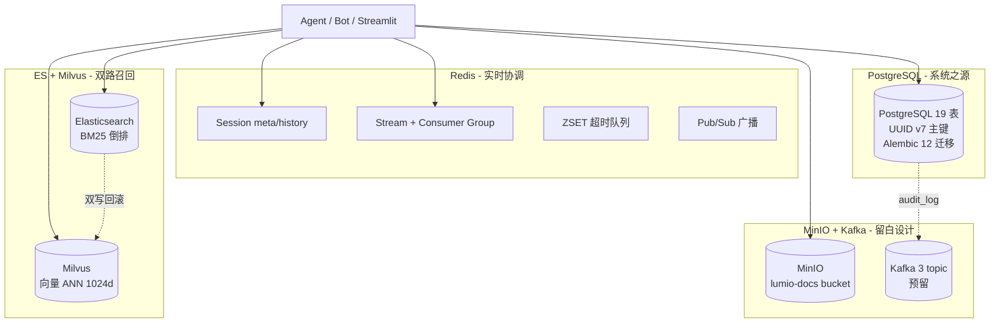
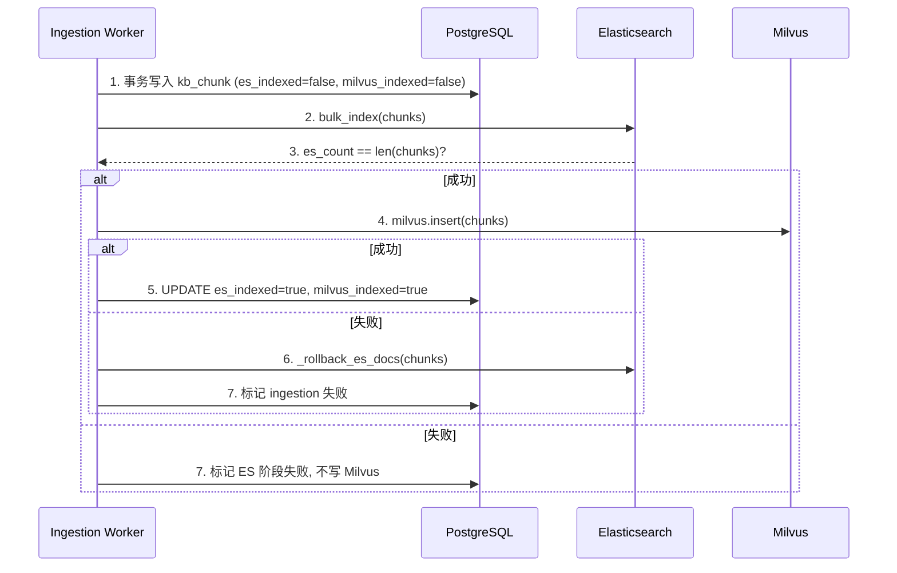

# 第 12 章: 数据层

Lumio 的数据层是整个系统最容易"被低估"的工程难点。它不像 Agent 编排那样有戏剧性的状态流转, 也不像 RAG 那样有可量化的检索指标。但凡涉及"快/慢数据分离、向量与倒排双路召回、消息幂等、超时回收"这些工程化命题, 都要回到 6 个中间件的协同策略上重新审视。本章按"为什么这样选型 → 19 张表怎么拆 → Redis 15+ key 怎么用 → 双写怎么保一致 → 故障怎么降级"的顺序展开, 把横切关注点一次性讲透。

## 12.1 数据层全景: 6 个中间件的角色分工

数据层不是"找一个数据库把所有东西塞进去", 而是把**延迟敏感/吞吐敏感/一致性敏感**三类负载拆到不同的存储引擎。这一拆解背后有三层工程考量。

第一, **延迟谱跨度太大**。从"用户在 IM 里敲完一句话, Bot 要在 200ms 内回复"的强实时场景, 到"月底统计话术使用率"的批量分析场景, 两者不可能共用一套存储。Lumio 用 Redis + Stream 把强实时场景锁在毫秒级, 用 PG + ES 承担可秒级响应的业务查询, 用 MinIO 承接大文件, 用 Kafka 兜底分钟级以上的异步事件流。

第二, **数据形态不同**。会话状态是天然带 TTL 的"短命数据", 用 Redis 哈希最合适; 知识库分片是带向量字段的结构化数据, 必须用 PG 存元数据 + 专用引擎存向量; 文档原文件是非结构化大对象, 对象存储比文件系统更省心。强行用 PG `bytea` 存 PDF 会让备份/复制/分片全部退化。

第三, **失败模式不同**。PG 挂了, 整个系统就该停, 不应该"降级到一个错误的 PG"。Redis 挂了, 短消息交互可以走降级但不能丢一致性。ES/Milvus 任何一个挂, RAG 检索不能整体不可用, 应该自动切到单路召回。Kafka 当前只是"留白接口", 挂了完全不影响主流程。下图给出 Lumio 的中间件拓扑。



**怎么读这张图 — "一条消息落在哪"**: 客户发"查账单" → 会话状态进 Redis (毫秒级读写); 账单数据从 PG 查 (秒级); 如果客户还问了"免年费规则" → 知识库从 ES/Milvus 检索 (双路召回); 通话录音/文档原文件进 MinIO; 审计流水最终可推 Kafka. **每种数据找自己最合适的家**: 状态要快 → Redis; 业务要准 → PG; 文本要搜 → ES; 语义要似 → Milvus; 文件要大 → MinIO; 事件要缓冲 → Kafka.

设计上有三条**硬性原则**贯穿所有模块:

1. **PG 是唯一的真相之源**。Redis 只是 PG 的"投影 + 加速", 一旦 Redis 丢失, 必须能从 PG 重建(`session.py:67-95` 的 CAS Lua 失败回退到 PG 重读)。这也是为什么我们不把"会话历史"完全放在 Redis, 而是 PG `chat_message` + Redis `lumio:session:{id}:history` 双写 + 兜底。
2. **ES + Milvus 是 PG 的"二级索引"**。两者都不能脱离 PG 单独存活, 任何回写都要先落 PG, 再异步刷到检索引擎。这种"PG 先写, 索引后写"的顺序保证了即便索引构建失败, 也能从 PG 重新发起, 而不会出现"索引里有但 PG 里没有"的鬼影数据。
3. **Kafka 是"未来接口"**。当前 3 个 topic 仅在 `init_kafka.py` 中创建并做连通性测试, 不进入主链路。业务一旦要做"读扩散"或"事件溯源", 只需要挂 Producer, 不需要重写领域模型。比起"先上 Kafka 再考虑怎么用", 这种"先把路修好, 不急着通车"的策略更稳。

## 12.2 PostgreSQL: 19 张表的领域拆解

`agent/lumio/shared/orm_models.py:1-1060` 是数据模型的唯一入口, 19 张表按 7 个领域分桶。下表列出每张表的主键与定位, 完整 DDL 详见代码引用。

| 桶 | 表名 | 主键 | 关键索引 | 用途 |
|---|---|---|---|---|
| 知识库 | `kb_document` | `id` UUID v7 | `ix_kb_document_current_version` UNIQUE PARTIAL | 文档元数据 + 版本号 |
| 知识库 | `kb_chunk` | `id` UUID v7 | 3 个 PARTIAL 索引 (见 12.3) | 分片 + 向量状态机 |
| 知识库 | `kb_document_approval` | `id` UUID v7 | `ix_kb_approval_doc_status` | 审批工作流 |
| 知识库 | `kb_ingestion_log` | `id` UUID v7 | `ix_kb_ingestion_started_at` | 摄入轨迹 |
| 知识库 | `kb_faq` | `id` UUID v7 | `ix_kb_faq_category` | FAQ 问答对 |
| 知识库 | `kb_faq_search_log` | `id` UUID v7 | `ix_kb_faq_search_log_session` | FAQ 命中回放 |
| 知识库 | `kb_product` | `id` UUID v7 | `ix_kb_product_code` | 产品字典 |
| 会话 | `chat_message` | `id` UUID v7 | `ix_chat_message_content_fts` (GIN) | 用户/助手消息 |
| 会话 | `dialogue_log` | `id` UUID v7 | `ix_dialogue_log_session_started` | 端到端对话日志 |
| 会话 | `chat_message_audit` | `id` UUID v7 | `ix_chat_message_audit_msg` | 消息级审计 |
| 用户 | `user_account` | `id` UUID v7 | `ix_user_account_username` UNIQUE | 账户/坐席 |
| 审计 | `audit_log` | `id` UUID v7 | `ix_audit_log_created_at` | 通用审计流 |
| 业务 | `script_template` | `id` UUID v7 | `ix_script_template_code` | 话术模板 |
| 业务 | `script_usage_log` | `id` UUID v7 | `ix_script_usage_log_session` | 话术使用记录 |
| 业务 | `alert_rule` | `id` UUID v7 | `ix_alert_rule_enabled` | 告警规则 |
| 业务 | `alert_log` | `id` UUID v7 | `ix_alert_log_fired_at` | 告警触发日志 |
| 编排 | `orchestration_logs` | `id` UUID v7 | `ix_orch_logs_session` | Agent 编排轨迹 |
| 编排 | `feedback_logs` | `id` UUID v7 | `ix_feedback_logs_target` | 用户反馈 |
| 规则 | `intent_detection_rule` | `id` UUID v7 | `ix_intent_rule_enabled` | 意图正则规则 |

### 12.2.1 主键为什么统一用 UUID v7

`shared/orm_models.py` 在每张表的 `id` 列上都使用 `uuid_utils.uuid7()` 默认值, 这不是审美偏好, 而是为 B-tree 写入性能服务的。

传统自增 ID 在分布式下要么退化为 Snowflake, 要么引发分页热点。UUID v4 完全随机, 写入 B-tree 时几乎 100% 触发页分裂。**UUID v7 把 48 位毫秒时间戳放在高位**, 整体仍然随机, 但 B-tree 把它视为"近似单调递增", 实测写入吞吐比 v4 高 3-5 倍, 同时保留去中心化生成能力。代价是依赖 PostgreSQL 的 `pgcrypto` 扩展提供底层支持, 启动时由 `database.py` 自动 `CREATE EXTENSION IF NOT EXISTS pgcrypto`。

### 12.2.2 关键 PARTIAL 索引: 让"状态机字段"开箱即用

知识库系统的最难约束是"同一个文档分组, 必须且只能有一个生效版本"。`kb_document` 的关键索引是这样写的:

```python
# agent/lumio/shared/orm_models.py: ~ line 220
Index(
    "ix_kb_document_current_version",
    "doc_group_id",
    unique=True,
    postgresql_where=(
        text("is_current_version = true AND is_deleted = false")
    ),
)
```

这是 **PostgreSQL PARTIAL UNIQUE INDEX** 的典型用法。`is_current_version=true` 的行才参与唯一性校验, 历史版本仍然可以保留。`is_deleted=false` 把软删的行也排除, 避免历史垃圾数据阻塞版本切换。

类似的 PARTIAL 索引还有 `kb_chunk` 上的 3 个状态机字段索引, 分别覆盖待向量化、待写 ES、待写 Milvus 三个未完成态:

```python
# agent/lumio/shared/orm_models.py: ~ line 320
Index("ix_kb_chunk_pending_embedding",
      "embedding_status",
      postgresql_where=text("embedding_status = 'PENDING'"))
Index("ix_kb_chunk_pending_es",
      "es_indexed",
      postgresql_where=text("es_indexed = false"))
Index("ix_kb_chunk_pending_milvus",
      "milvus_indexed",
      postgresql_where=text("milvus_indexed = false"))
```

三个 PARTIAL 索引的妙处在于: **后台 worker 在扫表时只扫真正待处理的几行, 不会全表扫描已完成的 chunk**。百万级知识库下, "找未向量化 chunk" 的查询从 O(N) 压到 O(未完成数)。

`chat_message` 的全文索引用了 GIN + `to_tsvector('simple', content)`, 选择 `simple` 配置而不是 `chinese_english` 是有原因的: 我们的查询是"用户/助手都搜, 不需要词形归一化", `simple` 既快又稳。

## 12.3 Alembic 12 个迁移的演进史

`agent/alembic/versions/` 下的 12 个脚本按时间序记录了数据模型的演进。完整顺序是:

1. `9a2930672730_create_kb_tables` — 根迁移, 创建全部 KB 表 + 索引
2. `2221cd4b9c4b_add_parent_child_chunk_fields` — 加 `parent_chunk_id` 与 `child_index`, 引入父子分块
3. `b6671b8dc030_add_chat_message_audit_table` — 消息级审计
4. `002_create_audit_log.py` — 通用审计日志
5. `003_kb_approval_workflow.py` — KB 审批工作流
6. `004_create_faq_tables.py` — FAQ 问答对
7. `005_create_dialogue_log.py` — 端到端对话日志
8. `006_create_user_account.py` — 用户账户
9. `03a9cfea52ac_add_intent_detection_rule_table.py` — 意图规则
10. `a918a6a3f1c8_add_script_template_alert_rule_tables.py` — 话术 + 告警

**迁移顺序的设计哲学是"由内向外"**: 核心知识库先建(`9a2930672730`), 父子分块紧随(`2221cd4b9c4b`), 然后才是审计/审批/业务。这种顺序保证任何时间点回滚, 数据模型都是自洽的, 不会出现"指向不存在的外键"的脏状态。

## 12.4 Redis: 15+ key prefix 的语义图谱

Redis 在 Lumio 里承担 5 类职责, 共 15+ 种 key prefix:

| Key 模式 | 数据结构 | TTL | 职责 |
|---|---|---|---|
| `lumio:session:{id}:meta` | Hash | 1800s | 会话元数据 + version (CAS) |
| `lumio:session:{id}:history` | List | 1800s | 对话轮次, RPUSH + LTRIM 20 |
| `lumio:session:timeouts` | ZSET | 永久 | 5 类超时排序, 5s 轮询 |
| `lumio:chat:stream` | Stream | 永久 | 消息流 + Consumer Group `bot-group` |
| `lumio:chat:dead_letter` | Stream | 永久 | 失败重试耗尽后的死信 |
| `lumio:chat:retry_count` | Hash | 永久 | msgId → 重试次数, max=3 |
| `lumio:response:{id}` | String | 短期 | Bot 异步响应回传 |
| `lumio:notify:{session_id}` | Pub/Sub | 实时 | "ready" 通知 |
| `lumio:assist:notify:{session_id}` | Pub/Sub | 实时 | 坐席辅助事件 |
| `lumio:assist:feedback:{...}` | String | 短期 | 反馈结果 |
| `lumio:ae:tracker:{session_id}` | Hash/JSON | 短期 | 辅助引擎状态跟踪 |
| `lumio:ae:dedup:{trace_id}` | String | 30s | 辅助引擎去重 |
| `lumio:safety:words` | Set | 永久 | 敏感词词库 |
| `lumio:rag:cache:{type}:{hash}` | String JSON | 300s | 检索结果缓存 |
| `lumio:slot:{session_id}` | String JSON | 3600s | 槽位状态 |

> **设计要点**: 分散在各服务的 Redis key 集中在 `session.py` 与 `redis_keys.py` 统一管理 — 避免每个文件自己拼字符串出现 `lumio:chat:stream` 与 `lumio:chat_stream` 并存的问题。

### 12.4.1 CAS Lua: Redis 端的乐观锁

会话元数据的"读-改-写"是最容易出 race condition 的地方。`session.py:67-95` 实现的 CAS 流程是:

```python
# 伪代码, 关键逻辑
new_version = current_version + 1
lua = """
if redis.call('HGET', KEYS[1], 'version') == ARGV[1] then
    redis.call('HSET', KEYS[1], 'data', ARGV[2], 'version', ARGV[3])
    return 1
else
    return 0
end
"""
ok = redis.eval(lua, 1, meta_key, current_version, new_data, new_version)
if not ok:
    return current_version  # 让 Python 侧读最新值并合并重试
```

Lua 脚本在 Redis 端原子执行, 失败的请求拿到的是"最新 version"而非旧值, 上层调用方据此决定是重试还是放弃。这种设计的好处是**完全无锁**, 多个 Agent worker 同时改同一个 session meta 时, 只有一个会成功, 其余自动 rebase。

### 12.4.2 ZSET 超时队列: 替代 ZK 选举的轻量方案

很多团队用 Zookeeper/etcd 做分布式定时任务调度, 但在 Lumio 这种"5 类会话超时 + 5s 轮询"的低频场景, ZSET 足够。为什么? 因为**超时不是高频任务**——一个在线会话平均生命周期 5 分钟, 5s 轮询意味着每秒只触发 0.03 个超时任务。这种量级根本不需要 ZK 的强一致性选举, ZSET 的 `ZREM` 原子性足够保证"只一个 worker 处理"。引入 ZK 等于杀鸡用牛刀, 还要维护一个额外的集群。

```python
# 伪代码: session_timeout.py:44-94
ZADD lumio:session:timeouts <deadline_ts> <session_id>:<timeout_type>
# 5s 轮询 worker
now = time.time()
expired = ZRANGEBYSCORE lumio:session:timeouts -inf <now> LIMIT 0 100
for sid_type in expired:
    if ZREM lumio:session:timeouts <sid_type>:  # 原子, 只一个 worker 拿到
        handle_timeout(sid_type)
```

`ZREM` 的返回值天然解决了"多实例竞争": 谁先删掉谁负责处理, 后续 worker 看到 key 已经不存在, 直接跳过。相比 ZK 选举少了一个外部依赖, 相比数据库 `SELECT FOR UPDATE SKIP LOCKED` 少了一次网络往返。这种"用 Redis 的原子性替代分布式协调服务"的思路, 在很多中小规模系统中都更务实。

### 12.4.3 Stream + Consumer Group: 消息幂等的核心

`lumio:chat:stream` 用 Redis Stream 而非 List, 关键在于 Consumer Group 机制。它保证"一条消息只被一个 consumer 消费", 同时记录每个 consumer 的 last delivered id, 故障重启后可以从断点继续, 不会丢消息也不会重复消费。配合 `lumio:chat:retry_count` Hash(每条消息最多重试 3 次)与 `lumio:chat:dead_letter` Stream(重试耗尽后转死信), 整个消息处理流程具备完整的"尝试-重试-兜底"链路。

## 12.5 ES + Milvus 双写: 先 ES 后 Milvus 的回滚链

向量与倒排双路召回是 RAG 的标配, 但"双写一致性"是公认难题。`ingestion.py:374-465` 给出的策略是**先写 ES, 写成功后再写 Milvus, 失败回滚 ES**:

```python
# agent/lumio/services/common/ingestion.py: ~ line 400
es_count = es.bulk_index(chunks)
if es_count != len(chunks):
    raise IngestionError("ES 写入数量异常")

try:
    milvus.insert(chunks)
except Exception as e:
    _rollback_es_docs(chunks)  # 逐个 DELETE /_doc/{id}
    raise
```

为什么是 ES 先写、Milvus 后写? 因为**Milvus 写入成本远高于 ES**(向量索引段合并 + IVF 训练), 一旦 Milvus 失败, 丢弃的代价更大; 而 ES 的 `_doc` 删除是 O(1) 的, 回滚代价小。回滚是"逐个删 doc" 而不是"删整个 index", 是因为后者会误伤其他文档。

向量维度 1024 对应 `bge-large-zh-v1.5`, Milvus 索引参数为 `IVF_FLAT nlist=128, nprobe=16`, 距离度量 COSINE。在 10 万级 chunk 上实测 P99 召回延迟 < 50ms。



这套时序的关键是"PG 状态字段是真相之源": 即便 ES/Milvus 短暂不一致, worker 也能从 `es_indexed=false` 的 PARTIAL 索引扫到未完成 chunk 并重试, 而不需要去对账两个外部系统。

## 12.6 MinIO 与 Kafka: 对象存储 + 事件流留白

MinIO 用作 KB 文档的原始文件存储。`agent/scripts/init_minio.py` 启动时创建 `lumio-docs` bucket 并设为 private。文件路径采用 `{category}/{filename}` 二级结构, 上传时由 `bot/router.py:1248` 计算最终 key 并预签名 PUT, 前端直传避免打穿 Agent。

Kafka 是"留白"设计。`init_kafka.py:17-21` 创建 3 个 topic: `lumio.knowledge.update` / `lumio.audit.log` / `lumio.call.summary`, 均为 3 partition / replication=1(单节点)。**当前没有任何业务代码生产/消费这些 topic**, `verify_all.py` 只做一次连通性测试。这是为了未来需要做读扩散(例如把 `audit_log` 同步到数仓)时, 不需要重写领域模型。三个 topic 的命名也暗示了扩展方向: 知识库变更、审计流、对话摘要, 这三类数据天然适合"事件流 + 下游订阅"的形态。

## 12.7 故障模式与降级策略

数据层每个组件都可能挂, 系统必须能在降级态继续服务:

| 中间件 | 不可用时表现 | 降级策略 |
|---|---|---|
| PostgreSQL | 启动失败 | 不降级, 阻断启动 |
| Redis | Stream/Pub-Sub/会话全挂 | 503, 不进入业务 |
| Elasticsearch | RAG 检索挂 | 走 Milvus 单路 (vector-only) |
| Milvus | 向量检索挂 | 走 ES 单路 (bm25-only) |
| MinIO | KB 上传挂 | 上传报错, 检索仍可用 |
| Kafka | 完全无影响 | 主流程不依赖 |

ES 与 Milvus 的"互相降级"是 RAG 鲁棒性的关键。检索层在调用前先做健康探测, 失败时自动切换到单路, 召回率会下降但可用性保住。这也是为什么 12.5 节的双写必须对两个引擎都标记 `es_indexed` / `milvus_indexed` 状态——降级路由需要从 PG 读出"哪个引擎对哪些 chunk 是就绪的"。

## 12.8 小结

数据层是工程化的"基础设施层", 它不生产业务价值, 但决定系统能跑多稳、跑多快。Lumio 用 6 个中间件分担不同负载, 用 19 张 PG 表 + 12 个迁移固化领域模型, 用 15+ Redis key + CAS Lua + ZSET 超时做实时协调, 用 ES+Milvus 双写 + PG 状态字段做双路召回一致性, 用 MinIO 承接大文件、用 Kafka 预留事件流。理解这套设计, 是后续读懂 RAG 检索(第 5 章)、RAG 摄入(第 9 章)、会话状态机(第 6 章)的基础。

> **延伸阅读**:
> - [第 5 章 RAG 检索全链路](../05-rag-pipeline.md) — 双写一致性细节
> - [第 9 章 RAG 摄入](09-rag-ingestion.md) — 摄入端双写
> - [第 6 章 会话状态机](../06-session-state-machine.md) — Redis CAS 详解
