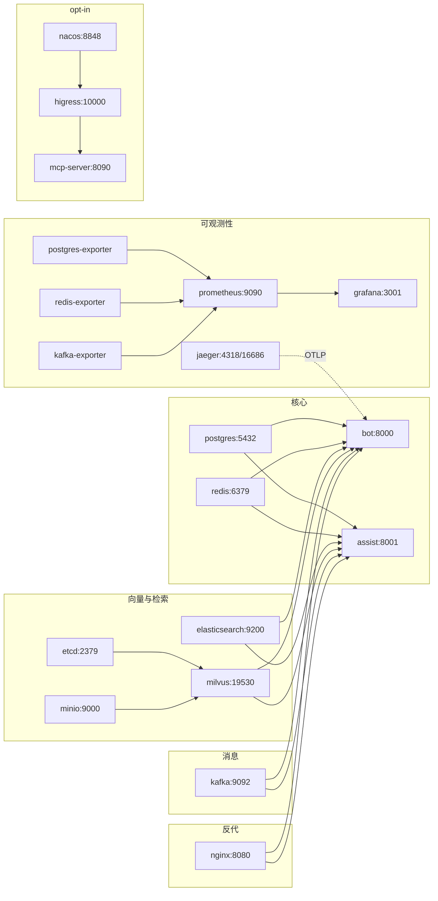

# 第 13 章: 部署

Lumio 的部署设计遵循一个朴素的工程直觉: **让本地开发与生产环境共享同一份容器编排, 只在 K8s 层做规模化**。这意味着开发者日常用 `make demo` 启动的 24 个容器, 几乎就是 K8s 集群上跑的那一套——只是多了 HPA、Secret 和反代网关。这一章将围绕 docker-compose 拓扑、multi-stage 镜像、K8s manifests、Nginx 反代、opt-in gateway profile 与 46 个 Make target 这六条主线, 解释 Lumio 在部署上做出的一系列权衡。

## 13.1 为什么是 24 个服务

第一次看到 `deploy/docker-compose.yml` 的服务数量, 多数人会问同一个问题: 一个聊天+客服系统, 真的需要这么多中间件吗? 答案是肯定的, 但前提是**这一切只服务于单机一键 Demo 场景**——开发者不必在多个工具链之间切换, 也不必为某个组件单独写文档。把这 24 个服务按职责切分, 可以归为五类:

| 类别 | 服务 | 镜像 / 构建 | 关键端口 | 健康检查 |
|------|------|-------------|----------|----------|
| **核心 7** | postgres | `postgres:16` | 5432 | `pg_isready -U lumio` |
| | redis | `redis:7.2-alpine` | 6379 | `redis-cli ping` |
| | elasticsearch | 自构建 `smartcs/elasticsearch-ik:8.19.9` (预装 IK 分词) | 9200 / 9300 | `curl /_cluster/health` |
| | milvus | `milvusdb/milvus:v2.4.0` | 19530 / 9091 | `curl /healthz` |
| | etcd | `quay.io/coreos/etcd:v3.5.5` | 不暴露 (避免与 VPNKit 冲突) | `etcdctl endpoint health` |
| | minio | `minio/minio:RELEASE.2024-01-16T16-07-38Z` | 9000 / 9001 | `mc ready local` |
| | kafka | `apache/kafka:3.7.0` (KRaft 单节点) | 9092 / 9094 | `kafka-topics.sh --list` |
| **可观测性 5** | jaeger | `jaegertracing/all-in-one:1.57` | 16686 (UI) / 4318 (OTLP) | 隐式 |
| | prometheus | `prom/prometheus:v2.50.0` | 9090 | 隐式 |
| | grafana | `grafana/grafana:10.4.0` | 3001 | 隐式 |
| | redis-exporter | `oliver006/redis_exporter:latest` | 9121 | 隐式 |
| | postgres-exporter | `prometheuscommunity/postgres-exporter` | 9187 | 隐式 |
| | kafka-exporter | `danielqsj/kafka-exporter` | 9308 | 隐式 |
| **可观测性+** | (如上 6 项, 其中 exporter 3 项 + jaeger/prom/grafana) | | | |
| **Java chat-svc 2+1** | customer-server | `chat-svc/customer-server` (本地 jar) | 8080 | 由 chat-svc 自行探测 |
| | agent-server | `chat-svc/agent-server` | 8081 | 同上 |
| | zookeeper | `zookeeper:3.8` | 2182 | 隐式 |
| **gateway opt-in 3** | nacos | `nacos/nacos-server:v2.4.3` | 8848 / 9848 | `/nacos/v1/console/health/readiness` |
| | higress | `higress-registry.../all-in-one:2.1.5` | 10000 / 18080 | 隐式 |
| | mcp-server | `mcp-server/Dockerfile` → `lumio-mcp-server:1.0.0` | 8090 | `/actuator/health` |
| **反向代理 1** | nginx | `nginx:1.25-alpine` | 8080 (宿主机) | 隐式 |

(注: 上表"可观测性"分类中 jaeger/prometheus/grafana 为核心三件套, 三个 exporter 辅助, 实际是 6 个可观测性容器。)

观察这张表, 一个隐藏的设计哲学浮现出来: **核心服务少而必要, 可观测性厚而完整, 网关薄且 opt-in**。postgres / redis / milvus / kafka / minio 是 AI 应用基础设施的"五件套"——任何 RAG 系统都跑不掉; 而 exporter + jaeger + prometheus + grafana 的组合, 在早期就把"线上黑盒"问题掐死在源头, 这是 Lumio 在每一章反复强调的"可观测性内建"。

值得专门说一句的是 etcd 的"刻意不暴露": `deploy/docker-compose.yml:91` 留了一行注释, 解释 etcd 端口故意不开给宿主机——`避免与 VPNKit 代理冲突`。在 macOS + Colima / OrbStack 环境下, 容器与宿主网络之间的端口转发非常容易撞车, 让 etcd 只活在容器网络 `lumio-net` 内部, 既满足了 Milvus 的内部寻址, 又把潜在端口冲突的可能性压到零。这种"少开一个端口"的小决定, 是多年被 Docker 网络折磨出来的经验。

再细看 ES 的镜像构建: `deploy/elasticsearch/Dockerfile:6` 一行 `RUN elasticsearch-plugin install --batch ...` 在构建期就把 IK 中文分词器装好了, 而不是让用户首次启动后再去手动执行 `bin/elasticsearch-plugin install` 还要重启。这种"构建期固化运行期配置"的做法, 与 multi-stage 镜像的"只在 builder 阶段装工具"是同一种哲学: 一切不可变的部分都应该在不可变层完成。

## 13.2 部署拓扑与启动顺序

**怎么读这张图 — "谁先起来谁后起来"**: 箭头表示"依赖" — 没有 etcd 和 MinIO, Milvus 起不来; 没有 Milvus/ES/Redis/PG, Bot 和 Assist 起不来. 这就像盖楼: 地基 (数据层) 必须先于楼层 (应用层), 楼层必须先于装修 (监控). 顺序错了, 应用启动时连不上数据库, 直接崩溃.

24 个服务不是同时拉起的, 它们之间有严格的依赖关系。Milvus 必须等 etcd + minio 健康; 应用服务必须等 Milvus / ES / Redis / Postgres 全部就绪; Bot 与 Assist 还必须等一次性 `demo-init` 跑完迁移+种子:



Compose 通过 `depends_on: { condition: service_healthy }` 把启动顺序从"先来后到"升级为"先健康后启动"——这是最容易被新同学忽略却最值钱的一行配置。Milvus 的 `depends_on` 块明确写明依赖 etcd 与 minio 的 `service_healthy`, 这意味着即使 etcd 容器已 running, 只要 `etcdctl endpoint health` 还没回 0, Milvus 就拒绝启动。

另一个值得注意的细节是 Kafka 的 KRaft 模式: `KAFKA_PROCESS_ROLES: broker,controller` + `KAFKA_CONTROLLER_QUORUM_VOTERS: 1@kafka:9093` 让单节点也能跑出集群语义, 彻底免去 ZooKeeper 依赖。这是 Kafka 3.3+ 的官方推荐, 在开发场景里节约的不仅是 1 个容器, 更省去了 ZK 与 Broker 的脑裂配置。`KAFKA_AUTO_CREATE_TOPICS_ENABLE: "true"` 又把"首次跑 Demo 必须先手动建 topic"这个常见踩坑点干掉了。

## 13.3 Multi-stage Dockerfile 与多入口

应用镜像的 57 行 Dockerfile 把"镜像大小"与"启动灵活性"两个目标拆得很干净:

```dockerfile
# deploy/Dockerfile:4-17
FROM python:3.11-slim AS builder
WORKDIR /app
RUN pip install --no-cache-dir poetry==2.0.1
COPY pyproject.toml poetry.lock* ./
RUN poetry config virtualenvs.in-project true \
    && poetry install --no-interaction --no-ansi --only main --no-root
```

这是**典型的 builder-only 镜像**——`poetry install` 的目的是把依赖装到 `.venv` 里, 而不是把 Poetry 本身带进 runtime。第二阶段只 `COPY --from=builder /app/.venv /app/.venv` 把虚拟环境拿过来, 再叠加应用代码与配置, 最终镜像只有 50MB 左右, 比"用 builder 直接 runtime"小一个数量级。

第二个巧思是**多入口切换**: 一个 `lumio:latest` 镜像既能跑 Bot(:8000) 也能跑 Assist(:8001), 靠 `SERVICE` 环境变量选择启动目标, 见 `deploy/Dockerfile:36-41`:

```dockerfile
ENV SERVICE=bot
COPY --chmod=755 docker-entrypoint.sh /docker-entrypoint.sh
```

健康检查也用了一行 Python 条件表达式同步端口 (`deploy/Dockerfile:53-54`):

```dockerfile
HEALTHCHECK --interval=30s --timeout=5s --start-period=10s --retries=3 \
    CMD python -c "import os,urllib.request; urllib.request.urlopen('http://localhost:%s/api/health' % ('8001' if os.environ.get('SERVICE')=='assist' else '8000'))" || exit 1
```

比起在镜像里塞两份 entrypoint 脚本, 这种做法让"一份镜像, 两个角色"成为可能, 配合 K8s 两个 Deployment 复用同一份 `image: lumio:latest`, 镜像仓库的存储与 CI 时间都减半。一个常被问到的细节是: 既然 multi-stage 能省 builder 层, 那 Poetry 自身能不能也只装在 builder? 答案是可以, 但 `poetry==2.0.1` 锁在 builder 阶段后, 它的 wheel 就不会被带进 runtime 镜像, `pip install` 留下的缓存又在 `pip install --no-cache-dir` 这条指令下被抹掉——层层过滤后, runtime 镜像里只剩下纯净的 `.venv/site-packages` 和应用代码, 这正是镜像最终能压到 50MB 级别的关键。

## 13.4 K8s manifests: HPA + 探针 + Secret

生产环境只部署 4 类资源: Bot Deployment、Assist Deployment、Bot Service、Assist Service, 外加两个 HPA。Bot/Assist 各 2 副本起步, HPA 区间 2-6, CPU 70% 触发扩容:

```yaml
# deploy/k8s/lumio.yaml:151-168
apiVersion: autoscaling/v2
kind: HorizontalPodAutoscaler
metadata:
  name: lumio-bot-hpa
spec:
  scaleTargetRef:
    name: lumio-bot
  minReplicas: 2
  maxReplicas: 6
  metrics:
    - type: Resource
      resource:
        name: cpu
        target:
          type: Utilization
          averageUtilization: 70
```

70% 的阈值是 K8s 社区文档推荐的折中点: 太低会导致"毛刺触发扩容", 太高又会在真实流量到达前失守。资源 `requests: 250m/512Mi, limits: 1000m/1Gi` 同样保守——4 副本起步总内存 2Gi, 在 8 节点小集群里也游刃有余。

liveness 与 readiness 探针分别指向 `/api/health/live` 和 `/api/health/ready`, 区分"还在不在"与"准备好接流量没", 这两条是 K8s 上 Web 服务的标配:

```yaml
# deploy/k8s/lumio.yaml:50-62
livenessProbe:
  httpGet: { path: /api/health/live, port: 8000 }
  initialDelaySeconds: 10
  periodSeconds: 30
readinessProbe:
  httpGet: { path: /api/health/ready, port: 8000 }
  initialDelaySeconds: 15
  periodSeconds: 10
  failureThreshold: 3
```

`LUMIO_JWT_SECRET` 通过 `valueFrom.secretKeyRef` 注入——第五轮修复后, **6 个敏感凭据全部走 K8s Secret** (jwt-secret / llm-api-key / minio-access-key / minio-secret-key / es-username / es-password / redis-password), 中间件 host/port 等非敏感项明文写进 Deployment spec。两个 Deployment 均显式设置 `SERVICE=bot` / `SERVICE=assist` (此前 assist 未设 → Dockerfile 默认 bot → 启动错应用), 并加 `terminationGracePeriodSeconds: 90` (> LLM timeout 60s, 滚动更新不截断 in-flight 请求)。

**生产凭据校验 (第五轮)**: `config._validate_production_security` 在生产环境强制要求 LLM_API_KEY / MINIO / ES / REDIS 凭据非默认值, 缺失即 `ValueError` 拒绝启动 — k8s manifest 必须注入全部 secret, 否则 crash loop (manifest 已同步)。

## 13.5 Nginx 反代: 路径分流 + WebSocket

`deploy/nginx/nginx.conf` 一共 42 行, 干了两件事: 把路径前缀路由到 Bot(:8000) 或 Assist(:8001), 并为 `/api/ws/` 启用 WebSocket upgrade。

```nginx
# deploy/nginx/nginx.conf:12-30
location /api/chat/   { proxy_pass http://host.docker.internal:8000/api/chat/; }
location /api/kb/     { proxy_pass http://host.docker.internal:8000/api/kb/; }
location /api/health  { proxy_pass http://host.docker.internal:8000/api/health; }
location /api/metrics { proxy_pass http://host.docker.internal:8000/metrics; }

location /api/notify   { proxy_pass http://host.docker.internal:8001/api/notify; }
location /api/session/ { proxy_pass http://host.docker.internal:8001/api/session/; }
location /api/hold     { proxy_pass http://host.docker.internal:8001/api/hold; }
location /api/resume   { proxy_pass http://host.docker.internal:8001/api/resume; }
location /api/review/  { proxy_pass http://host.docker.internal:8001/api/review/; }
location /api/feedback { proxy_pass http://host.docker.internal:8001/api/feedback; }
location /api/analyze  { proxy_pass http://host.docker.internal:8001/api/analyze; }

location /api/ws/ {
    proxy_pass http://host.docker.internal:8001/api/ws/;
    proxy_http_version 1.1;
    proxy_set_header Upgrade $http_upgrade;
    proxy_set_header Connection "upgrade";
    proxy_read_timeout 3600;
}
```

路径分流的依据是"哪类业务归属谁": 知识库检索 / 对话 / 健康检查走 Bot; 坐席辅助(接管/恢复/复核/反馈/分析)走 Assist; WebSocket 走 Assist 因为坐席工作台是长连接密集场景。`proxy_read_timeout 3600` 防止 1 小时后被网关主动断开——客服场景用户挂起排队是常见事, 默认 60 秒会致命。

Nginx 的定位是"开发网关", 生产环境由 Higress(`--profile gateway` 启用)替代, 这是 Lumio 把网关做成 opt-in 的核心动机: 多数开发者用不到 MCP 联邦, 不该被迫跑一个 500MB+ 的网关容器。

## 13.6 Opt-in Gateway Profile: 设计的克制

`nacos / higress / mcp-server` 三个服务在 `docker-compose.yml` 中都标了 `profiles: ["gateway"]`, 这意味着 `docker compose up -d` 默认不会拉起它们, 必须显式 `docker compose --profile gateway up -d` 或 `make gateway-up` 才会启动。

这种"可观测但默认关闭"的设计背后是一个朴素判断: **95% 的本地开发时段用不到 MCP 联邦**。Nacos 启动慢、Higress 镜像大、MCP Server 需要 Java 22+, 三件加起来足以让一台 16GB 内存的 MacBook 风扇狂转。把它们做成 opt-in, 核心 7+5+2+1 共 15 个容器先跑起来满足绝大多数调试, 等真要联调 MCP 工具面再开 gateway, 体验差距巨大。

## 13.7 Makefile: 33 个 Target 的语义地图

`Makefile:1-194` 一共暴露了 33 个 target, 按职责可分 11 组, 全部用 `##` 注释 + `help` 索引自描述:

- **AI Agent (5)**: `install / dev / mcp-ref / mcp-server-{build,test,run}`
- **质量 (6)**: `test / test-cov / lint / format / type-check / pre-commit / bench`
- **Docker (6)**: `build / build-app / up / down / ps / logs`
- **gateway opt-in (2)**: `gateway-up / gateway-down`
- **Demo (5)**: `demo / demo-down / demo-logs / demo-ps / demo-push`
- **初始化 (1)**: `init / init-minio / seed`
- **验证 (4)**: `verify / verify-ollama / verify-mcp-e2e / verify-observability`
- **迁移 (3)**: `migrate / migrate-create / migrate-downgrade`
- **清理 (2)**: `clean / distclean`
- **前端 (3)**: `web-{dev,build,install}`
- **Java (3)**: `chat-svc-{build,up,down}`

最常用的入口是 `make demo`: 它把 `docker-compose.yml` 与 `docker-compose.demo.yml` 叠加, 先跑一次性 `demo-init`(迁移+灌种子), 再拉起 Bot(:8000) 和 Assist(:8001):

```makefile
# Makefile:88-101
DEMO_COMPOSE := -f docker-compose.yml -f docker-compose.demo.yml
demo: ## 一键启动完整 Demo（中间件 + 初始化 + Bot:8000 + Assist:8001）
	cd deploy && docker compose $(DEMO_COMPOSE) up -d --build
```

`demo-push` 进一步把镜像推到 Docker Hub(`slowleelab/lumio:demo`), 用于"演示前远程部署"这类场景, 但 CI/CD 内部推送通常走专属仓库, 不与该 target 冲突。

`chat-svc-up` 这一组 target 看上去游离在主流程之外, 实则承担着 Java 在线客服子系统的启动入口: customer-server 监听 8080, agent-server 监听 8081, 二者通过 zookeeper 协调会话状态。`make chat-svc-down` 用 `pkill -f` 兜底, 比 `kill -9 PID` 更适合临时演示场景——不需要先查 PID, 一句命令把所有 chat-svc 相关进程清干净。

## 13.8 环境变量三层: dev / staging / production

Lumio 的配置分层在第 2 章已展开, 这里只重申部署侧的差异:

- **dev**: 本地 `.env`, 全部 host 是 `localhost` 或 `host.docker.internal`, 占位值允许(`POSTGRES_PASSWORD_DOCKER=lumio_pass`)。
- **staging**: K8s ConfigMap, 中间件地址走内部域名(`postgres.lumio.svc.cluster.local`), `LUMIO_ENVIRONMENT=staging`。
- **production**: K8s Secret + ConfigMap, 强制 `LUMIO_JWT_SECRET` 等敏感字段从 Secret 注入, ConfigMap 中所有占位符必须替换, CI 上有 `lumioconfig validate` 检查。

这样做的好处是同一份 `lumio` 代码在三个环境里只换 env 即可, 不必维护三套 helm chart 或三套启动脚本。

## 13.9 常见问题排查

部署踩坑通常集中在启动顺序、端口、数据库迁移三处。**端口冲突**是最高频问题, 一句 `lsof -i :8000` 找出占 PID, kill 掉即可, 也可在 compose 里改端口映射。**启动顺序错乱**通常表现为 Bot/Assist 起来后立刻连不上 Milvus, 此时 `docker compose ps` 看 Milvus 是否 `Up (healthy)`, 若 `Up` 但未 healthy, 必是 etcd 或 minio 的健康检查卡住。**数据库迁移失败**则直接看 `cd agent && poetry run alembic current` 返回的 revision, 与 `alembic/versions/` 目录里的 head 对比即可定位。

万能兜底是 `make verify`, 它依次 ping 全部中间件并打印 RTT, 哪一环亮红就从那一环往回查。

## 13.10 本章小结

Lumio 的部署核心可以总结为三条:

1. **一份 compose 跑到底**——24 个服务分核心/可观测/网关/反代四层, 但只通过 `depends_on.health` 控制启动序, 不引入额外的 init 容器或 sidecar。
2. **一份镜像两个角色**——multi-stage 把镜像压到 50MB 量级, `SERVICE` 环境变量让同一份 `lumio:latest` 既能跑 Bot 也能跑 Assist, 镜像仓库与 CI 时间双双减半。
3. **网关 opt-in, 不强加**——95% 的本地场景不需要 Higress/Nacos/MCP Server, 默认不拉起, 真需要时 `make gateway-up` 一键打开。

这三条的共性是**克制**: 不为了"看起来专业"而把所有组件默认拉起, 也不为了"节省内存"而把可观测性阉割。下一章会沿着这条主线, 走进可观测性系统, 看看 Prometheus 是怎么把 24 个容器的指标抓得一清二楚的。

> **延伸阅读**:
> - [第 1 章 整体架构](../01-architecture-overview.md) — 三层分层
> - [第 2 章 配置系统](../02-configuration-system.md) — 16 个 env_prefix
> - [第 10 章 可观测性](10-observability.md) — Prometheus 抓取
