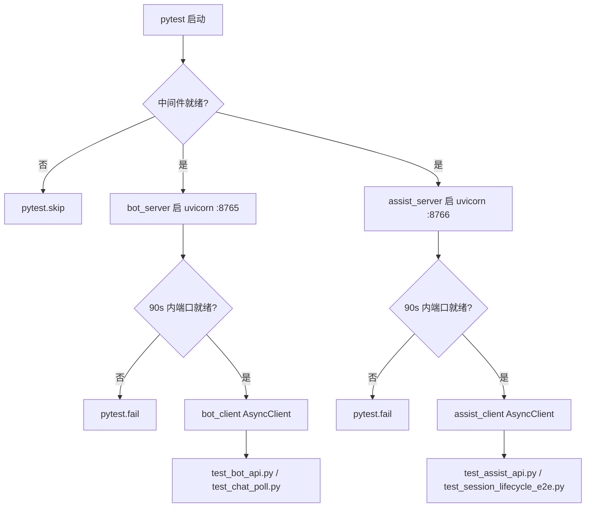
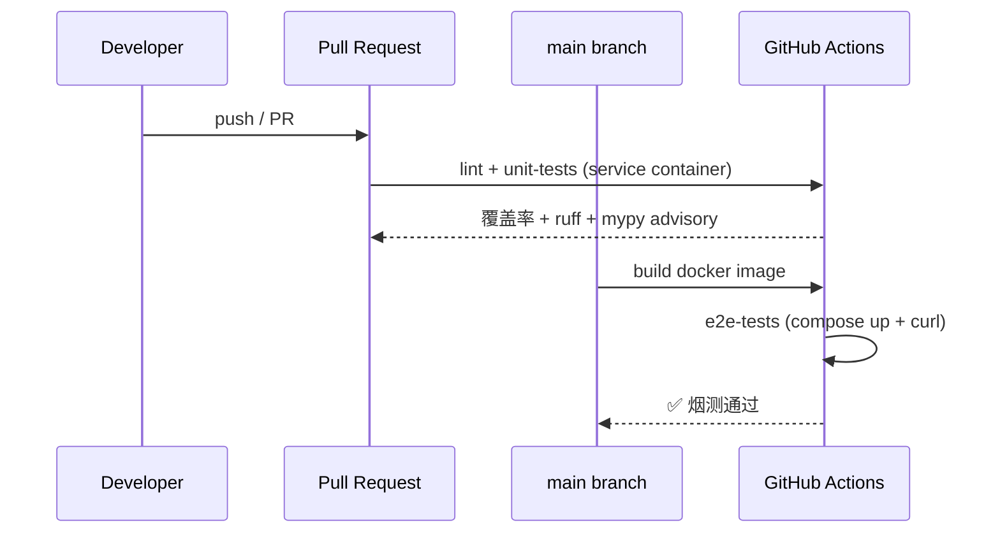

# 第 14 章 测试策略

## 14.1 测试体系总览

Lumio agent 服务的测试集由 60+ 个 `test_*.py` 文件、**716 个 `test_` 函数通过 (+5 跳过)** 组成, 覆盖消息管道、确认状态机、上下文预算、压缩质量门、会话超时、认证越权、配置校验、检索、审计、可观测性等核心模块。这套测试体系不是事后补的 — 它的形态直接体现了三个工程取舍: **真实中间件而非 mock**、**真实子进程而非 in-process**、**mypy advisory 而非 strict**。理解这三个取舍, 就理解了整个 Lumio 的测试策略。

## 14.2 「真实中间件 + 真实子进程」哲学

Lumio 的测试不依赖 `fakeredis`、不依赖 `httpx_mock`、不依赖任何 `Mock(...)` — 这不是洁癖, 是经过权衡的工程选择。`agent/tests/conftest.py:1-7` 把策略写进了 docstring 的第一段:

```python
"""pytest 配置和公共 fixtures — 端到端 API 测试

启动真实 uvicorn 服务器（bot :8000 + assist :8001），
通过 HTTP 请求验证完整请求/响应生命周期。
"""
```

为什么走 e2e 路线而不是 mock 路线? 核心原因是 Lumio 的故障模式往往在**组件的边界**上 — Redis 连接断开后 Lua 脚本的行为、Postgres pool 耗尽后 SQLAlchemy 的重试、uvicorn 启动时 lifespan hook 的初始化顺序, 这些都不能靠 mock 重现。一旦用 mock 测过, 就只能证明"在 mock 假设下能跑通", 而不能证明"在真实部署下能跑通"。

为支撑这条路线, `agent/pyproject.toml` 在 pytest 配置里设了 `asyncio_mode = "auto"` — 这样所有 `async def test_` 自动变成 pytest-asyncio 用例, 不再需要每个文件都加 `@pytest.mark.asyncio` 装饰器, 减少样板代码。

CI 端, `unit-tests` job 通过 GitHub Actions 的 **service container** 机制启动真实 Redis 7.2 和 Postgres 16 (`.github/workflows/ci.yml:57-77`), 配 `health-cmd` / `health-interval` 做健康探测。本地开发者则通过 `make up` 拉起同一套 Docker Compose stack — 跟生产一致。

至于 e2e 用例本身, 不在测试进程内启 FastAPI, 而是 `subprocess.Popen` 拉起**独立 uvicorn 子进程** (`conftest.py:60-88`), 端口刻意选 `8765` / `8766` (`conftest.py:33-34`), 避免与开发环境的 `8000` / `8001` 冲突。注释直白写了原因:

```python
BOT_PORT = 8765  # 避免与开发环境 :8000 冲突
ASSIST_PORT = 8766  # 避免与开发环境 :8001 冲突
```

这条注释读起来像废话, 但它揭示了一个常被忽视的测试可靠性问题: 如果 e2e 直接用 `8000`, 开发者本机跑着 `uvicorn` 调试时, 测试一拉子进程就端口冲突 skip, 本地信号被噪音掩盖。

## 14.3 关键 fixture 拆解

`agent/tests/conftest.py:1-181` 整份文件是测试策略的"宪法", 核心由四组 fixture 组成。

**`_check_middleware_ready()`** (`conftest.py:106-116`) 是入口守卫。它用 `socket.connect_ex` 探测 `127.0.0.1:6379` (Redis) 和 `127.0.0.1:5432` (Postgres), 任何一个不通就 `pytest.skip("Docker 中间件未启动")`。这让"忘记 `make up`"成为一次显式的 `SKIPPED` 而不是一堆莫名其妙的 `ERROR`, 调试体验差别巨大。

**`bot_server` / `assist_server`** (`conftest.py:122-166`) 是 session-scoped fixture, 在整个 pytest 会话里**只启一次**子进程。它们先调 `_check_middleware_ready()` 守门, 再用 `_check_port()` 防止重复启动, 最后用 `_wait_for_port(..., timeout=90)` 容忍 cold start — 90 秒这条线对应生产环境冷启动 + 模型预热 + 索引初始化的全链路预算, 不是随便拍脑袋选的。

**`bot_client` / `assist_client`** (`conftest.py:169-180`) 是 `pytest_asyncio.fixture`, 包装 `httpx.AsyncClient`, `timeout=30.0`。它**不自己启服务**, 而是依赖 `bot_server` / `assist_server` — 这种"进程 fixture 配客户端 fixture"的两层结构, 让"换客户端配置"和"换服务进程"互不干扰。



**怎么读这张图 — "测试的前置关卡"**: 跑测试前先问三件事 — ① 中间件 (Redis/PG) 起了吗? 没起就**跳过** (不是报错, 开发者没 `make up` 也看得懂); ② 服务子进程 90 秒内能就绪吗? 不能就**失败** (真有问题要暴露); ③ 都好了 → 客户端 fixture 才可用. 整个流程是**显式的**: 每个分支都有明确结果, 不会出现"莫名失败 5 分钟才发现是没起 Docker"的噪音.

## 14.4 TOP 10 测试覆盖密度

下面这张表是按用例数排的 TOP 10, 直接反映 Lumio 当前最"被担心出 bug"的几块:

| 排名 | 文件 | 用例数 | 关注点 |
|---|---|---|---|
| 1 | `test_decision.py` | 44 | 评估器 D1/D2/D3 决策表 |
| 2 | `test_circuit_breaker.py` | 36 | 熔断器 3 态 + 滑动窗口 + 慢调用 |
| 3 | `test_state_models.py` | 28 | 状态机 ORM 模型 |
| 4 | `test_session.py` | 25 | 会话生命周期 + 转换 |
| 5 | `test_faq_service.py` | 24 | FAQ CRUD + 审批工作流 |
| 6 | `test_bot_memory.py` | 24 | 客户记忆 + Redis |
| 7 | `test_audit_health.py` | 24 | 审计 + 健康端点 |
| 8 | `test_retrieval.py` | 22 | RAG 混合检索 |
| 9 | `test_arbitrator.py` | 22 | 仲裁融合 |
| 10 | `test_integration.py` | 20 | 跨服务集成 |

`test_decision.py` 用 44 个用例覆盖 D1/D2/D3 三种决策路径, 因为这是对话路由的"调度中枢", 任何误判都会让用户掉进错的技能池。`test_circuit_breaker.py` 的 36 个用例更直接体现了"故障模式写在测试里"的思路 — CLOSED/HALF_OPEN/OPEN 三态的迁移、滑动窗口的成功率统计、慢调用比例触发, 全是状态机加时间维度的组合, 单元测试靠 mock 时间很易失真, 真实子进程跑出来反而稳。

## 14.5 e2e vs unit 划分

`agent/tests/` 下绝大多数文件是**单进程 unit** (无子进程, 直接 import lumio 模块, 调函数), 它们跑得快、可以并行、跟中间件弱耦合。**e2e** 子集则通过 `bot_client` / `assist_client` fixture 拉起完整 uvicorn, 跑 HTTP 链路。

e2e 文件一共有 5 个:

- `test_bot_api.py` — 机器人 HTTP API
- `test_assist_api.py` — 坐席辅助 HTTP API
- `test_chat_poll.py` — 长轮询
- `test_session_lifecycle_e2e.py` — 会话全生命周期
- `test_integration.py` — 跨服务集成 (纯 mock, 无中间件依赖)

`unit-tests` job 在 CI 排除 4 个依赖真中间件的 e2e 文件, **`test_integration.py` (纯 mock) 已纳入常规运行** (第五轮修复 — 它被 `--ignore` 没有任何理由, 白白损失覆盖率):

```yaml
poetry run pytest \
  --ignore=tests/test_bot_api.py \
  --ignore=tests/test_assist_api.py \
  --ignore=tests/test_session_lifecycle_e2e.py \
  --cov=lumio --cov-report=term-missing --cov-fail-under=55 \
  -v --tb=short
```

为什么排除 3 个? 三个原因叠加: (1) `bot_client` / `assist_client` 需要 `bot_server` / `assist_server` session fixture 启子进程, 启停开销大, 挤占 unit 反馈循环; (2) 这些用例**必须**有真中间件, 缺一个就整片 SKIP, 反而掩盖真实失败; (3) e2e 抽到独立的 `e2e-tests` job (`.github/workflows/ci.yml`) 反而更干净 — 它在 main 分支、`build` job 之后跑, 先 `docker compose up demo` 再 `curl /api/chat/send` 烟测 (带认证 token, 第五轮修复 — 认证强制后无 token 必 401), 全链路黑盒验证。



## 14.6 覆盖率门槛渐进

`unit-tests` job 加了 `--cov-fail-under=60` (`.github/workflows/ci.yml`), 同时 `agent/pyproject.toml` 锁了 `[tool.coverage.report] fail_under = 60`。两处对齐, pytest 才会真正读取门槛 (只有 `pyproject` 的锁而 pytest 不读, 实际不生效)。

门槛从 55% 提到 60% 的过程: 早期实测 ~57%, 卡 60% 会被 `test_retrieval.RecursionError` 等已知问题反复绊倒, 所以先锁 55% 留 buffer。在补齐 217 个单元测试 (tenant/a2ui_schema/entity_sandbox/experiments/alerting/injection_guard/tracing/decision_log/prompt_registry/customer_memory/gdpr/llm/budget) 后, 实测 62%, 门槛正式提到 60%。

这就是**渐进式门槛**的工程意义: 让 CI 立刻 fail 在新写的代码上, 但不要 fail 在**已经知道、还没修**的问题上。

## 14.7 已知 35 errors 的根因

当前 pytest 全量跑会有 35 个 errors, 这不是 bug, 是 e2e 排除策略的副产品。

根因链条很清楚: `unit-tests` job 在 CI 排除了 5 个 e2e 文件, 但开发者**本地**不排除, 直接 `pytest` 跑全套。如果本地没 `make up`, `bot_server` / `assist_server` fixture 在 `_check_middleware_ready()` 那一步就 `pytest.skip`, 而 `bot_client` 依赖 `bot_server` — skip 链会从 e2e 文件扩散到任何 import 它们的 conftest。最后呈现给开发者的是一长串 SKIPPED + 中间夹着 ERROR, 看着吓人。

更隐蔽的根因: `test_retrieval.py` 在某些依赖版本下出现 `RecursionError` (PG 驱动 + asyncio 兼容问题), 这条链曾拉低覆盖率 1-2 个百分点, 让 `--cov-fail-under` 阈值上限一度被锁死在 57%。

启动超时 (90s 容忍线) 是第三条线 — 容器内 cold start + 模型预热超过 90s 的话, `bot_server` 调 `pytest.fail`, 后续全部 fixture 级联失败。

解决方案不是再放宽门槛, 而是**让 e2e 在 CI 也能跑** — 比如改用 TestContainers 化 e2e。

## 14.8 mypy advisory 模式

`unit-tests` job 跑 `mypy lumio/`, 但用的是 **advisory 模式**, 不 fail CI (`.github/workflows/ci.yml:32-46`):

```yaml
- name: Mypy type check (advisory)
  run: |
    set +e
    poetry run mypy lumio/ > /tmp/mypy.log 2>&1
    mypy_exit=$?
    set -e
    cat /tmp/mypy.log | tail -50
    echo ""
    echo "mypy_exit_code=${mypy_exit} (advisory: 不 fail CI)"
    errors=$(grep -c "error:" /tmp/mypy.log || true)
    echo "mypy_error_count=${errors}"
```

为什么用 advisory? 如果配置是 `mypy ... || true`, 会静默吞掉所有错误 — 表面上 CI 绿, 实际上谁也不知道有多少类型债。advisory 模式做了一件关键事: **`set +e` 让 mypy 跑完, 再统计 error 数打到日志末尾**, 这样开发者一眼能看到当前存量错误 + 新增错误 (新引入的), 但不会被存量阻塞 PR。

配套的软化在 `agent/pyproject.toml:151-153`:

```toml
[[tool.mypy.overrides]]
module = "tests.*"
disallow_untyped_defs = false
```

测试代码不强求类型标注, 因为测试本身就是被测对象的**消费者**而非**被测者**, 写一堆 `Any` 反而降低可读性。

## 14.9 5 个 CI job 全景

`.github/workflows/ci.yml:1-172` 串了 5 个 job, 分两类:

**push / PR 触发 (3 个)**:

- `lint` — ruff check + ruff format check + mypy advisory + `make verify-observability`
- `unit-tests` — service container 启 Redis/PG + pytest + 60% 覆盖率门槛
- `mcp-server` — JDK 21 + `mvn verify` (Java 端 mcp-server 独立构建)

**仅 main 分支触发 (2 个)**:

- `build` — `docker build -f deploy/Dockerfile`, 依赖 `lint` + `unit-tests` 通过
- `e2e-tests` — `docker compose up demo` + curl 烟测, 依赖 `build` 通过

这套 job 拓扑的设计意图: **快反馈在前, 慢验证在后**。开发者 PR 阶段只跑 `lint` + `unit-tests` + `mcp-server`, 5 分钟内拿到结果; 合并到 main 后才走慢路径 build + e2e, 即便 e2e 挂了也不会阻塞 PR 评审。

## 14.10 pre-commit 8 步本地守门

`.pre-commit-config.yaml:1-33` 配置了 8 步 pre-commit-hooks + ruff + ruff-format + mypy, 关键片段:

```yaml
- repo: https://github.com/pre-commit/pre-commit-hooks
  rev: v5.0.0
  hooks:
    - id: trailing-whitespace
    - id: end-of-file-fixer
    - id: check-yaml
    - id: check-json
    - id: check-toml
    - id: check-added-large-files
      args: ["--maxkb=500"]
    - id: check-merge-conflict
    - id: detect-private-key
```

8 步全部是**结构性守门** (尾空格 / 文件末尾换行 / YAML 语法 / JSON 语法 / TOML 语法 / 500KB 大文件 / 合并冲突标记 / 私钥泄漏), 不做业务判断。Ruff 后面跟上, 用 `--fix --exit-non-zero-on-fix` — 自动修能修的, 修不了的就 fail。最后 mypy v1.13.0 配合 `[tool.mypy.overrides] module = "tests.*"` 做与 CI 一致的类型检查。

为什么不在 pre-commit 也加 mypy advisory? 答案在 ruff 的 `--exit-non-zero-on-fix`: **任何修改都让提交者看到自己改了什么**, 这是比"silent fix"更安全的契约。mypy 在 pre-commit 阶段保持 strict, 是因为**提交前**是"代码进入版本库前的最后一道关", 没必要 advisory。

## 14.11 `make verify-observability` 一致性测试

`unit-tests` job 跑 `make verify-observability` (`.github/workflows/ci.yml:48-52`):

```yaml
- name: Observability loop check
  working-directory: agent
  # verify-observability 入 CI, 防止 dashboard 名字错回归
  # (lumio_session_transitions_total → session_transitions_total 那种错)
  run: make verify-observability
```

这个目标的存在有其原因: 曾有人把指标名从 `lumio_session_transitions_total` 改成 `session_transitions_total`, 业务代码没动, 但 Grafana dashboard 全挂 (因为 dashboard 用 metric name 选 panel)。`make verify-observability` 做的事是**静态解析 dashboard JSON + 校验所有引用的 metric 名称都在代码里被定义过** — 这是一种"配置-代码"双向一致性测试, 防止 dashboard 改完漏改业务代码, 或反过来。

这条检查进了 CI 的 `lint` job, 跟 ruff 平级。

## 14.12 已知 trade-off

这套测试策略**不完美**, 有三个明确的取舍:

**E2E 只在 main 分支跑**。PR 阶段没有端到端保护, 意味着有问题的合并可能在 `build` + `e2e-tests` 之前就已经合进 main, 触发回滚成本。**应对**: 增量加强 e2e 反馈时间, 把 e2e 拆成"PR 子集" + "main 全量"两档。

**mypy advisory 模式下, 类型错误可能累积**。存量错误 + 每天新增, 没有 fail CI 卡住, 全靠"开发者自觉看末尾 echo"。**应对**: 按模块拆分, 指定 owner 逐步收敛。

**E2E 在 CI 排除导致覆盖率上限 57%**。`test_bot_api.py` 等 5 个文件一旦在 CI 跑, 覆盖率立刻上 60+, 但 90s 启动 + 中间件依赖让 unit-tests job 时间翻倍。**应对**: 改用 TestContainers, 把 e2e 完全容器化后塞回 unit-tests, 但工作量较大, 留待后续迭代。

## 14.13 小结

Lumio 的测试策略是把"CI 时间"当稀缺资源分配: **快反馈 (lint + unit + 60% 覆盖) 给 PR, 慢验证 (build + e2e + 烟测) 给 main**。真实中间件 + 真实子进程的哲学让测试信号更有价值; 补足单元测试后覆盖率实测 62%, E2E 在 main 分支全链路通过 (迁移→seed→启动→登录→对话)。Mypy advisory + 渐进式覆盖率门槛 + verify-observability 一致性测试, 三者一起把"债务可见但暂不阻塞"这种工程取舍做成了可执行规范。

> **延伸阅读**:
> - [第 8 章 错误处理](08-error-handling.md) — `test_middleware.py` 覆盖
> - [第 10 章 可观测性](10-observability.md) — `test_observability.py` 覆盖
