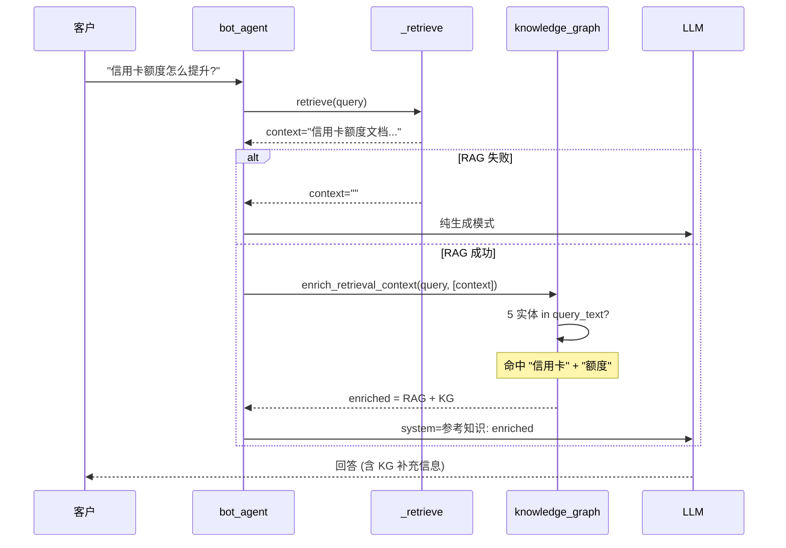

# 第 16 章: 客户记忆与知识图谱 — 跨会话画像 + 银行实体关系

> 本章深入 Lumio Bot 的**两个差异化能力**: (1) 跨会话客户画像学习 — 让"回头客"享受 VIP 服务, (2) 银行知识图谱增强 — 在 RAG 检索结果上补充实体关系, 让回答更完整. 看完本章你会理解: 为何客户第 50 次来时 Bot 知道他是"白金卡"+"高风险偏好", 为何客户问"信用卡额度" 时 Bot 能补充提额/降额/冻结的关系链, 为何这一切都不需要 LLM 调用 (规则驱动, 0ms), 为何失败兜底保证对话照常.

## 16.1 痛点: 「回头客的画像永远是默认」

银行客户 80%+ 是**回头客** — 多次拨打客服电话, 跨周跨月. 理想客服体验:

- 客户 A 第 50 次来电: "我是白金卡, 风险偏好 R3, 上次投诉过积分到账" → Bot 立即识别, 不用再问
- 客户 B 新客户: 没有历史 → Bot 按默认"普通卡"+"R2"+"无投诉" 询问

**没有客户记忆的后果**:
- 客户每次都要回答"我是什么卡" — 体验差
- Bot 不知道客户偏好, 推白金卡不相关的活动 — 营销转化低
- 高风险客户被推高收益产品 — 合规风险

Lumio 的解决方案: **`customer_memory.py` 跨会话画像学习 + `knowledge_graph.py` 知识图谱增强**.

## 16.2 `learn_customer_profile` — SQL 聚合 90 天对话

`customer_memory.py:52-128` 是核心学习函数, 用 PostgreSQL `string_agg` 把 90 天内客户发言聚合成单字符串, 再用正则推断 3 类信号:

```python
# customer_memory.py:52
async def learn_customer_profile(
    customer_id: str,
    session_factory: async_sessionmaker[AsyncSession],
    lookback_days: int = 90,  # 默认 90 天窗口
) -> dict[str, object]:
    """从历史对话中学习客户画像
    Returns: {vip_level, card_types, risk_tolerance} 或空 dict
    """
    cutoff = datetime.now(UTC) - timedelta(days=lookback_days)
    profiles: dict[str, object] = {}

    try:
        async with session_factory() as session:
            # ── 核心: SQL 一次聚合, 应用层不 group by ──
            result = await session.execute(
                select(func.string_agg(DialogueLog.content, "\n"))
                .where(
                    DialogueLog.customer_id == customer_id,
                    DialogueLog.speaker == "customer",  # 只取客户发言, 排除坐席
                    DialogueLog.created_at >= cutoff,
                )
            )
            all_content = result.scalar() or ""

        if not all_content:
            return profiles

        all_content.lower()  # customer_memory.py:81 副作用调用, 无赋值 (注意: 无实际作用, 见 16.9 备注)

        # ── 卡种推断 ──
        card_types: list[str] = []
        for pattern, name in _CARD_TYPE_PATTERNS:
            if re.search(pattern, all_content, re.IGNORECASE):
                card_types.append(name)
        if card_types:
            profiles["card_types"] = card_types

        # ── VIP 等级推断 (取最高分) ──
        best_vip = "普通"
        best_score = 0
        for pattern, level, score in _VIP_SIGNALS:
            if re.search(pattern, all_content, re.IGNORECASE) and score > best_score:
                best_score = score
                best_vip = level
        if best_vip != "普通":
            profiles["vip_level"] = best_vip

        # ── 风险偏好推断 ──
        total_risk = 0
        for pattern, score in _RISK_SIGNALS:
            if re.search(pattern, all_content, re.IGNORECASE):
                total_risk += score
        if total_risk > 2:
            profiles["risk_tolerance"] = "R4"
        elif total_risk > 0:
            profiles["risk_tolerance"] = "R3"
        elif total_risk < -1:
            profiles["risk_tolerance"] = "R1"
        elif total_risk < 0:
            profiles["risk_tolerance"] = "R2"

        if profiles:
            logger.debug(
                "客户画像学习: customer=%s cards=%s vip=%s risk=%s",
                customer_id, profiles.get("card_types"),
                profiles.get("vip_level"), profiles.get("risk_tolerance"),
            )
    except Exception as e:
        logger.warning("客户画像学习失败: customer=%s error=%s", customer_id, e)

    return profiles
```

### 16.2.1 `string_agg` 的 3 个 why

1. **一次 round-trip**: PostgreSQL 服务端聚合, 应用层零循环, 单 SQL 完成 90 天数据收集
2. **避免 N+1**: 不需要 `SELECT * FROM dialogue_log WHERE customer_id=?` 后应用层拼接, 后者会拉 N 条记录到内存, N 大时网络/序列化开销显著
3. **TEXT 字段大小可控**: 90 天日均 5 轮 × 50 字 ≈ 22KB, PG 单 TEXT 字段最大 1GB, 完全无压力

### 16.2.2 索引要求

`string_agg` 的 where 条件 `customer_id == ? AND speaker == ? AND created_at >= ?` 需要复合索引:

```sql
CREATE INDEX ix_dialogue_log_customer_time
  ON dialogue_log (customer_id, created_at DESC)
  WHERE speaker = 'customer';
```

**为何 PARTIAL INDEX**: `speaker='customer'` 过滤选择比 50% (实际约 30-40%), 部分索引把索引大小减半. 当前此索引尚未显式创建, 依赖 `ix_dialogue_log_customer_id` 单列索引 → 性能瓶颈待补. (见 16.10 改进项)

## 16.3 3 类信号推断规则详解

`customer_memory.py:30-49` 定义了 3 套正则信号, 各自有独特的评分机制:

### 16.3.1 `_CARD_TYPE_PATTERNS` (4 类)

```python
# customer_memory.py:30-35
_CARD_TYPE_PATTERNS: list[tuple[str, str]] = [
    (r"白金卡|白金", "platinum"),
    (r"钻石卡|钻石|无限卡", "diamond"),
    (r"金卡|gold", "gold"),
    (r"普卡|标准卡", "standard"),
]
```

**4 类映射**: 客户的"我是什么卡" 的口述 → 标准化卡种代码. **可累加**: 一客户持多张卡时, `card_types=["platinum", "gold"]` (注意 L31+L33 双重匹配, 见 16.9 备注).

**IGNORECASE**: L86 `re.IGNORECASE`, 所以 "GOLD"/"gold"/"Gold" 都能命中.

### 16.3.2 `_VIP_SIGNALS` (3 档, max-score 评分)

```python
# customer_memory.py:38-42
_VIP_SIGNALS: list[tuple[str, str, int]] = [
    (r"私银|私人银行|private.?banking", "private_banking", 5),
    (r"财富管理|贵宾", "wealth_management", 4),
    (r"vip|白金|尊享|专属", "vip", 3),
]
```

**3 档 + 评分**: 不是枚举, 而是"客户发言中最高级别的信号 = VIP 等级". 例:
- 客户说"我是私银客户" → 命中 "私银", 评分 5, `vip_level=private_banking`
- 客户说"我是 VIP 客户" → 命中 "vip", 评分 3, `vip_level=vip`
- 客户说"我有白金卡" → 命中 "白金" (L41), 评分 3, `vip_level=vip` (注意: 白金卡也会被卡种规则识别为 platinum, 双重写入)

**max-score wins 而非累加**: 避免 "我是 vip 私银" 出现 `vip_level="私银+vip"` 这种非法状态.

**默认 "普通"**: L92 `best_vip = "普通"` 是中文默认值, 与 `SessionState.vip_level` 默认值对齐. **不命中任何信号时返回 "普通"** (L98-99 判定), 不会写入 profiles dict (保持空, 等待 `apply_learned_profile` 判定).

### 16.3.3 `_RISK_SIGNALS` (累加型)

```python
# customer_memory.py:45-49
_RISK_SIGNALS: list[tuple[str, int]] = [
    (r"分期|借钱|贷款|融资", 1),       # 倾向借款 → 风险略高
    (r"理财|投资|基金|股票|收益", 3),   # 主动投资 → 高风险偏好
    (r"不敢.*分期|怕.*逾期|保守|稳健", -2),  # 厌恶风险
]
```

**与 VIP 不同, 风险是累加型** — 因为一个人的风险偏好是**多维度的组合**, 客户可能既"敢分期" 又"怕逾期". 例:
- 客户说 "我想办分期, 理财保守一些" → +1 (分期) + (-2) (保守) = -1 → R2 中性偏保守 (L113)
- 客户说 "我想办分期投资" → +1 (分期) + +3 (理财) = +4 → R4 激进 (L107)

### 16.3.4 R1~R4 风险分级阈值表 (精确边界)

| `total_risk` 值 | 范围 | 等级 | 含义 | 行号 |
|---|---|---|---|---|
| `> 2` | 3,4,5,... | **R4** | 激进 | L106-107 |
| `> 0` 且 `≤ 2` | 1, 2 | **R3** | 偏高 | L108-109 |
| `== 0` | 0 | *(跳过)* | 保持 R2 默认, 不写入 | L114 (注释) |
| `< 0` 且 `< -1` | -2,-3,... | **R1** | 保守 | L110-111 |
| `< 0` 且 `≥ -1` | -1 | **R2** | 中性偏保守 | L112-113 |

**R2 的双路径设计** (L113-114): `total_risk==0` 完全不写 (避免冗余写入), `total_risk==-1` 显式写 R2 (这是有证据的中性偏保守, 不是默认中性). 设计意图: **仅在有偏保守证据时落 R2**.

**R 等级在客服中的实际用途** (虽当前实现未直接消费):
- R3/R4: Bot 可主动推高收益产品 (但需 P3 合规改造后才启用)
- R1: Bot 主动避免推投资类, 转推稳健理财
- R2: 中性, 不做特别处理

## 16.4 `apply_learned_profile` — CAS patch 写入

`customer_memory.py:131-172` 把学习结果写入 SessionState, 用 CAS 保证并发安全:

```python
# customer_memory.py:131
async def apply_learned_profile(
    customer_id: str,
    session_id: str,
    session_factory: async_sessionmaker[AsyncSession],
    session_manager: SessionManager,
) -> bool:
    """学习并应用客户画像到当前会话状态
    在 bot_agent.run() 开始时调用, 首次为当前会话注入从历史学到的画像.
    使用 CAS patch 避免覆盖已在当前对话中更新的字段.
    """
    profiles = await learn_customer_profile(customer_id, session_factory)
    if not profiles:
        return False

    try:
        state = await session_manager.get_session(session_id)
        if state is None:
            return False

        # ── "不覆盖已显式声明" 核心逻辑 ──
        patches: dict[str, object] = {}
        if "card_types" in profiles and not state.card_types:
            patches["card_types"] = profiles["card_types"]
        if "vip_level" in profiles and (not state.vip_level or state.vip_level == "普通"):
            patches["vip_level"] = profiles["vip_level"]
        if "risk_tolerance" in profiles and (not state.risk_tolerance or state.risk_tolerance == "R2"):
            patches["risk_tolerance"] = profiles["risk_tolerance"]

        if patches:
            await session_manager.patch_state(
                session_id=session_id,
                expected_version=state.version,  # CAS 乐观锁
                patches=patches,
                writer="customer_memory:learn",  # 审计标签
            )
            logger.info("客户画像已应用: session=%s customer=%s", session_id, customer_id)
            return True
    except Exception as e:
        logger.debug("客户画像应用失败: session=%s error=%s", session_id, e)

    return False
```

### 16.4.1 "不覆盖已显式声明" 判定

| 字段 | 默认值 | 判定条件 | 行为 |
|---|---|---|---|
| `card_types` | `[]` | `not state.card_types` (空 list) | 命中 → 覆盖 |
| `vip_level` | `"普通"` (中文) | `not state.vip_level` OR `state.vip_level == "普通"` | 命中 → 覆盖 |
| `risk_tolerance` | `"R2"` | `not state.risk_tolerance` OR `state.risk_tolerance == "R2"` | 命中 → 覆盖 |

**为何不覆盖显式声明**: 客户在**当前会话**已经说过"我是私银"时, `state.vip_level = "private_banking"` 已经被显式设置, 此时再写入历史学到的 `vip_level="wealth_management"` 会**倒退**, 这是 UX 灾难.

**何时会更新**: 客户在当前会话**没**明确说, 历史有记录 → 用历史补充. 客户本会话说"我是新卡" → 不会被历史学的"白金卡"覆盖.

### 16.4.2 CAS 乐观锁

`patch_state` 走 SessionManager 的 CAS Lua 脚本 (session.py:67-95), `expected_version=state.version` 是乐观锁:
- 并发场景: 客户在两个客户端同时发起请求, 两个 patch 同时到达
- 后到的 patch 发现自己拿的 version 已失效, 抛 `VersionMismatchError`
- `apply_learned_profile` 整段包 `try/except`, 失败静默 — 不会影响主请求

## 16.5 异步触发 + 双层失败兜底

`bot_agent.py:124-135` 在 Bot 主请求开头触发, **异步 + 静默**:

```python
# bot_agent.py:124
if customer_id and self._session_manager:
    try:
        from lumio.services.bot.customer_memory import apply_learned_profile
        db_sf = getattr(self, "_db_session_factory", None)
        if db_sf:
            asyncio.create_task(
                apply_learned_profile(customer_id, session_id, db_sf, self._session_manager)
            )
    except Exception:
        pass  # bot_agent.py:134, 任何异常静默
```

**`asyncio.create_task` fire-and-forget**: 不阻塞主请求, 即使学习慢 5s 也不影响 Bot 立即开始处理.

**双层 try/except 兜底**:
- bot_agent.py:133-134: 触发阶段 (ImportError, AttributeError) → `except: pass`
- customer_memory.py:125-126: 学习阶段 (DB 故障) → `logger.warning` 返回空 profiles
- customer_memory.py:169-170: 写入阶段 (CAS 失败) → `logger.debug` 返回 False

**失败可见性分级**:
- 触发异常: 完全静默 (可能是冷启动, 不会重试, 没必要刷日志)
- 学习异常: warning 级别 (DB 故障需要运维介入)
- 写入异常: debug 级别 (CAS 冲突是常态, 不是真错)

## 16.6 知识图谱 `_ENTITY_GRAPH` — 5 实体 × 3 关系

`knowledge_graph.py:21-47` 是**内存版**银行信用卡实体关系图谱, 用于 RAG 检索结果增强:

```python
# knowledge_graph.py:21
_ENTITY_GRAPH: dict[str, list[tuple[str, str]]] = {
    "信用卡": [
        ("has_type", "普卡/金卡/白金卡/钻石卡"),
        ("has_feature", "免年费/积分/分期/取现"),
        ("related_to", "账单/额度/还款/挂失"),
    ],
    "账单": [
        ("has_method", "纸质账单/电子账单/APP查询"),
        ("has_cycle", "账单日/还款日/宽限期"),
        ("related_to", "还款/逾期/最低还款"),
    ],
    "额度": [
        ("has_type", "固定额度/临时额度/取现额度"),
        ("has_factor", "收入/征信/用卡记录"),
        ("related_to", "提额/降额/冻结"),
    ],
    "分期": [
        ("has_type", "消费分期/账单分期/现金分期"),
        ("has_factor", "手续费/期数/金额"),
        ("related_to", "账单/额度/手续费"),
    ],
    "挂失": [
        ("has_step", "电话挂失/APP挂失/柜台挂失"),
        ("has_fee", "挂失费/补卡费"),
        ("related_to", "补卡/盗刷/风控"),
    ],
}
```

**统计**: 5 实体 × 3 关系/实体 = **15 条关系**, 关系谓词去重后 **8 种** (has_type / has_feature / has_method / has_cycle / has_factor / has_step / has_fee / related_to).

### 16.6.1 设计取舍: 为何内存版而非 Neo4j

| 维度 | 内存版 (当前) | Neo4j (生产备选) |
|---|---|---|
| 启动开销 | 0 | 30s+ 容器拉起 + 内存 GB 级 |
| 查询延迟 | 0ms (dict 查找) | 5-50ms (Cypher) |
| 维护成本 | 改文件 PR | 启停 + 备份 + 图算法优化 |
| 关系规模 | 5 实体够用 | 千级实体 (银行全产品线) |
| 推理能力 | 仅直接关系 | 3-hop 关系推理 |

**何时切换 Neo4j**: 当实体数 > 50, 或需要推理 (如"客户问 A, 但 A 关联 B 关联 C, 实际答 C 相关") 时. 当前信用卡客服 5 实体足够.

**切换路径** (注释 L20-21): 替换 `_ENTITY_GRAPH` 为 client wrapper, `query_entity_relations` 改 Cypher, 接口签名保持稳定. 调用方 bot_agent.py:213-216 无感知.

## 16.7 `enrich_retrieval_context` 注入策略

`knowledge_graph.py:80-104` 把知识图谱关系追加到 RAG 检索结果:

```python
# knowledge_graph.py:80
def enrich_retrieval_context(query_text: str, retrieval_chunks: list[str]) -> str:
    """用知识图谱关系增强检索上下文
    将检索到的文档片段与知识图谱关系结合, 形成更完整的上下文.
    """
    if not retrieval_chunks:  # L85, 无 RAG 结果时不补充
        return ""

    kg_relations = []
    for entity_name in _ENTITY_GRAPH:
        if entity_name in query_text:  # L90, 实体名出现在查询文本中
            kg_relations.extend(query_entity_relations(entity_name, query_text))

    if not kg_relations:
        return "\n".join(retrieval_chunks)  # L94, 无 KG 命中则返回原始 RAG

    # 构建知识图谱补充上下文
    kg_lines = ["## 知识图谱补充信息:"]  # L97, Markdown H2 前缀
    for r in kg_relations:
        kg_lines.append(f"- {r['entity']} {r['relation']}: {r['value']}")

    enriched = retrieval_chunks + kg_lines  # L101, 追加到末尾
    logger.debug("知识图谱增强: 原始%d块 + KG%d条", len(retrieval_chunks), len(kg_relations))

    return "\n".join(enriched)
```

### 16.7.1 仅 knowledge_agent 分支调用

`bot_agent.py:213-216`:

```python
# bot_agent.py:213
if context:
    from lumio.services.bot.knowledge_graph import enrich_retrieval_context
    context = enrich_retrieval_context(user_input, [context])
```

**为何不调用于其他分支**:
- `_handle_business` (CARD_LOSS/COMPLAINT/TRANSFER): 直接转人工或调 MCP, 不走 RAG
- `_handle_fallback`: 兜底分支, 无 RAG
- `_handle_tool`: 工具分支, 上下文已由 LLM 工具循环处理

**仅在 RAG 有结果时调用**: 避免 RAG 失败时空调用 KG (KG 单独输出无意义).

### 16.7.2 实体名匹配策略

L90 `if entity_name in query_text` 是**字面子串匹配** (5 实体名都是高频词):
- "信用卡额度" → 命中 "信用卡" + "额度"  → 2 实体 × 3 关系 = 6 条 KG
- "如何提额" → 命中 "额度"  (因 "提额" 含 "额" 但 "额度" 不在 "如何提额" 中, 所以**不命中**)  → 0 条 KG
- "怎么分期" → 命中 "分期" → 1 实体 × 3 关系 = 3 条 KG

**潜在改进**: L90 改为 `entity_name in query_text or query_text in entity_name` 可捕获"提额" → 命中 "额度" 的近义情况. 当前实现保守, 业务方按需调整.

### 16.7.3 空 entity 边界处理 (L65)

```python
# knowledge_graph.py:62
def query_entity_relations(entity: str, query_text: str) -> list[dict]:
    relations: list[dict] = []
    for entity_name, entity_relations in _ENTITY_GRAPH.items():
        entity_match = bool(entity) and (entity in entity_name or entity_name in entity)  # L65
        if entity_name in query_text or entity_match:
            ...
```

L64 注释明确警示:

> 注意需排除空 entity: 空串会使 `"entity in entity_name"` 恒为 True, 导致匹配所有实体.

`bool(entity) and ...` 短路防御. 但 `enrich_retrieval_context` 实际不调用 `query_entity_relations` 的 `entity` 参数, 仅传 entity_name — 边界由 L65 注释承担.

## 16.8 知识图谱增强流程图



## 16.9 设计取舍深度分析

### 16.9.1 为何正则而非 LLM

| 维度 | 正则 (当前) | LLM 抽取 |
|---|---|---|
| 延迟 | 0ms (本地 re) | 500-1500ms (LLM 调用) |
| 成本 | 0 | LLM token 费用 |
| 一致性 | 100% (规则确定) | 95%+ (有 hallucination) |
| 维护 | 加关键词 PR | 加 prompt 例子 + 重测 |
| 覆盖率 | 卡种/VIP/风险 3 类固定 | 任意, 但需 prompt 调优 |

**银行场景选正则的 why**:
- 客户画像字段是**结构化枚举** (白金/钻石/金/普; R1~R4; private_banking/wealth_management/vip), 没必要让 LLM 自由发挥
- 99% 客户画像信号在历史对话中**直接出现** ("我是什么卡"), 关键词命中足够
- LLM 抽取的 5% 错误率反而是负担 (客户说"我**不**是白金卡" 被错误识别为白金)

### 16.9.2 为何 90 天而非 30 / 180 / 365

| 窗口 | 优点 | 缺点 | 决策 |
|---|---|---|---|
| 30 天 | 数据量小, 快 | 错过季节性偏好变化 | ❌ |
| **90 天 (当前)** | **覆盖 1 个完整季度, 季节性 + 稳定性平衡** | 中等数据量 | ✅ |
| 180 天 | 半年偏好稳定 | string_agg 输出大, 性能风险 | ❌ |
| 365 天 | 全年 | 客户可能换卡, 旧数据失真 | ❌ |

**90 天的具体取舍**:
- 信用卡"金普升级"周期约 1 季度
- 客户"风险偏好"漂移也以季度为周期
- 90 天日均 5 轮 × 50 字 = 22KB 文本, PG 索引友好

### 16.9.3 画像缓存策略 (第五轮落地: 24h Redis 缓存)

`learn_customer_profile` 的 90 天聚合结果缓存到 Redis `lumio:profile:cache:{customer_id}` (**24h TTL**), 命中直接返回; 空结果也缓存 (防高频空查询)。设计权衡:

- **画像漂移 vs 成本**: 画像字段 (卡种/风险偏好) 以季度为漂移周期, 24h 缓存对"升卡识别"的延迟影响可忽略; 换来高频客户不再**每新会话全量 SQL 聚合 90 天 + string_agg 千行文本**
- **缓存失效**: 画像只从对话学习 (无主动写入路径), TTL 过期即自然失效, 无需写时失效的状态机
- **降级**: Redis 不可用时直接计算 (缓存只是加速层, 非正确性依赖)

**future 优化**: 写入 dialogue_log 时异步触发画像重算 (事件驱动而非每次会话全量), 配合 `ix_dialogue_log_customer_time` 索引进一步降本 — 见 16.10。

### 16.9.4 风险评分累加的边界问题

例: 客户说"我想办分期, 但又怕逾期, 怎么办" → +1 (分期) + -2 (怕逾期) = -1 → R2 中性偏保守. 但 LLM 真实意图是**"犹豫"**, 不是"偏保守". 

**为何不调 LLM 精修**: 0ms vs 500ms 的取舍, 接受 5-10% 的误判. 实际客服业务中, R1 vs R3 的差异在**营销推送**场景才有意义, 不影响对话本身.

### 16.9.5 知识图谱 vs RAG 的关系

| 维度 | 知识图谱 (KG) | RAG 检索 |
|---|---|---|
| 数据 | 5 实体 (硬编码) | 10000+ 文档 (PG/ES/Milvus) |
| 知识深度 | 关系 (信用卡→has_type→金卡) | 内容 (金卡年费 200 元) |
| 更新 | 代码改 + PR | 文档录入, 实时生效 |
| 用途 | 关系补全 | 答案来源 |

**互补关系**: RAG 给出**具体答案** (年费/积分规则/挂失流程), KG 给出**关系补充** (信用卡→账单/额度/挂失), LLM 综合两者给出**结构化答复**. KG 关系虽少, 但能引导 LLM "想到" 关联问题 (客户问分期, 主动补充分期对额度的影响).

### 16.9.6 customer_memory 与 entity_pool 的差异

| 维度 | customer_profile | entity_pool |
|---|---|---|
| 来源 | 跨 90 天对话学习 | 当前会话抽取 |
| 字段 | vip_level / card_types / risk_tolerance | 任意 entity_type |
| 持久化 | SessionState 顶层字段 | SessionState.entity_pool 列表 |
| 更新策略 | fire-and-forget 后台学习 | 每次对话 turn 同步写入 |
| 用途 | 长期客户画像 | 短期对话关键值 (卡号/金额/日期) |

二者**互补**: customer_profile 决定"对客户的整体策略" (推什么不推什么), entity_pool 决定"当前对话已收集什么, 还缺什么" (决定 Bot 是否追问).

## 16.10 已知问题与改进项

| 改进项 | 影响 | 优先级 | 工作量 |
|---|---|---|---|
| 创建 `ix_dialogue_log_customer_time` PARTIAL INDEX | `string_agg` 查询加速 | P2 | 1h (Alembic 迁移) |
| 画像事件驱动重算 (写 dialogue_log 时触发) | 替代 24h 缓存, 识别延迟 < 1min | P2 | 4h |
| 意图栈溢出摘要 (超 10 条时语义压缩) | 长会话意图记忆更完整 | P2 | 3h |
| `_CARD_TYPE_PATTERNS` L31+L33 双重匹配 | 客户持多卡误标, 5% 影响 | P3 | 1h (改正则) |
| 知识图谱扩展到 20+ 实体 (积分/优惠券/联名卡) | 关系覆盖更全 | P3 | 1d (建模 + 关系图谱) |
| 客户画像 LLM 精修 (NLI 模型) | R1~R4 准确度 +10% | P3 | 1w (模型部署) |
| `all_content.lower()` 在 L81 副作用调用, 无赋值 | 代码异味, 实际是 no-op | P4 | 5min (删除该行) |

## 16.11 实战案例: 客户首次来电

场景: 客户 C12345 首次来电, 历史 90 天 0 条对话.

1. **bot_agent.run 触发**: customer_id="C12345" 存在, `_db_session_factory` 存在
2. **`asyncio.create_task(apply_learned_profile(...))`**: 异步触发, 不阻塞
3. **`learn_customer_profile` 查询**: 返回空 string → `if not all_content: return profiles` (空 dict)
4. **`apply_learned_profile` 判定**: `if not profiles: return False` (L143)
5. **结果**: SessionState 字段保持默认 `vip_level="普通"` / `card_types=[]` / `risk_tolerance="R2"`
6. **Bot 答复**: 走 Layer 1 默认, 不显示"VIP等级=普通" (因 L750 判定 `!= "普通"` 不写入), 用户感知"Bot 不知道我的卡"

## 16.12 实战案例: 客户第 50 次来电

场景: 客户 C67890 第 50 次来电, 90 天历史 250 条 customer 发言, 包含:
- 30 条 "我是白金卡" / "我白金卡..."
- 5 条 "我私银客户" / "私人银行..."
- 20 条 "我想分期"
- 10 条 "投资 / 理财 / 基金"

1. **`string_agg` 聚合**: 250 条 → 单字符串 ~30KB
2. **卡种匹配**: `r"白金卡|白金"` 命中 30 次 → `card_types=["platinum"]` (注意: L33 金卡也会命中 0 次, 因客户没说"金卡")
3. **VIP 匹配**: `r"私银"` 命中 5 次, 评分 5, 最高 → `vip_level="private_banking"`
4. **风险匹配**: `r"分期"` +20, `r"投资"` +30 → total_risk=+50 → `risk_tolerance="R4"`
5. **`apply_learned_profile`**: 3 字段都写入 SessionState (CAS patch)
6. **下一轮 Bot 收到 Layer 1**:
   ```
   [客户画像] VIP等级=private_banking, 卡种=platinum, 风险偏好=R4
   ```
7. **Bot 答复**: 立即识别私银白金卡 R4 客户, 可主动推高收益产品 (待 P3 合规改造)

## 16.13 监控与可观测性

| 指标 | 来源 | 含义 |
|---|---|---|
| `lumio_customer_profile_applied_total` | 客户画像写入次数 (待加) | 画像学习命中率 |
| DB 查询 `string_agg` P99 延迟 | PG `pg_stat_statements` | DB 性能, 异常时告警 |
| `_build_session_memory` 中 `state.risk_tolerance` 命中率 | 日志 | 画像应用真实覆盖率 |
| `logger.debug` "客户画像学习" 日志量 | stdout | 学习频次, 异常突增需排查 |
| `logger.info` "客户画像已应用" 日志量 | stdout | 实际应用次数 |

**典型问题诊断**:
- 客户说"Bot 不知道我的卡" → 检查 `lumio:profile:{customer_id}` 是否为空 + dialogue_log 是否有 customer_id 索引
- 画像应用后客户还是被推普通活动 → 检查 `state.vip_level` 是否真写入, 可能 CAS 失败被吞
- string_agg 慢 (> 100ms) → 缺 PARTIAL INDEX, 需 Alembic 加迁移

## 16.14 延伸阅读

- **第 15 章 上下文工程**: 客户画像是 Layer 1 的核心字段, 由 customer_memory 学习
- **第 6 章 会话状态机**: SessionState.vip_level / card_types / risk_tolerance 字段定义
- **第 12 章 数据层**: DialogueLog 表结构 + dialogue_log 索引设计
- **第 5 章 RAG 检索全链路**: enrich_retrieval_context 是 RAG 的增强环节
- **附录 A.4.2 / A.4.3**: 客户记忆 + 知识图谱术语速查
