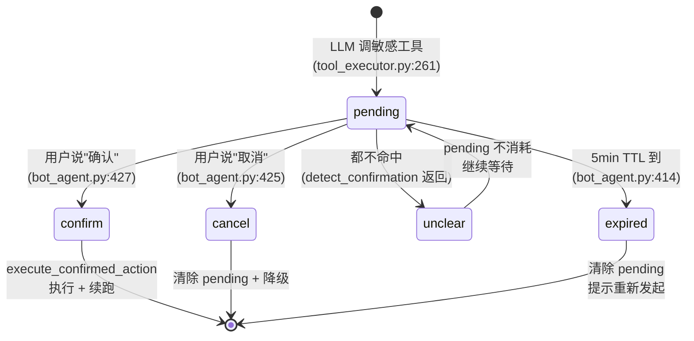
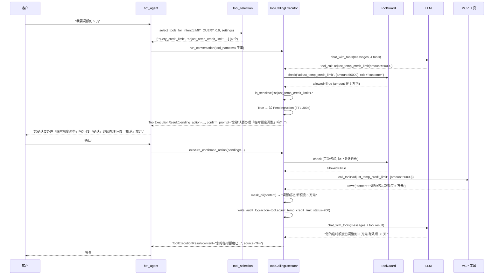

# 第 17 章: 工具调用与确认状态机 — 渐进式暴露 + 5 态确认 + 双重护栏

> 本章深入 Lumio Bot 的**最复杂编排** — 工具调用全链路. 银行客服有 22 个 MCP 工具, 其中 11 个是"敏感写操作" (挂失/调额/分期), 暴露全量工具给 LLM 会导致误调风险, 不做二次确认会导致合规问题. Lumio 设计了 **4 层防护**: (1) 渐进式工具暴露 (按意图裁剪) → (2) 执行前护栏 (角色+金额) → (3) 敏感工具 5 态确认 → (4) PII 全链路脱敏. 看完本章你会理解: 为何客户问"账单" 时 Bot 只看到 4 个账单工具而非 22 个, 为何 Bot 调"调额" 前要问"您确认吗", 为何 Bot 拒绝"调额 1 亿" 时不会说出真实原因, 为何所有工具调用 4 个出口都脱敏了 PII.

## 17.1 痛点: 22 个工具全暴露的灾难

Lumio Java MCP Server 注册了 22 个工具 (7 个域, 见第 7 章), 如果全暴露给 LLM function-calling:

| 问题 | 后果 |
|---|---|
| 22 个工具描述占用 ~3000 tokens | LLM 上下文被工具列表污染, 历史/RAG 空间被挤压 |
| LLM 在不相关工具上"瞎选" | 客户问"积分", LLM 误调 `apply_bill_installment` |
| 敏感工具无二次确认 | LLM 自动调 `card_loss` 挂失, 客户没确认 → 合规事故 |
| 客户输入"不限金额" → LLM 调 `adjust_temp_credit_limit` 1000000 | 实际只允许 5 万, 风控失守 |

Lumio 的解决: **4 层防护**.

## 17.2 渐进式工具暴露 (Progressive Disclosure)

`tool_selection.py` 按**意图 + 置信度**裁剪工具子集, 默认关闭 (零回归).

### 17.2.1 5 工具意图白名单

```python
# tool_selection.py:24-32
TOOL_INTENTS: frozenset[IntentLabel] = frozenset(
    {
        IntentLabel.BILL_QUERY,           # "bill_query"
        IntentLabel.TRANSACTION_QUERY,    # "transaction_query"
        IntentLabel.LIMIT_QUERY,          # "limit_query"
        IntentLabel.INSTALLMENT_INQUIRY,  # "installment_inquiry"
        IntentLabel.REWARD_QUERY,         # "reward_query"
    }
)
```

**5 工具意图** 正好是 `IntentLabel` 11 个值中**需要工具**的子集. 其它 6 个 (FAQ / CARD_LOSS / COMPLAINT / TRANSFER_AGENT / CHITCHAT) 走 RAG / 转人工 / 闲聊, 不调工具.

### 17.2.2 意图→工具映射表 (5 意图 × 17 工具)

`config.py:417-435` 配置:

```python
# config.py:417
intent_tool_map: dict[str, list[str]] = Field(
    default_factory=lambda: {
        "bill_query": [
            "query_card_bill", "query_bill_detail",
            "query_annual_fee", "repay_credit_card",
        ],
        "transaction_query": [
            "query_transactions", "report_transaction_dispute",
        ],
        "limit_query": [
            "query_credit_limit", "query_limit_adjust_history",
            "adjust_temp_credit_limit", "apply_permanent_limit",  # 调额 (写操作)
        ],
        "installment_inquiry": [
            "query_installment_offer", "query_installment_status",
            "apply_bill_installment", "cancel_installment",  # 分期申请 (写操作)
        ],
        "reward_query": [
            "query_points", "query_card_benefits", "redeem_points",
        ],
    }
)
```

**注意**: `limit_query` / `installment_inquiry` 映射里**既含查询也含写工具**. 渐进式暴露只按意图裁剪, 不分辨读写 — 敏感拦截留给 `is_sensitive()` 在 `_run_loop` (tool_executor.py:257) 阶段处理.

### 17.2.3 选择器纯函数

```python
# tool_selection.py:35-61
def select_tools_for_intent(
    intent: IntentLabel,
    confidence: float,
    settings: MCPSettings,
) -> list[str] | None:
    """根据意图与置信度选择要暴露的工具子集.
    :param intent: 主意图
    :param confidence: 主意图置信度
    :param settings: MCP 配置 (含开关/阈值/意图→工具映射)
    :returns: 工具名子集; None 表示暴露全量工具 (不裁剪)
    """
    # ── 零回归保险 1: 开关关闭 → 暴露全量 ──
    if not settings.progressive_disclosure_enabled:
        return None

    key = intent.value if isinstance(intent, IntentLabel) else str(intent)
    names = settings.intent_tool_map.get(key)
    # ── 零回归保险 2: 未配置或子集为空 → 暴露全量 ──
    if not names:
        return None

    # ── 零回归保险 3: 低置信 → 暴露全量 (避免误分类漏工具) ──
    if confidence < settings.pd_confidence_threshold:
        return None

    return list(names)
```

**3 重零回归保险**: 任一命中即返回 `None` → `to_openai_tools(None)` 暴露全量 22 工具. 默认 `progressive_disclosure_enabled=False`, 行为与打通前完全一致.

**3 重保险的 why**:
- 开关关: 业务方未审核工具子集前不启用
- 未配置: 新增意图还没建映射
- 低置信: 分类器不确定时宁可多暴露, 也不能少暴露 (漏工具 = LLM 答不出)

## 17.3 `ToolCallingExecutor` 4 分支循环

`tool_executor.py:104-216` 实现 LLM↔MCP 多轮循环 + 5 态确认. 核心是 `_run_loop` (L220-280) 4 个分支.

### 17.3.1 入口与构造

```python
# tool_executor.py:104
class ToolCallingExecutor:
    """LLM 工具调用循环 + 敏感操作确认状态机"""
    def __init__(
        self,
        mcp_client: MCPToolClient,
        llm_client: LLMClient,
        audit_session_factory: async_sessionmaker[AsyncSession] | None,
        settings: MCPSettings,
        guard: ToolGuard | None = None,
    ) -> None:
        self._mcp = mcp_client
        self._llm = llm_client
        self._audit_factory = audit_session_factory
        self._settings = settings
        self._guard = guard
```

**4 个依赖**: MCP 客户端 (调工具), LLM 客户端 (生成 + 工具决策), 审计 factory (写库), ToolGuard (执行前护栏).

### 17.3.2 `_run_loop` 4 分支详解

```python
# tool_executor.py:220
async def _run_loop(
    self, messages, tools, *,
    session_id, actor_id, actor_role, trace_id="",
    initial_executed=None,
) -> ToolExecutionResult:
    executed: list[str] = list(initial_executed or [])

    for _ in range(self._settings.max_tool_iterations):  # 默认 5
        result = await self._llm.chat_with_tools(messages, tools)

        # ── 分支 1: LLM 给出最终文本 (无 tool_call) ──
        if not result.has_tool_calls:
            return ToolExecutionResult(
                content=result.content, source="llm", executed_tools=executed,
            )

        messages.append(result.raw_message)  # 记录 assistant tool_calls

        for tool_call in result.tool_calls:
            # ── 分支 2: 护栏拒绝 (角色/金额) ──
            guard_decision = await self._enforce_guard(
                tool_call, session_id=session_id,
                actor_id=actor_id, actor_role=actor_role,
            )
            if not guard_decision.allowed:
                return ToolExecutionResult(
                    content=_GUARD_REFUSAL, source="guard", executed_tools=executed,
                )

            # ── 分支 3: 敏感工具 → 写 pending_action 短路 ──
            if self._mcp.is_sensitive(tool_call.name):
                pending = self._build_pending_action(tool_call, trace_id=trace_id)
                TOOL_CONFIRMATIONS.labels(decision="pending").inc()
                return ToolExecutionResult(
                    content=pending.confirm_prompt, source="tool",
                    pending_action=pending, executed_tools=executed,
                )

            # ── 分支 4: 非敏感工具 → 执行 + 脱敏 + 审计 + 回喂 ──
            tool_message = await self._execute_and_audit(
                tool_call, session_id=session_id,
                actor_id=actor_id, actor_role=actor_role,
            )
            messages.append(tool_message)
            executed.append(tool_call.name)

    # ── 循环上限保护 ──
    raise RuntimeError(f"工具调用超过最大轮数 {self._settings.max_tool_iterations}")
```

**第五轮加固 (分支 0-4 前置)**:

1. **执行侧白名单**: 循环开头对每个 `tool_call` 强制 `self._mcp.get_tool(name) is not None` — 幻觉调用未注册工具名直接拒绝并回喂 "工具 {name!r} 不存在, 请勿调用"。此前白名单只过滤"给 LLM 看"的一侧, 执行侧对未知工具透传后端且 `is_sensitive` 返回 False → 免确认执行。
2. **配额检查** (`_execute_and_audit` 内): `ToolQuotaGuard.check_and_increment(actor_id, tool_name)` per-customer per-tool 窗口计数, 超限拒绝返回"今日调用次数已达上限"。
3. **网络重试**: MCP 调用包 `async_retry(max_attempts=3)` (TimeError/ConnectionError 指数退避)。
4. **结果截断**: 工具返回 4096 字节截断 + `...[工具结果已截断]` 提示 — 5 轮循环累积防 prompt flooding。
```

**4 分支的短路顺序**: 分支 1 (无 tool_call) → 分支 2 (护栏拒绝) → 分支 3 (敏感 pending) → 分支 4 (执行回喂). 任何分支 `return` 即终止本轮, 仅分支 4 完成后回到 for 顶部.

**重要细节**: 4 个分支都是**单次循环内即可终止**. 敏感工具**不会**触发护栏以外的额外检查 — `_enforce_guard` 在 `is_sensitive` 之前先跑, 即使工具是 sensitive, 护栏也会先拦截 (合理: 先鉴权再确认).

### 17.3.3 `max_tool_iterations=5` 上限保护

`config.py:394` 默认 5, 即 LLM 最多连续调 5 轮工具. 超出抛 `RuntimeError`, 由 `bot_agent` 降级链 (`_handle_tool` 失败回落 `_handle_knowledge`).

**5 轮的 why**:
- 银行客服平均 2-3 轮工具 (查账单 → 还款)
- 极端 4-5 轮 (查账单 → 查积分 → 兑换 → 再查 → 总结)
- 5 轮是 99% 场景上限, 超出必是 LLM 死循环 (被引导或 hallucination)

## 17.4 5 态确认状态机

Lumio 用 `PendingAction` + `detect_confirmation` 实现 5 态:

### 17.4.1 状态转换图



**怎么读这张图 — "挂失前的最后一道闸"**: 客户说"帮我把卡挂失" → 系统**不立即执行**, 而是进入 `pending` 状态, 回一句"您确认要办理银行卡挂失吗?" — 然后客户的所有回复都会被解读为四种之一: 说"确认" → 真执行; 说"取消" → 放弃; 说别的 (比如"那积分怎么算") → `unclear`, 系统**不放弃**继续等, 但累计 3 次会**自动取消并放行新问题** (防卡死); 5 分钟没回复 → `expired` 自动失效. **为什么要这道闸**: 挂失/调额/分期都是不可逆或影响重大的操作, AI 说办就办 = 合规事故; 让客户亲口确认, 既合规又给客户反悔的机会.

### 17.4.2 `PendingAction` 7 字段

`models.py:216-229`:

```python
# models.py:216
class PendingAction(BaseModel):
    tool_name: str
    arguments: dict[str, Any] = Field(default_factory=dict)
    tool_call_id: str = ""          # 关联 LLM tool_call.id
    confirm_prompt: str = ""         # 已生成的确认话术
    created_at: datetime = Field(default_factory=lambda: datetime.now(UTC))
    expires_at: datetime | None = None  # 过期时间, 超时需重新发起
    trace_id: str = ""               # 链路追踪 id
```

`tool_executor.py:325-339` 实例化, TTL = `now + confirmation_ttl_seconds` (默认 300s):

```python
# tool_executor.py:325
def _build_pending_action(self, tool_call: ToolCall, *, trace_id: str) -> PendingAction:
    spec = self._mcp.get_tool(tool_call.name)
    friendly = (spec.description if spec and spec.description else tool_call.name).strip()
    prompt = f"您确认要办理「{friendly}」吗? 回复『确认』继续办理, 回复『取消』放弃."
    now = datetime.now(UTC)
    return PendingAction(
        tool_name=tool_call.name,
        arguments=tool_call.arguments,
        tool_call_id=tool_call.id,
        confirm_prompt=prompt,
        created_at=now,
        expires_at=now + timedelta(seconds=self._settings.confirmation_ttl_seconds),
        trace_id=trace_id,
    )
```

**`friendly` 来自 MCP tool spec description**: Java MCP Server 端 `@Tool(description="信用卡挂失")`, 提取出来作为用户可见的"业务名称", 而非冷冰冰的函数名 `card_loss_report`.

### 17.4.3 `detect_confirmation` 关键词优先级

`tool_executor.py:75-87`:

```python
# tool_executor.py:75
def detect_confirmation(text: str) -> ConfirmDecision:
    """纯关键词判定用户对待确认操作的意图
    优先判定取消 (否定优先), 再判定确认, 否则 unclear.
    """
    if not text:
        return "unclear"
    normalized = text.strip().lower()
    if any(kw in normalized for kw in _CANCEL_KEYWORDS):
        return "cancel"
    if any(kw in normalized for kw in _CONFIRM_KEYWORDS):
        return "confirm"
    return "unclear"
```

**13 cancel 关键词** (L46-60):
> 取消 / 不用 / 不要 / 不办 / 不确认 / 不同意 / 不可以 / 算了 / 放弃 / 别 / 停 / no / cancel

**10 confirm 关键词** (L61-72):
> 确认 / 确定 / 是的 / 好的 / 可以 / 继续 / 同意 / 办理 / ok / yes

**cancel 优先的 why** (L45 注释):

> 确认/取消关键词 (cancel 优先判定, 规避"不确认"这类否定表述)

例: 客户说"我**不确认**这笔分期", 字符串含"确认"也含"不确认". 如果先扫 confirm 集, "确认" 命中 → 误判为 confirm. 实际语义是 cancel. 所以 L83-86 先扫 cancel.

**大小写不敏感**: L82 `.strip().lower()`, "YES"/"Yes"/"yes" 一致.

### 17.4.4 5 态触发与处理

`bot_agent.py:402-469` 在每轮对话开头拦截, 顺序处理:

| 状态 | 触发位置 | 处理 |
|---|---|---|
| **pending** (初始) | LLM 上一轮调敏感工具 | (由 LLM 触发的状态, 写在 SessionState.pending_action) |
| **pending → expired** | `bot_agent.py:414-423` | `if pending.expires_at < now`: 清 pending + 提示"超时失效" |
| **pending → confirm** | `bot_agent.py:427-431` | `detect_confirmation` 返回 "confirm" → **幂等键检查** → 调 `execute_confirmed_action` 执行 + 续跑 |
| **pending → cancel** | `bot_agent.py:425-426` | `detect_confirmation` 返回 "cancel" → 清 pending + 降级到 `_handle_knowledge` |
| **pending → unclear** | 默认分支 | **计数递增** (`unclear_count`) → 重复确认话术; 连续 3 次 → **自动取消 + 放行新消息** (逃生路径) |

**惰性过期 (lazy expiration)**: 无后台清扫任务, 每次进入 `_handle_pending_action` 时比 `expires_at`. 极简实现, 1 行代码.

### 17.4.4a 确认窗口逃生路径 (unclear 自动取消)

敏感工具确认窗口内, 用户发**不是确认/取消的新问题** (如"那你们客服几点下班") — 旧行为:
新问题被吞掉, 重复确认话术直到 5 分钟过期, 用户被卡死. 现行为:

```python
# bot_agent.py unclear 分支 (简化)
new_count = (pending.unclear_count or 0) + 1
if new_count >= get_settings().mcp.unclear_auto_cancel_threshold:  # 默认 3
    await self._clear_pending_action(session_id, state.version)    # 自动取消
    return {**confirm_prompt_result, "pending_released": True}     # 标记放行
# 未达上限: patch_state 更新 unclear_count + 话术提示"可回复『取消』放弃当前操作"
```

- `run()` 检测到 `pending_released` 标记 → **不 return**, 继续走正常意图分类处理新消息
- 阈值可配: `LUMIO_MCP__UNCLEAR_AUTO_CANCEL_THRESHOLD` (默认 3)
- 每次 unclear 都有提示逃生路径, 用户也可直接回复"取消"

**确认幂等键 (第五轮加固)**: 敏感工具"确认后重复办理"是银行场景最高危路径 — at-least-once 重投递 + pending 清除 CAS 失败都可能让同一笔分期执行两次。修复: 以 `pending.tool_call_id` 为幂等键写 `lumio:tool:executed:{tool_call_id}` (24h TTL) —

```python
# bot_agent.py (确认分支)
idem_key = f"lumio:tool:executed:{pending.tool_call_id or pending.created_at.isoformat()}"
already = await redis.get(idem_key)          # 已执行 → 提示"已完成", 不重复调用
# 执行成功后: await redis.setex(idem_key, 24*3600, "1")
```

同时 `_clear_pending_action` 的 CAS 清除改 `max_retries=3` + 失败 WARNING (旧实现单次 CAS 失败仅 debug 静默, pending 残留导致下轮"好的"再次触发)。

**确认词整句判定 (第五轮加固)**: `detect_confirmation` 从"子串匹配"改为"整句判定" — 去噪 (标点/空白/语气词) 后核心内容与关键词等长才判确认/取消, "好的，另外帮我查下账单" 不再误触发挂失/调额 (附加问题被吞)。

### 17.4.5 `audit_decision` 单独审计

`tool_executor.py:391-408` 提供单独审计 API, 区别于 `_execute_and_audit` 的"执行结果"审计:

```python
# tool_executor.py:391
async def audit_decision(
    self, *, session_id, actor_id, actor_role, tool_name, decision,
) -> None:
    """审计敏感操作的确认决策 (confirm/cancel/expired), 补齐合规链路"""
    await self._audit(
        actor_id=actor_id, actor_role=actor_role,
        action=f"tool_confirm.{decision}",  # ← 区别于执行审计的 "tool.{name}"
        target_id=session_id,
        detail={"tool": tool_name, "decision": decision},
        status_code=200,
    )
```

**为何单独 API**:
- 执行审计是 "工具调用结果" (action=tool.{name}, detail 含 arguments/result)
- 决策审计是 "用户对工具的确认决策" (action=tool_confirm.{decision}, detail 仅含 tool/decision)
- 二者语义正交, 合规追溯"谁在何时同意了什么" 需独立维度

**实际调用**:
- `bot_agent.py:417-419` 写 expired 决策
- `bot_agent.py:427-431` 写 confirm 决策
- `bot_agent.py:425-426` 写 cancel 决策

## 17.5 双重护栏 ToolGuard

`tool_guard.py` 在工具执行**前**做授权 + 额度校验, 与 Higress 网关**纵深防御**:

### 17.5.1 双重护栏职责划分

| 维度 | Higress 网关 | Python ToolGuard |
|---|---|---|
| **运行位置** | MCP 后端 ingress (统一入口) | host 编排侧 (Python 进程内) |
| **职责** | 工具目录聚合 / 路由 / 限流 / 鉴权 | **执行前业务级纵深防御** |
| **角色授权** | 网关层 (粗粒度, token/role) | `tool_role_allowlist` (细粒度, role→tool 列表) |
| **金额限制** | 网关层 (流量级 QPS 限流) | `tool_amount_limits` + `amount_arg_keys` (业务语义级) |

**不冗余**: 网关负责"谁能进" (粗粒度), ToolGuard 负责"特定业务角色能调哪些工具 + 业务阈值" (细粒度). ToolGuard `active=False` (无规则) 时直接跳过, 避免在未启用时给网关层增加重复的同步开销.

### 17.5.2 ToolGuard 完整实现

```python
# tool_guard.py:35
class ToolGuard:
    """工具调用授权 + 额度校验"""
    def __init__(self, settings: MCPSettings) -> None:
        self._settings = settings

    @property
    def active(self) -> bool:
        """是否有任何护栏规则生效 (无规则时可跳过检查)"""
        return bool(self._settings.tool_role_allowlist or self._settings.tool_amount_limits)

    def check(self, tool_name: str, arguments: dict[str, Any], *, actor_role: str) -> GuardDecision:
        """执行前校验: 先授权, 后额度. 任一不通过即拒绝."""
        auth = self._check_authorization(tool_name, actor_role=actor_role)
        if not auth.allowed:
            return auth
        return self._check_amount(tool_name, arguments)

    # ── 授权 ──
    def _check_authorization(self, tool_name: str, *, actor_role: str) -> GuardDecision:
        allowlist = self._settings.tool_role_allowlist
        if not allowlist:
            # 未配置白名单 → 不做授权限制 (零回归)
            return GuardDecision(allowed=True)
        # 已配置白名单 → 保守策略: 角色未登记视为无任何权限
        allowed_tools = allowlist.get(actor_role, [])
        if tool_name in allowed_tools:
            return GuardDecision(allowed=True)
        return GuardDecision(
            allowed=False, code="role_denied",
            reason=f"角色 {actor_role} 无权调用工具 {tool_name}",
        )

    # ── 额度 ──
    def _check_amount(self, tool_name: str, arguments: dict[str, Any]) -> GuardDecision:
        limits = self._settings.tool_amount_limits
        if tool_name not in limits:
            return GuardDecision(allowed=True)
        limit = limits[tool_name]
        for key in self._settings.amount_arg_keys:  # 默认 ["amount", "target_limit", "target_amount", "limit"]
            if key not in arguments:
                continue
            value = _coerce_number(arguments[key])
            if value is not None and value > limit:
                return GuardDecision(
                    allowed=False, code="amount_exceeded",
                    reason=f"工具 {tool_name} 入参 {key}={value} 超过上限 {limit}",
                )
        return GuardDecision(allowed=True)
```

### 17.5.3 零回归 + 保守策略

**L57-59 (授权)**: `if not allowlist: return allowed=True` — 未配置白名单时**完全放行**, 行为与现状一致 (零回归).

**L60-68 (配置后保守)**: 一旦 allowlist 非空 → 角色未登记视为无任何权限 (`allowlist.get(role, [])` 返回空列表). 这是**白名单模型**, 显式允许才允许.

**L72-87 (额度)**: 工具未在 `tool_amount_limits` 中登记 → 跳过 (默认放行); 登记了 → 遍历 `amount_arg_keys` (默认 4 个) → 任一超 limit → 拒绝.

### 17.5.4 `_coerce_number` 边界 (L90-101)

```python
# tool_guard.py:90
def _coerce_number(value: Any) -> float | None:
    """尽力将入参转为 float, 无法转换返回 None (非数值不参与额度校验)"""
    if isinstance(value, bool):                       # bool 不参与 (避免 True==1)
        return None
    if isinstance(value, (int | float)):
        return float(value)
    if isinstance(value, str):
        try:
            return float(value.strip())               # 字符串 strip 后强转
        except ValueError:
            return None
    return None
```

**2 条关键边界**:
1. `bool` 是 `int` 子类 (`isinstance(True, int) == True`), 必须**先于** `int|float` 判定, 否则 `True` 被当作 `1.0` 参与额度校验
2. 字符串 `value.strip()` 容忍前后空格 " 1000 ", 转换失败返回 `None` (不参与, 不会触发 `amount_exceeded`)

### 17.5.5 拒绝话术 (不外泄内部原因)

`tool_executor.py:41`:

```python
# tool_executor.py:41
_GUARD_REFUSAL = "很抱歉, 该操作目前无法为您办理. 如需帮助, 我可以为您转接人工客服."
```

**不外泄 `decision.reason` 给用户**: 内部 reason 含 "角色 customer 无权调用 adjust_temp_credit_limit", 这是安全信息, 不能让攻击者知道角色 / 工具白名单. 给用户的是统一礼貌话术, 同时审计 detail 仍记录真实 reason (脱敏后).

**护栏拒绝 → 真实转人工**: `ToolExecutionResult.should_transfer=True` 随结果回传, `bot_agent`
构建回复时透传 `should_transfer` — 客户看到"我可以为您转接人工客服"时**转接已真实触发**,
不必再发一条"转人工"消息. 拒绝原因 (`tool_guard_refused: {tool} ({reason})`) 写入 transfer_reason 供坐席端展示.

### 17.5.6 拒绝时仍写审计 (L378-388)

```python
# tool_executor.py:378
TOOL_GUARD_DENIALS.labels(tool=tool_call.name, reason=decision.code or "denied").inc()
masked_args = mask_pii(json.dumps(tool_call.arguments, ensure_ascii=False))
await self._audit(
    actor_id=actor_id, actor_role=actor_role,
    action=f"tool.{tool_call.name}",
    target_id=session_id,
    detail={"arguments": masked_args, "denied": decision.reason, "guard": decision.code},
    status_code=403,
)
```

**status_code=403**: 即便工具没执行, 审计表里也是 403 (Forbidden), 合规审计可查"哪个角色在何时被拒".

## 17.6 PII 脱敏 4 处注入点

`mask_pii` 在 tool_executor 全链路 **3 处** 注入, 共 4 个出口:

| # | 位置 | 行号 | 脱敏对象 | 写入字段 |
|---|---|---|---|---|
| 1 | **入参脱敏** | `tool_executor.py:291` | `tool_call.arguments` | 审计 `detail.arguments` (执行 + 异常) |
| 2 | **出参脱敏** | `tool_executor.py:295` | MCP 返回 `raw["content"]` | 审计 `detail.result` + 回喂 LLM 的 `tool_message.content` |
| 3 | **护栏拒绝脱敏** | `tool_executor.py:379` | 拒绝时再脱敏 arguments | 审计 `detail.arguments` (403 行) |
| 4 | **审计 detail 通用脱敏** | 同 #1 / #3 共用 | 无论成功/拒绝/异常 | 落库 `write_audit_log` |

### 17.6.1 `mask_pii` 链顺序敏感

`pii.py:63-76`:

```python
# pii.py:63
def mask_pii(text: str) -> str:
    """一键脱敏所有已知 PII 类型
    按顺序: 敏感字段 → 邮箱 → 身份证 → 银行卡 → 手机号
    (身份证/银行卡优先于手机号, 避免 11 位数字被误判为手机号)
    """
    result = mask_sensitive_fields(text)
    result = mask_email(result)
    result = mask_id_card(result)  # 18 位优先
    result = mask_bank_card(result)  # 16-19 位次之
    result = mask_phone(result)  # 11 位最后
```

**顺序敏感**: 身份证 (18 位) / 银行卡 (16-19 位) 必须**先于**手机号 (11 位), 否则 18 位身份证前 11 位会被手机号规则吃掉, 后面 7 位变成裸数字, 反而泄露.

### 17.6.2 全链路覆盖

| 数据生命周期 | 是否脱敏 | 证据 |
|---|---|---|
| 入参 → MCP | **否** (原始调用, 但 `tool_call.arguments` 不含 PII 风险字段) | `tool_executor.py:293` `await self._mcp.call_tool(name, args)` |
| MCP 返回 → LLM | **是** | `tool_executor.py:295` `masked_content`, `tool_executor.py:322` 回喂 |
| 审计 detail.arguments | **是** | 4 处 (执行 / 异常 / 护栏拒绝) |
| 审计 detail.result | **是** | `tool_executor.py:315` `masked_content[:500]` |
| 拒绝审计 (403) | **是** | `tool_executor.py:385` |
| 日志输出 | **是** (因 detail 入库前已脱敏) | 隐含 |

**3 个数据出口** (a) 回喂 LLM 的 tool_message, (b) 审计 detail, (c) 日志输出 — 全部经 `mask_pii`.

## 17.7 Prometheus 指标 (3 个)

`metrics.py:54-70` 定义 3 个 Counter:

```python
# metrics.py:54
TOOL_CALLS = Counter(
    "tool_calls_total",
    "MCP 工具调用次数",
    ["tool", "status"],         # status: success/error
)
TOOL_CONFIRMATIONS = Counter(
    "tool_confirmations_total",
    "敏感工具确认决策次数",
    ["decision"],                # decision: pending/confirm/cancel/unclear/expired
)
TOOL_GUARD_DENIALS = Counter(
    "tool_guard_denials_total",
    "被工具护栏拦截 (授权/额度) 的工具调用次数",
    ["tool", "reason"],          # reason: role_denied/amount_exceeded
)
```

### 17.7.1 `TOOL_CALLS` (labels: tool, status)

- 写入点: `tool_executor.py:298` (异常 → `status="error"`) + L309 (成功/失败 → `status="success"/"error"`)
- 维度: 按工具聚合成功率, 发现 "哪个工具最容易失败"

### 17.7.2 `TOOL_CONFIRMATIONS` (labels: decision, 5 态)

- `pending` → `tool_executor.py:261` (LLM 调敏感工具)
- `confirm` → `bot_agent.py:447` (用户确认并执行)
- `cancel` → `bot_agent.py:425-486` (推断, 与 confirm 同 switch)
- `unclear` → `bot_agent.py` 澄清分支
- `expired` → `bot_agent.py:416` (TTL 过期)
- **5 态全覆盖 → 漏斗分析**: `pending → confirm 转化率` 是核心健康指标

### 17.7.3 `TOOL_GUARD_DENIALS` (labels: tool, reason)

- 写入点: `tool_executor.py:378`
- `reason` 来自 `GuardDecision.code`: `role_denied` 或 `amount_exceeded`
- **双维度交叉定位**: "哪个工具被哪种规则拒得最多" → 调白名单 / 调金额上限

## 17.8 工具调用全链路时序图

**怎么读这张图 — "调额 5 万的完整旅程"**: 客户说"我要调额到 5 万", 系统走了**四道闸** — ① 工具选择: 只给 LLM 看 4 个额度相关工具 (不是 22 个); ② 护栏: 金额 5 万在限额内才放行; ③ 确认: 因为是敏感操作, **先问客户确认** (写 PendingAction, 5 分钟有效); ④ 客户说"确认" → 二次校验 → 真调工具 → 脱敏 → 审计 → LLM 组织回答. **注意第 657 行的"二次校验"**: 客户确认后还要再过一次护栏 — 防止确认期间参数被篡改 (比如"确认"时金额被改成 50 万).



## 17.9 设计取舍深度分析

### 17.9.1 为何默认关 PD

`progressive_disclosure_enabled` 默认 `False`, 即默认暴露全量 22 工具. 这是**有意的零回归设计**:

- 新功能上线**默认行为不变**, 不影响生产
- 业务方审核工具子集 + 单测 + 灰度后才打开开关
- 避免 LLM 因为工具列表少而"答不出" (因 5 意图外的意图走 RAG, 不调工具, 没影响)

**何时开启**: 业务方 + 算法 + 测试三方 review `intent_tool_map` 后, 在配置中心把开关翻到 `True`.

### 17.9.2 为何 cancel 关键词多于 confirm (13 vs 10)

| 类别 | 关键词 | 业务考量 |
|---|---|---|
| cancel 13 | 取消 / 不用 / 不要 / 不办 / **不确认** / 不同意 / 不可以 / 算了 / 放弃 / 别 / 停 / no / cancel | 银行客服客户**拒绝心理强**, 表达方式多 (尤其负面情绪下用"算了""放弃"等口语) |
| confirm 10 | 确认 / 确定 / 是的 / 好的 / 可以 / 继续 / 同意 / 办理 / ok / yes | 客户**配合度强**, 表达相对标准化 |

**L45 注释**: "取消/不用/不要/不办/不确认/不同意/不可以/算了/放弃/别/停/no/cancel" — 注意**"不确认"**是关键, 客户说"我**不确认**", 字符串既含 "确认" 也含 "不确认", 必须先扫 cancel 集命中"不确认".

### 17.9.3 为何金额用 `_coerce_number` 强转

`amount_arg_keys` 默认 4 个: `["amount", "target_limit", "target_amount", "limit"]`. LLM 调用时这些字段可能是:
- `50000` (int) → 直接 float
- `"50000"` (str, LLM 序列化异常) → strip + float
- `"50,000"` (str, 千位分隔符) → **转换失败, 不参与校验** ⚠️
- `True` (bool, LLM 错传) → 返回 None, 不参与 (避免 True==1)
- `50000.0` (float) → 直接 float
- `null` (None) → 不在 args 里, 跳过

**"50,000" 不参与是 bug 还是 feature?**: 倾向 bug. 实际生产中 LLM 极少输出千位分隔符 (LLM 输出是结构化数字), 但极端 prompt 注入可能输出, 后续 P3 需加千位分隔符解析.

### 17.9.4 为何护栏拒绝统一话术

`_GUARD_REFUSAL` 是固定的"很抱歉, 该操作目前无法为您办理", 不告诉用户**为什么**拒绝:

- **安全**: 不暴露内部白名单 / 金额上限细节 (攻击者能针对性绕过)
- **UX 一致**: 所有拒绝场景统一话术, 用户不会困惑"为什么上次能这次不能" (实际原因: 角色不对, 但用户不需要知道)
- **合规可追溯**: detail 仍写真实 reason, 内部审计可查

### 17.9.5 为何 audit_decision 与 _execute_and_audit 分离

| 维度 | `tool.{name}` (执行) | `tool_confirm.{decision}` (决策) |
|---|---|---|
| 触发时机 | 工具已执行 | 工具未执行, 仅决策 |
| detail | arguments + result + is_error | tool + decision (无 arguments 脱敏副本) |
| status_code | 200/500 | 200 |
| 业务含义 | "工具调用结果" | "用户对工具的确认决策" |

**分离原因**: 合规审计需独立查"哪些敏感操作被用户在何时同意/拒绝", 与"工具实际执行结果"是不同维度. 合并会丢失"客户拒绝但工具未执行" 的关键决策记录.

### 17.9.6 为何用 `is_sensitive` 注解而非工具名白名单

Java MCP Server 在 `@Tool` 注解上标 `destructiveHint = true` (Spring AI), Python 端 `MCPToolClient.is_sensitive(name)` 查询此元数据. 优势:

- **敏感标记**与**工具实现**同源 (Java 端), 不会出现 Python 白名单与 Java 实现不一致
- 新增敏感工具时只需 Java 端加注解, Python 端无改动
- 业务方改白名单**不影响**敏感标记 (正交设计)

## 17.10 实战案例: 客户调额 5 万

1. **客户输入**: "我白金卡, 想把临时额度调到 5 万"
2. **bot_agent 路由**: `LIMIT_QUERY` 意图, 置信度 0.95
3. **渐进式裁剪**: `select_tools_for_intent` 返回 4 个 limit_query 工具 (含 `adjust_temp_credit_limit`)
4. **LLM 决定**: 调 `adjust_temp_credit_limit`, args=`{target_limit: 50000, card_type: "platinum"}`
5. **护栏**: 
   - `_check_authorization`: 角色 `customer`, `allowlist` 空 → 放行
   - `_check_amount`: `adjust_temp_credit_limit` 在 `tool_amount_limits` 中, `target_limit=50000` < 50000 上限 → 放行
6. **敏感判定**: `is_sensitive("adjust_temp_credit_limit")` → True → 写 PendingAction
7. **Bot 回复**: "您确认要办理「临时额度调整」吗?回复『确认』继续办理,回复『取消』放弃."
8. **客户回复**: "确认"
9. **execute_confirmed_action**: 二次护栏校验 (防参数篡改) → 调 MCP → MCP 返回 "调额成功" → 脱敏 → 审计 → 续跑 LLM → 最终答复
10. **审计记录**: 
    - `tool_confirm.pending` (1)
    - `tool_confirm.confirm` (1)
    - `tool.adjust_temp_credit_limit` status=200 (1)
    - `TOOL_CALLS{tool="adjust_temp_credit_limit", status="success"}` ++

## 17.11 实战案例: 客户调额 1 亿 (护栏拒绝)

1. **客户输入**: "我要把额度调到 1 亿"
2. **bot_agent 路由**: `LIMIT_QUERY` 意图
3. **LLM 调**: `adjust_temp_credit_limit`, args=`{target_limit: 100000000}`
4. **护栏**:
   - `_check_authorization`: allowlist 空 → 放行
   - `_check_amount`: `target_limit=100000000` > 上限 50000 → **拒绝**, `code="amount_exceeded"`
5. **Bot 回复**: "很抱歉, 该操作目前无法为您办理. 如需帮助, 我可以为您转接人工客服." (不告诉客户"金额超限")
6. **审计**: 
   - `TOOL_GUARD_DENIALS{tool="adjust_temp_credit_limit", reason="amount_exceeded"}` ++
   - `audit_log`: action=`tool.adjust_temp_credit_limit`, status=403, detail=`{arguments: 脱敏后, denied: "工具 adjust_temp_credit_limit 入参 target_limit=100000000 超过上限 50000", guard: "amount_exceeded"}`

## 17.12 监控与可观测性

| 指标 | PromQL 示例 | 业务含义 |
|---|---|---|
| 工具调用成功率 | `rate(tool_calls_total{status="success"}[5m]) / rate(tool_calls_total[5m])` | MCP 整体健康度, < 95% 告警 |
| 调额拒绝率 | `rate(tool_guard_denials_total{reason="amount_exceeded"}[5m]) / rate(tool_calls_total[5m])` | 异常调额 (可能合规问题) |
| 5 态确认漏斗 | `pending → confirm 转化率 = rate(confirm) / rate(pending)` | 客户对敏感操作的接受度, 转化 < 30% 说明 UI 不友好 |
| 工具调用 P99 延迟 | `histogram_quantile(0.99, tool_call_duration_seconds_bucket)` | MCP 后端性能 |
| 工具循环超限 RuntimeError 次数 | (需在 bot_agent 降级链加 counter) | LLM 死循环预警 |

## 17.13 延伸阅读

- **第 7 章 MCP 工具集成**: 22 工具分类 + Higress 网关集成
- **第 11 章 安全合规**: PBKDF2 / JWT / Aho-Corasick 敏感词
- **第 3 章 Bot 自助问答**: 工具调用在 Bot 主链路中的位置
- **第 5 章 RAG 检索全链路**: 工具调用与 RAG 的协同
- **附录 A.4.4 / A.4.5 / A.4.6 / A.4.7**: 工具调用 + 护栏 + 指标 + PII 脱敏术语速查
